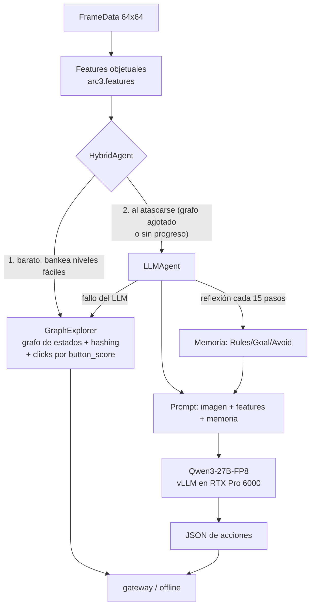

# ARC-AGI-3 — Diseño, features y estrategia (documento vivo)

> **Documento vivo.** Se actualiza en cada decisión de estrategia. Ver el
> [registro de decisiones](#5-registro-de-decisiones) y el [estado actual](#6-estado-actual-2026-07-29--resumen-ejecutivo)
> al final. Última actualización: **2026-07-29**.

---

## 1. El problema

ARC-AGI-3 (Kaggle `arc-prize-2026-arc-agi-3`) mide **inteligencia fluida**: un agente juega
environments interactivos **nunca vistos** y debe (a) **explorar** para descubrir las reglas,
(b) **modelar** el mundo a partir de observaciones, y (c) **fijarse metas** sin instrucciones.

- **Observación:** un grid **64×64** con colores 0–15 (una imagen). Se entrega en `FrameData`
  junto a `state` (`NOT_PLAYED/NOT_FINISHED/WIN/GAME_OVER`), `levels_completed`, `win_levels`
  y `available_actions`.
- **Acciones:** `RESET`(0), `ACTION1–5`(1–5) y `ACTION7`(7) simples (teclado/botones), y
  `ACTION6`(6) = **click(x,y)** en una celda. Los juegos se etiquetan `keyboard`, `click` o
  `keyboard_click`.
- **Objetivo/score:** completar niveles en el set **oculto** (~110 juegos). No hay ejemplos
  input→output como en ARC-AGI-2: aquí el agente **actúa** y aprende de las transiciones.
- **Reglas de cómputo:** submission = notebook. En el *rerun* real espera un gateway
  (`http://gateway:8001`) y juega los juegos ocultos ~8 h, **sin internet**; el score sale de
  las partidas (el `submission.parquet` es un dummy). En *Save & Run* se juegan los 25 juegos
  públicos **offline** — nuestro banco de pruebas gratis (no gasta cupo de submission).

**Por qué es difícil:** el sondeo aleatorio completa ~0 niveles en casi todos los juegos de
train; y la exploración sistemática (nuestra vía inicial) topa en **0.25** en el set oculto —
esa es la fracción de juegos resolubles *sin entender el objetivo*. El resto exige un modelo
del mundo y del objetivo. Ahí entra el LLM.

---

## 2. Features (feature engineering)

Un frame es una imagen 64×64. Extraemos estructura **objetual** dura (numpy puro, offline)
que alimenta tanto al explorador como al prompt del LLM. Ver `src/arc3/features.py`.

**Frame sintético de ejemplo** (no es un juego real; ilustrativo):

**Features extraídas sobre ese frame:**

- **Objetos** = componentes conexas 4-conectadas del mismo color, excluyendo el fondo
  (color mayoritario). Por objeto: color, tamaño, bounding box, centroide.
- **`button_score`** (recuadros): mezcla *rareza de color* + *compacidad/tamaño pequeño*. Los
  elementos interactivos (botones, avatares) suelen ser pequeños y de color raro → score alto
  (verde). Las regiones grandes de relleno → score bajo (amarillo). Guía dónde hacer click.
- **Borde enmascarado (recuadro blanco):** los juegos pintan contadores/HUD en el borde de
  3 px; el **hash de estado** los ignora (si no, cada frame sería único y el grafo explota).
  Además aprendemos una **máscara de contador** interior (celdas que cambian en ≥80% de las
  transiciones = animaciones/relojes) para no confundir estados que se ven distintos por ruido.
- **Features de transición (s,a,s′):** píxeles cambiados, bbox del cambio, colores
  ganados/perdidos y **vector de movimiento** (detecta si un objeto se trasladó dy,dx). Esto
  distingue "esta acción movió al avatar" de "no pasó nada".
- **Perfil por acción** (`action_summary.csv`): P(cambio), píxeles medios, P(subir nivel) por
  acción y juego — revela qué acciones "hacen algo" en cada juego.

Datos de train (`features_out/games_summary.csv`): 25 juegos, tags keyboard/click/mixto,
`win_levels` 6–10, y `p_change` muy variable (ft09=0.07, lp85=0.02 → casi nada responde salvo
la acción correcta; ls20/tu93=1.0 → todo cambia). Esta señal dirige el diseño del agente.

---

## 3. Estrategia

### 3.1. Arquitectura actual: híbrido explorador + LLM

- **Piso (GraphExplorer):** exploración de grafo de estados con hashing enmascarado, clicks
  por `button_score`, supresión de clases de click inertes (deadsig) y BFS a nodos pendientes.
  Garantiza el ~0.25 sin coste de LLM. `src/arc3/agent.py`.
- **Techo (LLMAgent):** cuando el explorador se atasca, el LLM decide sobre la imagen **+ la
  descripción textual de features** (nuestro diferenciador) **+ memoria de reflexión**.
- **Fallback:** cualquier fallo del LLM → GraphExplorer. Nunca se queda sin acción ni crashea.

### 3.2. ¿Por qué un LLM, y por qué así?

- **Por qué:** completar niveles ocultos exige *entender el objetivo* a partir de pocas
  observaciones — razonamiento de sentido común y de causa-efecto que la búsqueda ciega no
  tiene. Los mejores del leaderboard (0.86–1.21) son todos LLM-agénticos, no búsqueda pura.
- **Por qué Qwen3-27B-FP8 local:** cabe en la G4 (36 GB en 96 GB VRAM), es open-weights
  (offline, requisito de la competencia) y está probado en esta GPU (lo usó el ganador 1.21).
- **Por qué features en el prompt (diferenciador):** los VLM alucinan sobre píxeles crudos;
  dándoles la estructura ya computada ("obj rojo 4×4 en (46,46), button_score 1.0") razonan
  sobre **datos duros**. Confirmado en los logs: el modelo cita `button_score` al elegir click.

### 3.3. El prompt (qué se mide)

Dos prompts (ver `src/arc3/llm_prompt.py`):

1. **Acción** (`SYSTEM_PROMPT` + `build_user_text`): system fija el formato JSON estricto
   (`{"reasoning","actions":[{"name":"up|down|left|right|click","x","y"}]}`) y la instrucción
   de *confiar en los números sobre la imagen*. El user trae: `legal_actions`, la **estructura
   de objetos** con `button_score`, el **efecto de la última acción** (píxeles/movimiento), las
   acciones marcadas **inefectivas en ese estado**, y la **memoria** de reflexión.
2. **Reflexión** (`REFLECT_SYSTEM` + `build_reflection_text`): cada 15 transiciones, una 2ª
   llamada resume el historial en markdown `# Memory / ## Rules / ## Goal / ## Progress /
   ## Avoid` (<1800 chars), que se re-inyecta en el prompt de acción. Convierte
   predicción-de-una-acción en **aprendizaje en contexto**.

**Qué medimos** (vía Save & Run offline, sin gastar submission): niveles completados,
`llm_calls`, y el desglose de fallos (`exception` / `parse_empty` / `no_legal`), más un volcado
de muestras (prompt→respuesta cruda→acciones) y las reflexiones. Así iteramos el prompt con
evidencia. Ver el diagnóstico embebido en `notebooks/llm.ipynb`.

### 3.4. Trucos de ingeniería (del análisis del leaderboard)

Presupuesto global 8 h con corte; **concurrencia** de workers (vLLM agrupa requests → más
throughput en la misma GPU); RESET temprano; degradación a fallback ante cualquier excepción;
JSON-repair robusto; hashing/diff ignorando el borde; `enable_thinking=False` (Qwen3 es modelo
de razonamiento); `VLLM_TEST_FORCE_FP8_MARLIN=1` (evita el crash de flashinfer en GEMM FP8).

---

## 4. Tácticas de aprendizaje / entrenamiento (detallado)

### 4.0. ¿Qué significa "entrenar" en ARC-AGI-3? (el encuadre)

Esto es clave y suele confundirse. ARC-AGI-3 **no** es aprendizaje supervisado como ARC-AGI-2: no hay
pares `input→output` que ajustar. Es un problema **RL-interactivo** (el agente actúa, observa, y solo
recibe señal esparsa: `levels_completed`). "Aprender" aquí puede significar **tres cosas distintas**,
y los tres coexisten en los agentes top del leaderboard:

1. **Aprender los PESOS del modelo** (con descenso de gradiente): SFT/LoRA offline, o RL. Cambia la red.
2. **Aprender EN CONTEXTO** (sin tocar pesos): meter en el prompt lo aprendido durante la partida
   (reglas, qué no funciona) para que el LLM lo use dentro de su ventana de atención.
3. **Aprender un MODELO DEL MUNDO explícito** durante la partida: estructuras de datos (un grafo de
   estados, un modelo de movimiento) que se actualizan con la experiencia — aprendizaje **sin
   gradientes** y sin LLM.

La táctica correcta depende de cuál cuello domina. **Nuestro estado actual usa (2) y (3); no usamos
(1).** Y el hallazgo reciente (§4.2) reordena las prioridades.

### 4.1. Lo que USAMOS ahora: aprendizaje sin gradientes (in-context + world-model)

**(3) Modelo del mundo explícito (el GraphExplorer).** Es aprendizaje real, online, sin gradientes:
- **Grafo de estados**: cada frame distinto (tras enmascarar) es un nodo; cada acción, una arista. El
  agente *construye* este mapa jugando y lo *reusa* (BFS a nodos con acciones pendientes, replay tras
  RESET). Aprende la topología del juego.
- **Máscara de contador aprendida**: durante 12 transiciones aprende qué celdas interiores son ruido
  (animaciones/contadores) y las congela — aprende a *ignorar* lo irrelevante.
- **P(cambio) por acción y `deadsig`**: aprende qué acciones/clicks mueven el mundo en cada estado y
  cuáles son inertes. Aprende la dinámica local.
- **Modelo de movimiento** (`acción → vector (dy,dx)`): aprende cómo cada tecla mueve al avatar, y con
  eso navega hacia objetivos. Aprende la física del juego.

**(2) Aprendizaje en contexto (el LLMAgent).** El LLM está **congelado**; "aprende" solo dentro del
prompt:
- **Memoria de reflexión**: cada 15 transiciones, una 2ª llamada resume el historial en reglas
  (`## Rules / ## Goal / ## Avoid`) que se re-inyectan. El modelo *acumula* comprensión sin cambiar
  pesos — es TTT *en contexto*.
- **Memoria de inefectividad** por `(hash_estado, acción)` y **efectividad** por acción: datos duros
  re-inyectados para que no repita lo que ya falló.

**Por qué esta táctica (y no entrenar pesos):** (a) **generaliza** a juegos nuevos por diseño — no hay
riesgo de overfit porque no ajustamos nada a los 25 de train; (b) es **barata** (sin corridas de
entrenamiento); (c) es exactamente lo que hizo el mejor agente público de un-solo-LLM (LB 0.86). Es el
primer lever a exprimir antes de pagar el coste de entrenar.

### 4.2. Estado HONESTO de esta táctica (2026-07-27 — crítico, reordena todo)

Medimos con submissions reales y una **ablación** (re-enviar el mismo config): el loop in-context del
LLM **no supera 0.25 de forma robusta**. La memoria *funciona* (infiere reglas correctas, verificado en
los logs), pero **no se traduce en niveles nuevos** por encima del piso de exploración; el único 0.26
resultó ser **ruido de semilla** (banda medida ~1 nivel ≈ 0.01, ver §6-bis del working note).

**El reencuadre que esto fuerza:** el cuello inmediato **no** es la táctica de entrenamiento del LLM.
Es que nuestro **modelo-del-mundo explorador (0.25) está muy por debajo del explorador público
(poby7722 = 0.54)** — más del doble, sin ML y sin GPU. Cerrar esa brecha **no requiere entrenar pesos**:
es ingeniería del aprendizaje-sin-gradientes (mejor hashing de estado, cobertura de candidatos de
click, detección de ciclos, presupuesto serial-por-juego). Por eso la prioridad #1 dejó de ser "más
LLM" y pasó a "arreglar el explorador". El LLM se reserva para lo que la exploración *genuinamente* no
alcanza.

### 4.3. (B) LoRA-SFT offline — entrenar un adaptador pequeño (cuándo y cómo)

Si (2)+(3) se agotan, el siguiente escalón **sí** toca pesos. Mecánica:
- **Qué es LoRA**: en vez de re-entrenar los 27B parámetros, se inserta un par de matrices de bajo
  rango `A·B` (rango r=16–64) en las capas de atención; solo se entrenan esos ~0.1% de parámetros.
  Cabe en la G4 y es rápido.
- **De dónde salen los datos (behavior cloning)**: generamos **trayectorias buenas** offline. La fuente
  potente: **cargar el `.py` del juego** (accesible offline en los 25 de train) y **resolverlo con
  búsqueda en el simulador** (BFS/beam, estilo FORGE) → secuencias `(estado → acción óptima)`. Luego se
  entrena al LLM a imitar esas acciones dado el estado + nuestras features.
- **Augmentación** (obligatoria contra overfit): D4 (rotaciones/reflejos) × permutación de colores ×
  reetiquetado de acciones equivalentes → multiplica los 25 juegos en miles de variantes.
- **El riesgo central (el núcleo de ARC)**: los juegos **ocultos son distintos** de los 25 de train.
  SFT puede **memorizar** soluciones concretas y **no generalizar**. La mitigación no es opcional:
  entrenar *skills generales* ("ir hacia el botón pequeño y raro", "explorar y luego explotar"), no
  soluciones; y validar en un **held-out** de juegos de train nunca vistos por el SFT. Si el held-out no
  mejora, el SFT está memorizando y no sirve.
- **Coste**: 1 corrida de entrenamiento en la G4 + generación de datos offline. Medio.

### 4.4. (C) TTT online sobre el LLM — por qué NO

"TTT" (test-time training) en ARC-AGI-2 = fine-tunear en los ejemplos de la tarea al inferir. Aquí sería
**actualizar el LoRA online** con `(estado, acción, resultado)` durante la partida de 8 h.
- **Por qué no**: vLLM (el servidor de inferencia) **no** soporta bien updates de pesos en caliente;
  montar entrenamiento **y** servido del 27B en paralelo en **una** GPU es caro, frágil y come el
  presupuesto de 8 h. El ganador (1.21) **no** lo hizo.
- **Qué hacemos en su lugar**: la **memoria de reflexión** ES la adaptación en test — TTT *en contexto*,
  sin tocar pesos, sin el coste. Cumple el mismo rol (el agente se especializa al juego actual) de forma
  robusta.

### 4.5. (D) RL online ligero (CNN estilo StochasticGoose) — la alternativa sin LLM

Si se quisiera aprendizaje **online con gradientes** pero barato: una CNN pequeña (no un LLM) entrenada
desde cero **por nivel**, con reward de curiosidad (`+1` si la acción cambió el frame). Es lo que hizo
el sample oficial. **Pro**: barata, sin GPU cara, adapta online de verdad. **Contra**: **techo bajo**
(~0.35–0.46 en el LB) porque aprende "qué hace algo", no "cuál es el objetivo". La descartamos como vía
principal, pero es un candidato de política auxiliar si el explorador+LLM dejan huecos.

### 4.6. Recomendación (actualizada tras el reencuadre 2026-07-27)

| Prioridad | Táctica | Tipo de aprendizaje | Coste | Estado |
|---|---|---|---|---|
| **1** | Cerrar la brecha del **explorador** a 0.54 (hashing, cobertura, presupuesto serial) | mundo explícito, sin gradientes | CPU, **sin cuota G4** | **el lever de mayor valor ahora** |
| 2 | LLM in-context (reflexión+features) solo sobre juegos que la exploración no alcanza | en contexto, sin gradientes | G4 (inferencia) | construido; noise-bound sobre el piso actual |
| 3 | LoRA-SFT con trayectorias del solver + augmentación fuerte + held-out | pesos, offline | G4 (1 entrenamiento) | si 1–2 se agotan |
| 4 | TTT-online sobre el LLM | pesos, online | alto/frágil | **descartado** (usar reflexión) |

> **¿Sirve LoRA + TTT aquí?** **LoRA-SFT**: sí, condicionalmente — para formato y skills generales, con
> riesgo real de overfit a los 25 juegos; el valor es enseñar a *generalizar*, no a memorizar, y hay que
> probarlo en held-out. **TTT-online sobre el LLM**: no — incompatible en la práctica con vLLM y mal
> coste/beneficio; la reflexión en contexto ya cumple ese papel. **Y el punto más importante hoy**: el
> cuello actual no se resuelve con *ninguna* forma de entrenar pesos, sino mejorando el **modelo del
> mundo sin gradientes** del explorador (0.25→0.54), que es gratis en GPU.

---

## 5. Registro de decisiones

| Fecha | Decisión | Evidencia / razón |
|---|---|---|
| 2026-07-18 | Vía inicial = exploración de grafo (GraphExplorer), CPU | mejor coste/beneficio del LB público (0.54 sin ML); no gasta cuota G4 |
| 2026-07-19 | v2 = runner paralelo (workers) | rerun es HTTP-latencia; concurrencia sube throughput |
| 2026-07-20 | Confirmado: exploración pura capada | v1=v2=0.25 idéntico pese a 14× throughput → cuello semántico |
| 2026-07-21 | v3 reinicio diversificado = 0.25; pivote a LLM en la G4 | los reinicios tampoco mueven el LB → hace falta entender el objetivo |
| 2026-07-22 | Fase 3: LLMAgent con features en prompt; resueltos blockers vLLM (Marlin FP8, thinking off) | el modelo lee nuestras features (smoke test); llm_fails 6.5% |
| 2026-07-22 | HybridAgent (piso explorador + techo LLM) enviado = 0.25 | LLM single-shot no rompe el techo → añadir memoria |
| 2026-07-22 | + Reflection memory (opción A); trigger diario 8pm; Save & Run como banco de pruebas con diagnóstico | replicar el diferencial del agente 0.86; iterar sin gastar submission |
| 2026-07-22 | Diagnóstico v8: el LLM entiende mecánica+objetivo (memoria excelente) pero no rompe el piso; re-elige clicks pese a saber que no sirven | volcado real de prompts/respuestas/reflexiones en el log de Save & Run |
| 2026-07-22 | + Inyección de "action effectiveness" (P(cambio) por acción) en el prompt | contrarresta el desfase observado: dato duro de qué acciones mueven el mundo |
| 2026-07-22 | v9: fallos 7.7%→5% pero niveles offline planos (9) | los tweaks de prompt mejoran robustez, no rompen el muro; el cuello es planeación/objetivo, no el prompt |

## Diagnóstico del muro (2026-07-22)

Save & Run con volcado confirma: el LLM **entiende** la mecánica y el objetivo (la memoria de
reflexión infiere reglas correctas y hasta el tipo de meta), pero **no ejecuta un plan** hacia
ese objetivo. Los niveles que completa son los mismos que la exploración ya alcanza. Los tweaks
de prompt (effectiveness, ineffective, memoria) reducen fallos pero no añaden niveles.

**Conclusión:** para romper 0.25 hacen falta inversiones mayores, no más ajuste de prompt:
1. **Planner sobre simulador** (estilo FORGE): si el `.py` del juego es accesible en el rerun,
   buscar la solución en el simulador local domina al LLM. Depende de accesibilidad del source.
2. **LoRA-SFT** (opción B) sobre trayectorias del solver, con augmentación fuerte.
3. **Loop agéntico más profundo**: multi-candidato + verificación, o búsqueda guiada por el LLM
   (el LLM propone sub-objetivos; la búsqueda los alcanza).

Estas son decisiones de inversión (coste G4 + ingeniería) a consultar antes de ejecutar.

| 2026-07-22 | **Loop agéntico + búsqueda guiada** (elegido): el LLM propone un sub-objetivo espacial `goal:{x,y}`; un controlador de navegación con **modelo de movimiento aprendido** (acción→vector, de las features) alcanza el objetivo sin gastar llamadas al LLM por paso | ataca la causa raíz (planeación); en test la navegación reemplaza ~½ de las llamadas al LLM |
| 2026-07-22 | v10 Save&Run: navegación activa (nav_used=1692), fallos 3.7% (récord), pero niveles offline planos (9) | la navegación es más capaz/eficiente pero el test offline (30min) está limitado por tiempo; el rerun oculto (8h) es donde la eficiencia compone. Plateau offline v6–v10 = 9 |

## Nota sobre el plateau offline (2026-07-22)

Los niveles **offline** se estancan en ~9 (v6–v10) pese a mejoras reales (reflexión,
effectiveness, navegación guiada, fallos 7.7%→3.7%). Dos lecturas:
1. El test offline son **30 min/8 workers sobre 25 juegos** → limitado por tiempo. Las mejoras
   de eficiencia (navegación reemplaza ½ de las llamadas LLM) **componen en el rerun de 8 h**,
   donde el tiempo por juego es mucho mayor. El offline subestima al agente en el oculto.
2. Los juegos que faltan necesitan más que navegación (click-puzzles, match-config, lógica
   multi-paso). Próximos sub-objetivos a añadir al loop: `click_all(sig)`, `match_target`.

El siguiente dato duro es el **score oculto de v10** (lo envía el trigger diario). Decidir más
inversión (LoRA / planner sobre simulador) tras ver ese número.

**RESULTADO (2026-07-23): v10 = 0.26** — primer quiebre del piso 0.25. El loop agéntico SÍ compone en
las 8 h (offline plano confirmó ser solo limitación de tiempo). Plan en ejecución: apilar sub-objetivos
más ricos (`click_all`, `match_target`).

> **Convención:** toda decisión de estrategia nueva se añade a esta tabla y actualiza las
> secciones relevantes arriba, junto con la fecha de "Última actualización".

**ACTUALIZACION 2026-07-26: 0.26 fue RUIDO.** 7 submissions LLM/hibrido = 0.26 una vez (v10), 0.25 seis veces. El loop agentico no supera 0.25 de forma robusta; los sub-objetivos incrementales estan por debajo de la banda de ruido (~1 nivel = 0.01). Proximo paso debe ser un lever cualitativamente mas fuerte (planner/LoRA) o protocolo de reduccion de varianza. Ver paper/working_note.

**ABLACION 2026-07-27: confirmado.** Re-enviar el config EXACTO de v10 (nav-sola) dio **0.25** (antes 0.26) → medición directa, mismo-config, de la banda de ruido. 0.26 = varianza de semilla, sin ambigüedad. Además, **reencuadre**: 0.25 es el techo de *nuestro* explorador, no de la exploración (poby7722 = 0.54 sin ML). Prioridad #1 pasa a **cerrar la brecha del explorador** (CPU, sin cuota).

**REDUCCIÓN DE VARIANZA 2026-07-27 (elegido por el usuario):** temp LLM → 0 (greedy, determinista); explorador ya determinista (sin RNG); varianza residual por timing/concurrencia medida ~1 nivel. Regla: solo cambios con efecto esperado ≥3 niveles (≈0.03) valen un slot.

---

## 6. Estado actual (2026-07-29) — resumen ejecutivo

**Dónde estamos:** score oculto **0.25** (nuestro mejor robusto), igual al piso de exploración. El
agente es sofisticado y funciona técnicamente (explorador + LLM con features + reflexión + navegación
guiada + click_all guardado), pero **el LLM no ha superado el piso de exploración de forma medible** —
confirmado por ablación.

**Qué aprendimos (lo valioso):**
1. El 0.25 no es el límite de la exploración, es el límite de *nuestra* exploración; hay headroom
   probado a 0.54 sin GPU.
2. Con métrica discreta (~1 nivel = 0.01) y ruido de timing, los micro-cambios de prompt no se pueden
   distinguir del ruido; hace falta un lever grande.
3. La táctica de "entrenamiento" correcta ahora es **aprendizaje sin gradientes** (mejorar el modelo del
   mundo del explorador), no LoRA/TTT.

**Camino elegido:** reducción de varianza primero (hecho: agente determinista, banda cuantificada); el
siguiente lever candidato de mayor valor es **cerrar la brecha del explorador a 0.54** (§4.6 prioridad
#1), CPU-only, con la referencia pública en mano.

**Infra estable:** submission = kernel `arc-agi3-llm` (dual-mode gateway/offline, vLLM boot con Marlin
FP8 + thinking off); trigger diario 8pm auto-envía; Save & Run con volcado diagnóstico como banco de
pruebas gratis; working notes EN+ES y este doc como documentos vivos.

> **Convención:** toda decisión de estrategia nueva se añade al registro y actualiza las secciones
> relevantes, junto con la fecha de "Última actualización".
