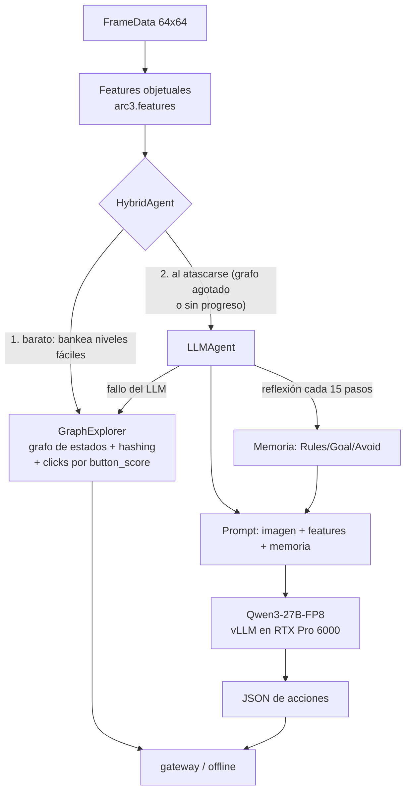

# ARC-AGI-3 — Diseño, features y estrategia (documento vivo)

> **Documento vivo.** Se actualiza en cada decisión de estrategia. Última actualización:
> **2026-08-17** (§8.9: reanálisis del cuello tras cuatro experimentos — **acciones y niveles están
> desacoplados por encima de un piso; la frontera es semántica, no de presupuesto**).
>
> **Empieza por aquí si buscas el estado vigente:** §8.9 (el reanálisis) y
> [ARCHITECTURE.md](ARCHITECTURE.md) §2 (los *seams* por donde entra código nuestro, ya validados
> en producción). §8.1–§8.7 conservan la medición del presupuesto, que sigue siendo correcta como
> descripción aunque §8.9 corrige su lectura estratégica.
> Le siguen el [registro de decisiones](#5-registro-de-decisiones) y el [estado ejecutivo](#6-estado-actual-2026-08-11--resumen-ejecutivo).
>
> Las secciones §1–§4 son el diseño fundacional (problema, features, arquitectura propia,
> tácticas de entrenamiento). Su descripción del **agente propio** quedó superada por el pivote al
> harness público (§5, 2026-08-11): hoy competimos con el harness duck + injertos, y nuestro
> `src/arc3` aporta las features y la navegación que se re-montan sobre él. El análisis del
> problema y de las features sigue vigente.

---

## 1. El problema

ARC-AGI-3 (Kaggle `arc-prize-2026-arc-agi-3`) mide **inteligencia fluida**: un agente juega
environments interactivos **nunca vistos** y debe (a) **explorar** para descubrir las reglas,
(b) **modelar** el mundo a partir de observaciones, y (c) **fijarse metas** sin instrucciones.

- **Observación:** un grid **64×64** con colores 0–15 (una imagen). Se entrega en `FrameData`
  junto a `state` (`NOT_PLAYED/NOT_FINISHED/WIN/GAME_OVER`), `levels_completed`, `win_levels`
  y `available_actions`.
- **Acciones:** `RESET`(0), `ACTION1–5`(1–5) y `ACTION7`(7) simples (teclado/botones), y
  `ACTION6`(6) = **click(x,y)** en una celda. Los juegos se etiquetan `keyboard`, `click` o
  `keyboard_click`.
- **Objetivo/score:** completar niveles en el set **oculto** (~110 juegos). No hay ejemplos
  input→output como en ARC-AGI-2: aquí el agente **actúa** y aprende de las transiciones.
- **Reglas de cómputo:** submission = notebook. En el *rerun* real espera un gateway
  (`http://gateway:8001`) y juega los juegos ocultos ~8 h, **sin internet**; el score sale de
  las partidas (el `submission.parquet` es un dummy). En *Save & Run* se juegan los 25 juegos
  públicos **offline** — nuestro banco de pruebas gratis (no gasta cupo de submission).

**Por qué es difícil:** el sondeo aleatorio completa ~0 niveles en casi todos los juegos de
train; y la exploración sistemática (nuestra vía inicial) topa en **0.25** en el set oculto —
esa es la fracción de juegos resolubles *sin entender el objetivo*. El resto exige un modelo
del mundo y del objetivo. Ahí entra el LLM.

---

## 2. Features (feature engineering)

Un frame es una imagen 64×64. Extraemos estructura **objetual** dura (numpy puro, offline)
que alimenta tanto al explorador como al prompt del LLM. Ver `src/arc3/features.py`.

**Frame sintético de ejemplo** (no es un juego real; ilustrativo):


**Features extraídas sobre ese frame:**


- **Objetos** = componentes conexas 4-conectadas del mismo color, excluyendo el fondo
  (color mayoritario). Por objeto: color, tamaño, bounding box, centroide.
- **`button_score`** (recuadros): mezcla *rareza de color* + *compacidad/tamaño pequeño*. Los
  elementos interactivos (botones, avatares) suelen ser pequeños y de color raro → score alto
  (verde). Las regiones grandes de relleno → score bajo (amarillo). Guía dónde hacer click.
- **Borde enmascarado (recuadro blanco):** los juegos pintan contadores/HUD en el borde de
  3 px; el **hash de estado** los ignora (si no, cada frame sería único y el grafo explota).
  Además aprendemos una **máscara de contador** interior (celdas que cambian en ≥80% de las
  transiciones = animaciones/relojes) para no confundir estados que se ven distintos por ruido.
- **Features de transición (s,a,s′):** píxeles cambiados, bbox del cambio, colores
  ganados/perdidos y **vector de movimiento** (detecta si un objeto se trasladó dy,dx). Esto
  distingue "esta acción movió al avatar" de "no pasó nada".
- **Perfil por acción** (`action_summary.csv`): P(cambio), píxeles medios, P(subir nivel) por
  acción y juego — revela qué acciones "hacen algo" en cada juego.

Datos de train (`features_out/games_summary.csv`): 25 juegos, tags keyboard/click/mixto,
`win_levels` 6–10, y `p_change` muy variable (ft09=0.07, lp85=0.02 → casi nada responde salvo
la acción correcta; ls20/tu93=1.0 → todo cambia). Esta señal dirige el diseño del agente.

---

## 3. Estrategia

### 3.1. Arquitectura actual: híbrido explorador + LLM



- **Piso (GraphExplorer):** exploración de grafo de estados con hashing enmascarado, clicks
  por `button_score`, supresión de clases de click inertes (deadsig) y BFS a nodos pendientes.
  Garantiza el ~0.25 sin coste de LLM. `src/arc3/agent.py`.
- **Techo (LLMAgent):** cuando el explorador se atasca, el LLM decide sobre la imagen **+ la
  descripción textual de features** (nuestro diferenciador) **+ memoria de reflexión**.
- **Fallback:** cualquier fallo del LLM → GraphExplorer. Nunca se queda sin acción ni crashea.

### 3.2. ¿Por qué un LLM, y por qué así?

- **Por qué:** completar niveles ocultos exige *entender el objetivo* a partir de pocas
  observaciones — razonamiento de sentido común y de causa-efecto que la búsqueda ciega no
  tiene. Los mejores del leaderboard (0.86–1.21) son todos LLM-agénticos, no búsqueda pura.
- **Por qué Qwen3-27B-FP8 local:** cabe en la G4 (36 GB en 96 GB VRAM), es open-weights
  (offline, requisito de la competencia) y está probado en esta GPU (lo usó el ganador 1.21).
- **Por qué features en el prompt (diferenciador):** los VLM alucinan sobre píxeles crudos;
  dándoles la estructura ya computada ("obj rojo 4×4 en (46,46), button_score 1.0") razonan
  sobre **datos duros**. Confirmado en los logs: el modelo cita `button_score` al elegir click.

### 3.3. El prompt (qué se mide)

Dos prompts (ver `src/arc3/llm_prompt.py`):

1. **Acción** (`SYSTEM_PROMPT` + `build_user_text`): system fija el formato JSON estricto
   (`{"reasoning","actions":[{"name":"up|down|left|right|click","x","y"}]}`) y la instrucción
   de *confiar en los números sobre la imagen*. El user trae: `legal_actions`, la **estructura
   de objetos** con `button_score`, el **efecto de la última acción** (píxeles/movimiento), las
   acciones marcadas **inefectivas en ese estado**, y la **memoria** de reflexión.
2. **Reflexión** (`REFLECT_SYSTEM` + `build_reflection_text`): cada 15 transiciones, una 2ª
   llamada resume el historial en markdown `# Memory / ## Rules / ## Goal / ## Progress /
   ## Avoid` (<1800 chars), que se re-inyecta en el prompt de acción. Convierte
   predicción-de-una-acción en **aprendizaje en contexto**.

**Qué medimos** (vía Save & Run offline, sin gastar submission): niveles completados,
`llm_calls`, y el desglose de fallos (`exception` / `parse_empty` / `no_legal`), más un volcado
de muestras (prompt→respuesta cruda→acciones) y las reflexiones. Así iteramos el prompt con
evidencia. Ver el diagnóstico embebido en `notebooks/llm.ipynb`.

### 3.4. Trucos de ingeniería (del análisis del leaderboard)

Presupuesto global 8 h con corte; **concurrencia** de workers (vLLM agrupa requests → más
throughput en la misma GPU); RESET temprano; degradación a fallback ante cualquier excepción;
JSON-repair robusto; hashing/diff ignorando el borde; `enable_thinking=False` (Qwen3 es modelo
de razonamiento); `VLLM_TEST_FORCE_FP8_MARLIN=1` (evita el crash de flashinfer en GEMM FP8).

---

## 4. Tácticas de aprendizaje / entrenamiento (detallado)

### 4.0. ¿Qué significa "entrenar" en ARC-AGI-3? (el encuadre)

Esto es clave y suele confundirse. ARC-AGI-3 **no** es aprendizaje supervisado como ARC-AGI-2: no hay
pares `input→output` que ajustar. Es un problema **RL-interactivo** (el agente actúa, observa, y solo
recibe señal esparsa: `levels_completed`). "Aprender" aquí puede significar **tres cosas distintas**,
y los tres coexisten en los agentes top del leaderboard:

1. **Aprender los PESOS del modelo** (con descenso de gradiente): SFT/LoRA offline, o RL. Cambia la red.
2. **Aprender EN CONTEXTO** (sin tocar pesos): meter en el prompt lo aprendido durante la partida
   (reglas, qué no funciona) para que el LLM lo use dentro de su ventana de atención.
3. **Aprender un MODELO DEL MUNDO explícito** durante la partida: estructuras de datos (un grafo de
   estados, un modelo de movimiento) que se actualizan con la experiencia — aprendizaje **sin
   gradientes** y sin LLM.

La táctica correcta depende de cuál cuello domina. **Nuestro estado actual usa (2) y (3); no usamos
(1).** Y el hallazgo reciente (§4.2) reordena las prioridades.

### 4.1. Lo que USAMOS ahora: aprendizaje sin gradientes (in-context + world-model)

**(3) Modelo del mundo explícito (el GraphExplorer).** Es aprendizaje real, online, sin gradientes:
- **Grafo de estados**: cada frame distinto (tras enmascarar) es un nodo; cada acción, una arista. El
  agente *construye* este mapa jugando y lo *reusa* (BFS a nodos con acciones pendientes, replay tras
  RESET). Aprende la topología del juego.
- **Máscara de contador aprendida**: durante 12 transiciones aprende qué celdas interiores son ruido
  (animaciones/contadores) y las congela — aprende a *ignorar* lo irrelevante.
- **P(cambio) por acción y `deadsig`**: aprende qué acciones/clicks mueven el mundo en cada estado y
  cuáles son inertes. Aprende la dinámica local.
- **Modelo de movimiento** (`acción → vector (dy,dx)`): aprende cómo cada tecla mueve al avatar, y con
  eso navega hacia objetivos. Aprende la física del juego.

**(2) Aprendizaje en contexto (el LLMAgent).** El LLM está **congelado**; "aprende" solo dentro del
prompt:
- **Memoria de reflexión**: cada 15 transiciones, una 2ª llamada resume el historial en reglas
  (`## Rules / ## Goal / ## Avoid`) que se re-inyectan. El modelo *acumula* comprensión sin cambiar
  pesos — es TTT *en contexto*.
- **Memoria de inefectividad** por `(hash_estado, acción)` y **efectividad** por acción: datos duros
  re-inyectados para que no repita lo que ya falló.

**Por qué esta táctica (y no entrenar pesos):** (a) **generaliza** a juegos nuevos por diseño — no hay
riesgo de overfit porque no ajustamos nada a los 25 de train; (b) es **barata** (sin corridas de
entrenamiento); (c) es exactamente lo que hizo el mejor agente público de un-solo-LLM (LB 0.86). Es el
primer lever a exprimir antes de pagar el coste de entrenar.

### 4.2. Estado HONESTO de esta táctica (2026-07-27 — crítico, reordena todo)

Medimos con submissions reales y una **ablación** (re-enviar el mismo config): el loop in-context del
LLM **no supera 0.25 de forma robusta**. La memoria *funciona* (infiere reglas correctas, verificado en
los logs), pero **no se traduce en niveles nuevos** por encima del piso de exploración; el único 0.26
resultó ser **ruido de semilla** (banda medida ~1 nivel ≈ 0.01, ver §6-bis del working note).

**El reencuadre que esto fuerza:** el cuello inmediato **no** es la táctica de entrenamiento del LLM.
Es que nuestro **modelo-del-mundo explorador (0.25) está muy por debajo del explorador público
(poby7722 = 0.54)** — más del doble, sin ML y sin GPU. Cerrar esa brecha **no requiere entrenar pesos**:
es ingeniería del aprendizaje-sin-gradientes (mejor hashing de estado, cobertura de candidatos de
click, detección de ciclos, presupuesto serial-por-juego). Por eso la prioridad #1 dejó de ser "más
LLM" y pasó a "arreglar el explorador". El LLM se reserva para lo que la exploración *genuinamente* no
alcanza.

### 4.3. (B) LoRA-SFT offline — entrenar un adaptador pequeño (cuándo y cómo)

Si (2)+(3) se agotan, el siguiente escalón **sí** toca pesos. Mecánica:
- **Qué es LoRA**: en vez de re-entrenar los 27B parámetros, se inserta un par de matrices de bajo
  rango `A·B` (rango r=16–64) en las capas de atención; solo se entrenan esos ~0.1% de parámetros.
  Cabe en la G4 y es rápido.
- **De dónde salen los datos (behavior cloning)**: generamos **trayectorias buenas** offline. La fuente
  potente: **cargar el `.py` del juego** (accesible offline en los 25 de train) y **resolverlo con
  búsqueda en el simulador** (BFS/beam, estilo FORGE) → secuencias `(estado → acción óptima)`. Luego se
  entrena al LLM a imitar esas acciones dado el estado + nuestras features.
- **Augmentación** (obligatoria contra overfit): D4 (rotaciones/reflejos) × permutación de colores ×
  reetiquetado de acciones equivalentes → multiplica los 25 juegos en miles de variantes.
- **El riesgo central (el núcleo de ARC)**: los juegos **ocultos son distintos** de los 25 de train.
  SFT puede **memorizar** soluciones concretas y **no generalizar**. La mitigación no es opcional:
  entrenar *skills generales* ("ir hacia el botón pequeño y raro", "explorar y luego explotar"), no
  soluciones; y validar en un **held-out** de juegos de train nunca vistos por el SFT. Si el held-out no
  mejora, el SFT está memorizando y no sirve.
- **Coste**: 1 corrida de entrenamiento en la G4 + generación de datos offline. Medio.

### 4.4. (C) TTT online sobre el LLM — por qué NO

"TTT" (test-time training) en ARC-AGI-2 = fine-tunear en los ejemplos de la tarea al inferir. Aquí sería
**actualizar el LoRA online** con `(estado, acción, resultado)` durante la partida de 8 h.
- **Por qué no**: vLLM (el servidor de inferencia) **no** soporta bien updates de pesos en caliente;
  montar entrenamiento **y** servido del 27B en paralelo en **una** GPU es caro, frágil y come el
  presupuesto de 8 h. El ganador (1.21) **no** lo hizo.
- **Qué hacemos en su lugar**: la **memoria de reflexión** ES la adaptación en test — TTT *en contexto*,
  sin tocar pesos, sin el coste. Cumple el mismo rol (el agente se especializa al juego actual) de forma
  robusta.

### 4.5. (D) RL online ligero (CNN estilo StochasticGoose) — la alternativa sin LLM

Si se quisiera aprendizaje **online con gradientes** pero barato: una CNN pequeña (no un LLM) entrenada
desde cero **por nivel**, con reward de curiosidad (`+1` si la acción cambió el frame). Es lo que hizo
el sample oficial. **Pro**: barata, sin GPU cara, adapta online de verdad. **Contra**: **techo bajo**
(~0.35–0.46 en el LB) porque aprende "qué hace algo", no "cuál es el objetivo". La descartamos como vía
principal, pero es un candidato de política auxiliar si el explorador+LLM dejan huecos.

### 4.6. Recomendación (actualizada tras el reencuadre 2026-07-27)

| Prioridad | Táctica | Tipo de aprendizaje | Coste | Estado |
|---|---|---|---|---|
| **1** | Cerrar la brecha del **explorador** a 0.54 (hashing, cobertura, presupuesto serial) | mundo explícito, sin gradientes | CPU, **sin cuota G4** | **el lever de mayor valor ahora** |
| 2 | LLM in-context (reflexión+features) solo sobre juegos que la exploración no alcanza | en contexto, sin gradientes | G4 (inferencia) | construido; noise-bound sobre el piso actual |
| 3 | LoRA-SFT con trayectorias del solver + augmentación fuerte + held-out | pesos, offline | G4 (1 entrenamiento) | si 1–2 se agotan |
| 4 | TTT-online sobre el LLM | pesos, online | alto/frágil | **descartado** (usar reflexión) |

> **¿Sirve LoRA + TTT aquí?** **LoRA-SFT**: sí, condicionalmente — para formato y skills generales, con
> riesgo real de overfit a los 25 juegos; el valor es enseñar a *generalizar*, no a memorizar, y hay que
> probarlo en held-out. **TTT-online sobre el LLM**: no — incompatible en la práctica con vLLM y mal
> coste/beneficio; la reflexión en contexto ya cumple ese papel. **Y el punto más importante hoy**: el
> cuello actual no se resuelve con *ninguna* forma de entrenar pesos, sino mejorando el **modelo del
> mundo sin gradientes** del explorador (0.25→0.54), que es gratis en GPU.

---

## 5. Registro de decisiones

| Fecha | Decisión | Evidencia / razón |
|---|---|---|
| 2026-07-18 | Vía inicial = exploración de grafo (GraphExplorer), CPU | mejor coste/beneficio del LB público (0.54 sin ML); no gasta cuota G4 |
| 2026-07-19 | v2 = runner paralelo (workers) | rerun es HTTP-latencia; concurrencia sube throughput |
| 2026-07-20 | Confirmado: exploración pura capada | v1=v2=0.25 idéntico pese a 14× throughput → cuello semántico |
| 2026-07-21 | v3 reinicio diversificado = 0.25; pivote a LLM en la G4 | los reinicios tampoco mueven el LB → hace falta entender el objetivo |
| 2026-07-22 | Fase 3: LLMAgent con features en prompt; resueltos blockers vLLM (Marlin FP8, thinking off) | el modelo lee nuestras features (smoke test); llm_fails 6.5% |
| 2026-07-22 | HybridAgent (piso explorador + techo LLM) enviado = 0.25 | LLM single-shot no rompe el techo → añadir memoria |
| 2026-07-22 | + Reflection memory (opción A); trigger diario 8pm; Save & Run como banco de pruebas con diagnóstico | replicar el diferencial del agente 0.86; iterar sin gastar submission |
| 2026-07-22 | Diagnóstico v8: el LLM entiende mecánica+objetivo (memoria excelente) pero no rompe el piso; re-elige clicks pese a saber que no sirven | volcado real de prompts/respuestas/reflexiones en el log de Save & Run |
| 2026-07-22 | + Inyección de "action effectiveness" (P(cambio) por acción) en el prompt | contrarresta el desfase observado: dato duro de qué acciones mueven el mundo |
| 2026-07-22 | v9: fallos 7.7%→5% pero niveles offline planos (9) | los tweaks de prompt mejoran robustez, no rompen el muro; el cuello es planeación/objetivo, no el prompt |

## Diagnóstico del muro (2026-07-22)

Save & Run con volcado confirma: el LLM **entiende** la mecánica y el objetivo (la memoria de
reflexión infiere reglas correctas y hasta el tipo de meta), pero **no ejecuta un plan** hacia
ese objetivo. Los niveles que completa son los mismos que la exploración ya alcanza. Los tweaks
de prompt (effectiveness, ineffective, memoria) reducen fallos pero no añaden niveles.

**Conclusión:** para romper 0.25 hacen falta inversiones mayores, no más ajuste de prompt:
1. **Planner sobre simulador** (estilo FORGE): si el `.py` del juego es accesible en el rerun,
   buscar la solución en el simulador local domina al LLM. Depende de accesibilidad del source.
2. **LoRA-SFT** (opción B) sobre trayectorias del solver, con augmentación fuerte.
3. **Loop agéntico más profundo**: multi-candidato + verificación, o búsqueda guiada por el LLM
   (el LLM propone sub-objetivos; la búsqueda los alcanza).

Estas son decisiones de inversión (coste G4 + ingeniería) a consultar antes de ejecutar.

| 2026-07-22 | **Loop agéntico + búsqueda guiada** (elegido): el LLM propone un sub-objetivo espacial `goal:{x,y}`; un controlador de navegación con **modelo de movimiento aprendido** (acción→vector, de las features) alcanza el objetivo sin gastar llamadas al LLM por paso | ataca la causa raíz (planeación); en test la navegación reemplaza ~½ de las llamadas al LLM |
| 2026-07-22 | v10 Save&Run: navegación activa (nav_used=1692), fallos 3.7% (récord), pero niveles offline planos (9) | la navegación es más capaz/eficiente pero el test offline (30min) está limitado por tiempo; el rerun oculto (8h) es donde la eficiencia compone. Plateau offline v6–v10 = 9 |

## Nota sobre el plateau offline (2026-07-22)

Los niveles **offline** se estancan en ~9 (v6–v10) pese a mejoras reales (reflexión,
effectiveness, navegación guiada, fallos 7.7%→3.7%). Dos lecturas:
1. El test offline son **30 min/8 workers sobre 25 juegos** → limitado por tiempo. Las mejoras
   de eficiencia (navegación reemplaza ½ de las llamadas LLM) **componen en el rerun de 8 h**,
   donde el tiempo por juego es mucho mayor. El offline subestima al agente en el oculto.
2. Los juegos que faltan necesitan más que navegación (click-puzzles, match-config, lógica
   multi-paso). Próximos sub-objetivos a añadir al loop: `click_all(sig)`, `match_target`.

El siguiente dato duro es el **score oculto de v10** (lo envía el trigger diario). Decidir más
inversión (LoRA / planner sobre simulador) tras ver ese número.

**RESULTADO (2026-07-23): v10 = 0.26** — primer quiebre del piso 0.25. El loop agéntico SÍ compone en
las 8 h (offline plano confirmó ser solo limitación de tiempo). Plan en ejecución: apilar sub-objetivos
más ricos (`click_all`, `match_target`).

> **Convención:** toda decisión de estrategia nueva se añade a esta tabla y actualiza las
> secciones relevantes arriba, junto con la fecha de "Última actualización".

**ACTUALIZACION 2026-07-26: 0.26 fue RUIDO.** 7 submissions LLM/hibrido = 0.26 una vez (v10), 0.25 seis veces. El loop agentico no supera 0.25 de forma robusta; los sub-objetivos incrementales estan por debajo de la banda de ruido (~1 nivel = 0.01). Proximo paso debe ser un lever cualitativamente mas fuerte (planner/LoRA) o protocolo de reduccion de varianza. Ver paper/working_note.

**ABLACION 2026-07-27: confirmado.** Re-enviar el config EXACTO de v10 (nav-sola) dio **0.25** (antes 0.26) → medición directa, mismo-config, de la banda de ruido. 0.26 = varianza de semilla, sin ambigüedad. Además, **reencuadre**: 0.25 es el techo de *nuestro* explorador, no de la exploración (poby7722 = 0.54 sin ML). Prioridad #1 pasa a **cerrar la brecha del explorador** (CPU, sin cuota).

**REDUCCIÓN DE VARIANZA 2026-07-27 (elegido por el usuario):** temp LLM → 0 (greedy, determinista); explorador ya determinista (sin RNG); varianza residual por timing/concurrencia medida ~1 nivel. Regla: solo cambios con efecto esperado ≥3 niveles (≈0.03) valen un slot.

| 2026-08-10 | Auditoría (pedida por el usuario, §7): replicar la mejor referencia pública ANTES de declarar un techo; juegos sintéticos adoptados como held-out | el "techo 0.25 de la exploración" se declaró sin calibrar contra poby7722; trigger diario reparado (falló en silencio ~2 sem) |
| 2026-08-10 | Réplica fiel del pipeline 0.54 enviada → **0.22** | el set oculto ROTÓ (~1-jul): el 0.54 era del set de junio; nuestra exploración (0.25) ya era mejor que la referencia en el set actual. Lección: toda referencia tiene fecha |
| 2026-08-11 | **PIVOTE a base duck**: réplica del fork v12 de TAAF (thtennant, con taaf-grafts) → **1.17** (4.7× nuestro 0.25) | el LB actual (top 1.86, cluster 1.5–1.7) son forks del duck; grafts confirmados instalados en el log → brecha 1.17→1.5 = diferencias de config, no graft caído |
| 2026-08-11 | Open-source completo: repo GitHub público (MIT), 5/5 kernels públicos, atribución en README | reglas ARC Prize: "all code and methods must be open sourced to be eligible" (milestone #2: 30-sep) |
| 2026-08-11 | Brecha 1.17→1.5 re-diagnosticada: NO es config — el v12 de thtennant usa flags idénticos a los nuestros | leído el notebook de referencia: `{efficiency, retry_guard, shortcircuit}` exacto. El duck tiene varianza alta entre corridas (Tufa: la versión legible "no tuvo la misma suerte" que el 1.21); el cluster 1.5–1.7 = máximo de N envíos diarios. Respuesta: enviar a diario (trigger ya lo hace) + cambios que muevan la media |
| 2026-08-11 | **+ goalkeep** (duck v3, sigue al v18 de thtennant publicado hoy) | goalkeep retiene el modelo del mundo (el stock lo borra en cada game-over/nivel: no-vacío solo 33/481 turnos, medido por thtennant) e inyecta digest de resultados medidos por turno — la misma tesis de nuestra inyección de effectiveness de Fase 3. Piso garantizado: install() blindado → peor caso = config v12 (1.17) |
| 2026-08-11 | Causa raíz del trigger diario: code competitions exigen `-v <versión>` — el script nunca lo pasó, el trigger NUNCA envió con éxito | corregido: `kernel_versions.json` (escrito por push_kernels.py) + `-v` en daily_submit.ps1 (con `-DryRun` verificado). "400 = cupo agotado" era un diagnóstico falso; el cupo real dice "Submission limit exceeded". v3 goalkeep enviada manual (id 55445915) |
| 2026-08-12 | **goalkeep = 0.81 (−0.36 vs 1.17): REVERTIDO** — trigger diario devuelto a duck v2 (config v12) vía kernel_versions.json, sin gastar GPU | 0.81 queda por debajo de toda la banda duck-base (1.1–1.3): no es varianza. Retener el modelo del mundo atrinchera errores; el digest gasta contexto. Lección: un graft publicado el mismo día no trae evidencia del set oculto — esperar señal del autor antes de adoptar. `schema_helpers` (viernes) irá sobre config v12, no sobre goalkeep |

---

## 6. Estado actual (2026-08-11) — resumen ejecutivo

**Dónde estamos:** score oculto **1.17** (duck v12-fork: harness TAAF + Qwen3-27B-FP8 en la G4 +
taaf-grafts), un salto de 4.7× sobre todo lo que logró nuestro stack propio (0.25–0.26). Es
esencialmente el número del ganador del milestone de junio (1.21) pero sobre el set oculto actual,
más difícil. LB: top 1.86, cluster denso 1.5–1.7 (forks del mismo duck).

**Qué aprendimos (lo valioso):**
1. **Un harness LLM que razona sobre objetivos vale ~5× frente a exploración pura** — la hipótesis
   semántica era correcta; lo que faltaba era la escala/madurez del harness, no la idea.
2. Toda referencia tiene fecha: el set oculto rota (la réplica "0.54" dio 0.22). Calibrar siempre
   contra el LB vigente.
3. La brecha 1.17→1.5 NO es de config: el v12 de referencia usa flags idénticos a los nuestros. El
   duck tiene **varianza alta entre corridas** (Tufa mismo no reprodujo su 1.21 con la versión
   legible) y el cluster 1.5–1.7 es el máximo de N envíos diarios. Nuestro 1.17 es 1 muestra.

**Camino elegido:** (1) enviar a diario la mejor config (el trigger ya lo hace) — con varianza alta,
cada slot es una muestra y el LB retiene el máximo; (2) adoptar cambios que muevan la MEDIA:
`goalkeep` (v18 de thtennant, hoy) que retiene el modelo del mundo e inyecta resultados medidos por
turno — convergente con nuestra tesis de inyección de features; (3) montar nuestro diferenciador
(features objetuales de `src/arc3` en el prompt del solver TAAF) sobre esta base; (4) juegos
sintéticos como held-out de generalización para iterar sin gastar slots.

**Infra estable:** submission = kernel `arc-agi3-duck` (dual-mode gateway/offline, vLLM boot con Marlin
FP8 + thinking off); trigger diario 8pm auto-envía; Save & Run con volcado diagnóstico como banco de
pruebas gratis; working notes EN+ES y este doc como documentos vivos; todo público (repo MIT + kernels).

---

## 7. Auditoría de la estrategia sin-gradientes (2026-08-10, pedida por el usuario)

Veredicto por punto, con evidencia:

1. **Dirección: CORRECTA.** El LB público confirma que la exploración sin gradientes bien hecha (0.54)
   supera al RL-online con gradientes (CNN, 0.35–0.46) en coste/beneficio, y es la base de todos los
   agentes altos. Nuestro déficit era de **implementación/harness**, no de paradigma.
2. **Fallo de proceso detectado (la lección de la auditoría):** declaramos "techo de exploración =
   0.25" **sin calibrar contra la mejor referencia pública** (0.54), y pivotamos al LLM sobre esa
   premisa falsa. Regla nueva: *antes de declarar un techo y pivotar, replicar la mejor referencia
   pública de esa vía y medir contra ella.*
3. **El harness pesa tanto como el algoritmo.** La brecha 0.25→0.54 es en parte **scheduling**: el
   Swarm oficial corre todos los juegos **concurrentes** (cada uno con 8 h y 15000 acciones); nuestro
   runner repartía presupuesto (~40 min/juego). Réplica fiel primero, mejoras después.
4. **Diferencias de algoritmo detectadas** (nuestro explorador vs 0.54): (a) su contador de
   agotamiento se **resetea al descubrir estados nuevos** (el nuestro nunca — abandona temprano);
   (b) **sin deadsig** (nuestra supresión de clases de click pudo dañar exploración; su nota dice que
   podas parecidas "mataron niveles"); (c) click-likeness `fill/(1+size)` plano (el suyo, validado con
   A/B propio) vs nuestro score con rareza; (d) efectividad medida sobre **cambio de estado
   enmascarado**, no de píxeles.
5. **Reducción de varianza: BIEN** (agente determinista, banda medida ~1 nivel). Se mantiene la regla:
   solo cambios con efecto esperado ≥3 niveles valen slot.
6. **Límite conocido de la vía:** la exploración sin gradientes topa en ~0.54 público. Para 0.86–1.21
   hace falta el LLM — pero **sobre la base 0.54**, no sobre 0.25. El trabajo LLM ya construido
   (features, reflexión, navegación) queda listo para re-montarse sobre la base nueva.
7. **Idea del usuario — JUEGOS SINTÉTICOS (aceptada, registrada como lever de validación):** los
   environment_files son subclases de `ARCBaseGame` (python puro sobre arcengine). Podemos **generar
   variantes sintéticas** (permutación de colores, reflejos/rotaciones, tamaños, mecánicas simples
   recombinadas) y usarlas como: (a) **held-out de generalización** — validar mejoras del explorador
   sin gastar slots ni sobreajustar a los 25 públicos; (b) banco de calibración de la banda de ruido;
   (c) a futuro, fuente de trayectorias para LoRA-SFT (§4.3) con menos riesgo de memorizar.
   Encaja exactamente con "monitorear y generalizar".

**Plan post-auditoría:** (i) réplica fiel 0.54 enviada (kernel `arc-agi3-explorer054`); (ii) según su
score real, A/B de nuestras diferencias (deadsig off/on, reset-de-contador, likeness) sobre esa base;
(iii) juegos sintéticos como held-out para iterar sin slots; (iv) re-montar el LLM sobre la base nueva
solo donde la exploración se agote de verdad.

> **Convención:** toda decisión de estrategia nueva se añade al registro y actualiza las secciones
> relevantes, junto con la fecha de "Última actualización".

---

## 8. La física del presupuesto (2026-08-16) — el análisis que reordena las prioridades

> Sección nueva a raíz de dos preguntas del usuario: (a) ¿serviría tokenizar en *nibbles* para
> gastar menos?, (b) ¿en qué nos podemos inspirar en la física cuántica? Ambas llevaron al mismo
> sitio: **medir dónde se va de verdad el presupuesto**. Lo que sigue está medido, no estimado.

### 8.1. Cuántas decisiones tiene el agente (y por qué eso explica el puntaje)

Un *token* es la unidad mínima de texto que el modelo produce (aproximadamente media palabra).
La tarjeta gráfica sirve al modelo de 27 mil millones de parámetros a **195 tokens generados por
segundo en total**, repartidos entre los **28 juegos que corren en paralelo**. En las 8 horas del
rerun oculto:

| Cantidad | Cálculo | Resultado |
|---|---|---|
| Presupuesto total de generación | 195 tok/s × 28.800 s | ~5,6 millones de tokens |
| Por juego (~110 juegos) | 5,6 M / 110 | **~52.000 tokens** |
| Turnos de pensamiento por juego | 52.000 / (1.000–2.500 por turno, con razonamiento explícito) | **~20–40 turnos** |
| Acciones por juego | 52.000 / 556 tokens por acción (medido) | **~94 acciones** |

Y el costo de ganar, leído de los pares por nivel del propio harness (juego tu93: 19, 16, 34, 42,
123, 80, 14, 23, 111): **el primer nivel cuesta entre 7 y 55 acciones jugando perfecto**. Con ~94
acciones y exploración imperfecta, el techo natural es **un nivel por juego** — exactamente el
0,98 de media que medimos. La aritmética predice nuestro puntaje sin ajustar nada.

### 8.2. Dónde se concentra la pérdida

En la validación, **todos los juegos reciben casi los mismos tokens (~8.000)** pero los convierten
en cantidades de acciones radicalmente distintas, y ahí está la señal:

| Juego | Acciones | Tokens por acción | ¿Nivel? |
|---|---|---|---|
| ka59 | 2 | 4.204 | no |
| lp85 | 2 | 3.502 | no |
| sb26 | 18 | 464 | **sí** |
| su15 | 21 | 385 | **sí** |
| tu93 | 52 | 108 | no |

**Ningún juego con menos de ~18 acciones completó jamás un nivel.** En los peores casos el agente
quemó todo el presupuesto deliberando sin actuar. El error no es uniforme: se concentra en una
cola de juegos que entran en bucle de deliberación. Eso también explica la varianza medida
(0,76–1,17 con código idéntico): hay muchos juegos justo en el filo.

### 8.3. El hallazgo mayor: se relee 26 veces más de lo que se escribe

Auditoría del registro del servidor de inferencia (gratis, ya estaba en las salidas del kernel):

| Medida | Valor | Lectura en palabras claras |
|---|---|---|
| Tokens de entrada procesados | 1.950–5.775 por segundo | *prellenado*: releer la conversación previa |
| Tokens de salida generados | 110–236 por segundo | lo único que produce decisiones |
| **Relación entrada/salida** | **~26 : 1** | por cada token escrito, se releen 26 |
| **Acierto de caché de prefijos** | **43,6–45,1%** | debería ser 85–95% en un diálogo que solo crece |
| Memoria de atención disponible | 177.968 tokens | para 28 conversaciones de hasta 32.768 → **sobresuscrita ~5×** |
| Decodificación especulativa | apagada | palanca disponible sin usar |

La *caché de prefijos* guarda el trabajo ya hecho sobre la parte del texto que no cambió, para no
recalcularla. Que acierte solo el 44% significa que **más de la mitad del trabajo de lectura es
recálculo desperdiciado**, casi con seguridad por desalojo: no cabe todo en la memoria de atención.
Y empeora con el tiempo — los historiales crecen, el desalojo aumenta, y el agente se frena justo
cuando está más cerca de completar un nivel.

### 8.4. Respuesta a la idea de los *nibbles*

Un *nibble* son 4 bits, es decir 16 valores posibles — exactamente los 16 colores de ARC-AGI-3. La
correspondencia es elegante, pero: (1) no se puede cambiar el vocabulario de un modelo ya entrenado
sin reentrenarlo; (2) el agente **no lee la grilla cruda** — recibe objetos segmentados y una
imagen; (3) y sobre todo, **la grilla no es donde se van los tokens**: se van en releer la
conversación. La intuición ("comprimir la representación para gastar menos") es la correcta; el
blanco es el historial, no el tablero. En el proyecto hermano la misma pregunta produjo la línea
más valiosa de allá (decodificación especulativa, ×1,88 menos pasos) por exactamente este camino:
la idea se conserva, el blanco se corrige con medición.

### 8.5. Inspiración de la física cuántica: qué sí se traslada

El paralelo honesto no es místico: **nuestro agente tiene ~30 mediciones por juego y cada una es
cara y altera el sistema** — el problema clásico del diseño experimental bajo escasez.

1. **Elegir la medición que más distingue, no la que parece más prometedora.** Mantener
   explícitamente varias hipótesis sobre las reglas ("la flecha mueve al personaje" / "desplaza el
   tablero" / "rota la pieza") y elegir la acción cuyos resultados más *difieran* entre ellas. Con
   30 oportunidades, cada acción debería eliminar la mitad de las explicaciones vivas. Fuera de la
   analogía se llama diseño experimental por ganancia de información, y es implementable como
   herramienta del entorno aislado, **sin gastar tokens del modelo**.
2. **Superposición con colapso tardío.** No casarse con un único modelo del mundo en el turno tres
   y arrastrarlo. Nota empírica: el injerto que *añadía* memoria persistente (`goalkeep`) fue el
   que peor puntuó — la evidencia disponible sugiere que lo que falta no es memoria sino decisiones.
   Lo aprovechable de la metáfora es la **interferencia destructiva**: dos hipótesis que predicen
   resultados contradictorios sobre la misma acción se cancelan al ejecutarla, y eso indica
   exactamente qué acción vale la pena.
3. **Suma sobre trayectorias.** Evaluar muchos caminos posibles en el modelo aprendido y quedarse
   con el mejor, en vez de un solo plan hacia adelante. Ya lo construimos en la Fase 3 (modelo de
   movimiento aprendido + búsqueda en anchura) y encaja con la palanca de amplificación: la
   búsqueda ocurre en código, cuesta cero tokens del modelo, y devuelve una secuencia completa.
4. **Advertencia (decoherencia):** mantener demasiadas hipótesis vivas consume el recurso escaso.
   Con ~30 mediciones, el número sano es tres o cuatro, no veinte.

### 8.6. Prioridades resultantes

1. **Reducir la relectura** — perilla `context_window` del composite. Experimento CTX-8192 en curso
   en kernel aparte, con umbrales pre-registrados (ver working notes). **Validable gratis**: el
   registro del servidor imprime acierto de caché y tokens por segundo; no gasta envío diario.
2. **Amplificación por programas** — que un turno ejecute muchas acciones. El entorno ya acepta
   `action([...])` con listas y bucles; el modelo casi nunca lo usa. Inyectar nuestra navegación
   por el mismo mecanismo que `schema_helpers`.
3. **Decodificación especulativa** — hoy apagada; con n-gramas no requiere modelo extra. Acelera la
   escritura, que es la parte menor del costo → tercera.

### 8.7. Método (adoptado del proyecto hermano)

- **Umbrales de decisión escritos ANTES de ver el resultado.** Nació de dos errores propios: leer
  un 1.17 como avance (era la cola alta de una distribución con media 0,98) y un 0.81 como daño
  (cae dentro del rango de la misma línea base).
- **Matar hipótesis en el banco más barato disponible.** Orden: CPU local (segundos) → validación
  en la tarjeta grande sin envío (~40 min) → envío diario (1 por día, con varianza de 0,41, así que
  distinguir dos configuraciones cuesta 3–4 noches).

### 8.8. Corrección del 2026-08-17: Goodhart, y por qué el experimento offline mintió

El v5 (ventana de contexto 16.384) marcó **0.60** en el set oculto — por debajo de todo el rango
del baseline {0.76–1.17} — pese a que offline había medido **+48% de acciones** en dos corridas
independientes. La causa es un defecto de diseño mío que conviene dejar escrito:

**La validación offline dura 16 minutos y genera ~9.500 tokens por juego; el rerun oculto genera
~52.000.** El experimento nunca ejercitó el régimen de historial largo donde vive el problema.
Recortar la ventana compra acciones (prompts más cortos, menos relectura) vendiendo memoria de
trabajo — y esa venta solo se cobra cuando el historial se alarga, es decir, en el rerun.

Corrección a la ecuación de §8.1:

```
puntaje ∝ acciones × CALIDAD POR ACCIÓN     (antes escribí solo "∝ acciones")
```

Mi análisis del 16-ago identificó bien el numerador y olvidó el denominador. Optimicé el proxy
medible (acciones) y perdí el objetivo (niveles): **ley de Goodhart en carne propia**, la tercera
vez en el proyecto que el instrumento resulta ser parte del experimento.

**Regla de reversión refinada** (para no repetir ni el error de `goalkeep` ni este): con una sola
muestra, revertir **solo si cae fuera del rango observado de la alternativa**. El 0.81 de
`goalkeep` caía dentro de {0.76–1.17} → esperar más muestras (y en efecto el veredicto quedó en
suspenso). El 0.60 de v5 cae fuera → revertir ya.

**Regla de diseño de experimentos añadida:** un experimento offline solo es informativo si
ejercita el **mismo régimen** que la producción. Para este harness eso significa ventanas de
validación largas (≥60 min) cuando lo que se toca afecta al historial. Las ventanas cortas siguen
sirviendo para verificar mecanismos (¿se instala el injerto?, ¿arranca el servidor?), no para
decidir configuraciones.

**Hacia dónde va la palanca ahora:** el desalojo de memoria sigue siendo real (44% de acierto de
caché), pero la vía correcta no es quitarle contexto al agente sino **darle más memoria por
juego bajando la concurrencia**: con 28 conversaciones simultáneas la memoria de atención reparte
6.356 tokens por juego para contextos de 32.768; con 14 reparte el doble, sin recortar una sola
línea del historial. Experimento en curso con ventana offline de 70 minutos y umbrales
pre-registrados que esta vez **incluyen los niveles**, no solo las acciones.

### 8.9. Reanálisis del cuello (2026-08-17, tras cuatro experimentos)

Cuatro experimentos después, la hipótesis de §8.1 —"el cuello es el número de acciones"— queda
**refutada como estaba enunciada**. La tabla completa:

| Cambio | Acciones | Niveles / score | Veredicto |
|---|---|---|---|
| Ventana de contexto 32.768 → 16.384 | **+48%** (offline) | **0.60 oculto** (baseline 0.98) | ❌ peor |
| Concurrencia 28 → 14 | −27% | 7 vs 9 niveles | ❌ peor |
| Helpers de navegación en el sandbox | −18% | 9 = 9 niveles, score +25% | 🟡 neutro |
| (referencia) ventana offline 16 min → 62 min | +333% | 3 → 9 niveles | ✅ mejor |

**Lo que dicen juntos:** por encima de un piso, **las acciones y los niveles están desacoplados**.
Se puede subir acciones un 48% y bajar el puntaje; se puede bajarlas un 18% y mantener los niveles.
Lo único que escaló limpio fue dar más **tiempo real** — que sube acciones *y* preserva calidad.

Modelo corregido:

```
niveles ≈ f(acciones × CALIDAD de cada acción)      con un PISO duro
piso: ningún juego con < ~18 acciones completó jamás un nivel
```

- **Por debajo del piso** (juegos que se quedan en 2-10 acciones): el problema es presupuesto y se
  arregla con throughput. En el rerun de 8 h ya estamos por encima: ~94 acciones por juego.
- **Por encima del piso**: el problema es **semántico**. El agente no infiere la regla ni la meta,
  y más acciones no compran comprensión. Ahí es donde vive nuestro techo de ~1 nivel por juego.

**Consecuencia estratégica:** la física del presupuesto (§8.3) describe una ineficiencia **real**
—se releen 26 tokens por cada uno escrito, la caché acierta 44%— pero **esa ineficiencia no es lo
que capa el puntaje**. Los dos experimentos que la atacaron de frente fallaron, que es justo lo que
se espera si el presupuesto no es la restricción activa. El 44% es el precio estructural de correr
28 conversaciones largas en una tarjeta, y se convive con él.

**Dónde queda la frontera:** en la calidad por acción, es decir, en lo semántico. Y la herramienta
para atacarla ya está validada: los **seams de inyección** (ver [ARCHITECTURE.md](ARCHITECTURE.md)
§2). El experimento del 17-ago probó que una sola línea de nota basta para que el modelo adopte
código nuestro en 25 de 25 juegos. Lo que falló no fue el canal sino la carga: entregamos una
*función que cuesta un turno llamar* en vez de un *dato que ya viene en el prompt*.

**Siguiente carga, v2:** inyectar por el seam C (`_build_user_prompt`) el **modelo de movimiento
medido y el perfil de efectividad por acción**, calculados en el anfitrión a partir del historial
que el harness ya tiene. Coste cero en turnos, disponible en todos los juegos, y es exactamente la
tesis de Fase 3 (§3.2) que este proyecto persigue desde julio — ahora con el canal demostrado.

### 8.10. El instrumento micro y un error de medición propio (2026-08-19)

**Por qué se construyó.** El único instrumento fiable era el envío diario: un dato por noche, con
varianza 0.41 entre repeticiones de la *misma* configuración. Con eso hacen falta 3–4 días para
distinguir dos variantes, y cuatro experimentos seguidos no produjeron dirección. El banco micro
mide otra cosa, mucho más barata y mucho más cerca del cuello identificado en §8.9: **si el agente
infiere la mecánica**. Preguntas con respuesta derivada del propio environment (sin juez humano ni
modelo evaluador), cientos por minuto.

**Hallazgo operativo:** no hacía falta GPU. Los prompts son cortos (~330 tokens los de rejilla, ~86
los demás) → ~93k tokens de prefill para el banco entero, que un modelo de 0.6B despacha en CPU.
Se pedía T4 por inercia. Además, **vLLM no sirve en la T4 gratis**: sus workers agotan la RAM del
anfitrión (~12.7 GB) y matan el kernel de Jupyter (`Timeout waiting for output`); `transformers`
con batching sobra para generaciones cortas y greedy.

**El hallazgo que justifica todo el ejercicio: nuestro detector de movimiento fabricaba datos.**
`sandbox_nav._nav_shift` busca el desplazamiento que mejor alinea *todo* el conjunto de celdas
no-fondo. Los tableros reales son densos (medido: 630–855 celdas no-fondo de 4096), así que ese
criterio ajusta ruido: sobre una textura densa siempre hay algún offset que alinea muchas celdas
por casualidad. Consecuencias medidas:

- reportaba el **mismo desplazamiento para cuatro acciones distintas** (tu93);
- **contradecía a un segundo detector en casi todos los pares** — ninguno de los dos era fiable;
- y lo hacía con 100% de *consistencia*, repitiendo el mismo error: **la consistencia no valida nada**.

La causa se ve en una transición real de tu93: `(15,15..17) 9→0` y `(15,21..23) 0→9` es una barra
de 3 celdas que se traslada +6 columnas, pero como el 0 no es el fondo (es el 5), las celdas
vaciadas caían en el conjunto «destino» y las nuevas en el «origen». Ambos contaminados, y el test
de mayoría tumbaba una traslación limpia.

**Corrección** (`src/arc3/effects_model.py`): emparejar huellas **por color** y **solo sobre las
celdas que cambiaron**. Un objeto que se mueve vacía unas pocas celdas y llena otras pocas; las
600+ restantes no cambian. Desempate por rareza global del color (el objeto es lo raro, el campo
lo abundante).

**Validación por predicción fuera de muestra** — se ajusta la tabla con la primera mitad del
historial y se predice la segunda. Es lo único que un detector no puede fingir:

| detector | aciertos fuera de muestra | juegos degenerados |
|---|---|---|
| anterior (`_nav_shift`) | 131/146 = 89.7% | varios (tu93 con 4 acciones iguales) |
| corregido, sin filtro | 188/221 = 85.1% | 1/25 |
| **corregido, conf ≥ 0.6** | **141/146 = 96.6%** | 1/25 |

La confianza declarada resultó ser un filtro limpio (0.6 → 96.6%; 0.5 → 88.1%; sin filtro → 85.1%),
de ahí `MIN_CONF = 0.6`. Por debajo, la nota **degrada a incertidumbre honesta** en vez de afirmar
un vector falso: meter un hecho inventado en el prompt es peor que callar.

**Consecuencia sobre el banco:** su primera versión (201 items) derivaba la verdad del detector
roto — las respuestas `move DR DC` estaban inventadas. Reconstruido sobre verdad válida quedan 176
items; al corregir apareció que `change` se llevaba el 60.8% de `effect_of_action`, así que se topan
las clases (20/clase) para que el brazo A pueda distinguir algo. Bases triviales: 37.0% / 38.5% /
30.8%.

**Sobre el modelo pequeño como instrumento.** Qwen3-0.6B quedó **por debajo del suelo útil**: en la
variante de control `C.lookup` —donde la respuesta está literalmente escrita en el enunciado— sacó
53.8%. Un modelo que no lee de forma fiable no puede informar sobre formatos de prompt aguas abajo.
La variante de control hizo exactamente su trabajo: declarar inválido el resto de la corrida.
(El brazo A dio 0/54 por un defecto **nuestro**: el prompt ofrecía la plantilla literal `move DR DC`
y el modelo la copiaba tal cual. Un hueco copiable se copia.)

**Estado de la carga del seam C.** `effects_model.render_effects_note()` produce nota **no vacía en
25/25 juegos** — justo donde falló la v1, que era vacía en los juegos sin movimiento. Detecta además
35 acciones inertes, incluidos **5 juegos donde ninguna acción simple hace nada** pero el tablero sí
responde a clics (medido: s5i5 y vc33, 12/12). Ahí el agente puede quemar la partida entera pulsando
botones muertos, así que la nota lo dice explícitamente en vez de dejarlo deducir.

### 8.11. Primer resultado del banco micro (2026-08-19) — la carga del seam C queda justificada

Corrida en T4 sobre el banco corregido (176 items), dos tamaños para poder distinguir un efecto
**estructural del prompt** de un ruido de un modelo concreto. Contraste **pareado** sobre los
discordantes (los items que un brazo acierta y el otro falla), no dos porcentajes sueltos.

| | Qwen3-1.7B | Qwen3-4B | base trivial |
|---|---|---|---|
| A.V0 recortes crudos | 38.9% | **70.4%** | 37% |
| A.V1 + objetos del recorte | 38.9% | 68.5% | 37% |
| **A pareado** | 0 vs 0 · p=1.0 | 3 vs 2 · **p=1.0** | |
| B.V0 sin tabla | 14.7% | 44.0% | 38% |
| B.V2 + tabla de efectos medida | 5.5% | **66.1%** | 38% |
| **B pareado** | 15 vs 5 · p=0.041 (**perjudica**) | **0 vs 24 · p≈0** (**ayuda**) | |

**Lectura 1 — la tabla de efectos medida funciona, y el resultado es unánime.** A 4B, inyectar el
modelo de movimiento sube la planificación de 44.0% a 66.1%, y de los 24 items discordantes
**los 24 van a favor de la tabla, ninguno en contra**. Es la evidencia directa que faltaba para la
carga del seam C: el dato ya calculado, entregado como texto, cambia la decisión del modelo.

**Lectura 2 — las features objetuales no aportan (negativo limpio).** A 4B, 70.4% vs 68.5% con
3 vs 2 discordantes: indistinguible. Y esta vez la comparación es válida — la versión anterior
adjuntaba objetos del tablero completo en coordenadas absolutas mientras mostraba un recorte, o
sea que medía «¿ayuda una lista irrelevante?». Con features **del recorte y en coordenadas del
recorte**, el efecto sigue siendo nulo. La tesis de Fase 3, en esta forma, no paga: lo que el
modelo necesita no es que le describan lo que ya ve, sino **lo que no puede ver** (la dinámica).

**Lectura 3 (metodológica, la más importante) — el efecto SE INVIERTE con el tamaño.** A 1.7B la
misma tabla **perjudica** (15 vs 5 discordantes, p=0.041); a 4B ayuda de forma unánime. Es un
umbral de capacidad: un modelo que no sabe usar información estructurada se distrae con ella.
**Consecuencia operativa: el modelo más pequeño posible NO es un proxy válido por sí solo.** Si
esta corrida se hubiera hecho sólo con el pequeño —que era el plan— la conclusión habría sido
«la tabla perjudica» y se habría matado la carga del seam C que acaba de demostrarse buena.
Regla adoptada: **toda comparación de formato de prompt se corre a dos tamaños como mínimo**, y
sólo se cree la dirección si se sostiene en el mayor (el de producción es de 27B, por encima de
ambos).

### 8.12. El formato del dato importa tanto como el dato (2026-08-19)

Tras confirmar que la tabla de efectos ayuda (§8.11), se analizó **dónde seguía fallando** el 4B
con ella (37 fallos de 109). El patrón no era aleatorio:

| condición | acierto con tabla vectorial |
|---|---|
| meta en eje puro | 81.1% |
| **meta en diagonal** | **51.8%** |
| una sola acción alcanza la meta | 80.0% |
| **hay que componer varias** | **64.6%** |
| con 4 acciones disponibles | 100% |
| **con sólo 2 disponibles** | **58.4%** |

El cuello está en **componer**: cuando ninguna acción apunta a la meta, hay que comparar
reducciones de distancia. Se probaron dos reformulaciones, ambas **computables en producción**
(precalcular la distancia a la meta habría subido el número, pero en producción no hay meta
explícita — sería optimizar un proxy inexistente, el mismo Goodhart que costó el v5):

| variante (Qwen3-4B, 109 items) | acierto | pareado vs vectorial |
|---|---|---|
| sin tabla | 44.0% | — |
| V2 vectorial `move 0 -3` | 66.1% | — |
| **V3 palabras** `mueve 3 a la izquierda` | **86.2%** | **24 vs 2** · p≈0 |
| V4 mapa inverso `para ir IZQUIERDA: ACTION3` | 85.3% | 35 vs 14 · p=0.0038 |

**Sólo cambiar el vector por palabras vale +20 puntos** — más que la ganancia de añadir la tabla
entera (+22). Interpretar `move 0 -3` consume razonamiento que el modelo necesita para la tarea;
nombrar la dirección se lo devuelve. Es la misma lección que el §8.9 en otra escala: **el cuello
no es el presupuesto ni la disponibilidad del dato, sino cuánto trabajo cuesta usarlo**.

A diferencia del efecto tabla-vs-nada (que **se invierte** a 1.7B, §8.11), el formato en palabras
gana en **ambos** tamaños (1.7B: 15.6% vs 5.5%; 4B: 86.2% vs 66.1%). Una dirección consistente a
través de la escala es lo que autoriza a extrapolar hacia el 27B de producción; una que se
invierte, no.

**Carga desplegada** (`render_effects_note`, flag `--effects`): formato V3. Se eligió sobre V4
por ser más corto a igualdad estadística (86.2% vs 85.3%).

### 8.13. Confirmación a tres tamaños y la segunda mitad de la carga (2026-08-20)

Banco corregido (197 items, metas todas dentro del tablero). Se añade un tercer tamaño para
apoyar la extrapolación al 27B de producción, y una pregunta nueva (`avoid_inert`) que mide la
**otra mitad** de la nota: marcar las acciones sin efecto.

**Formato de la tabla — la dirección se sostiene en los tres tamaños:**

| plan_action (99 items) | 1.7B | 4B | 8B (4 bits) |
|---|---|---|---|
| sin tabla | 14.7% | 45.5% | 45.5% |
| V2 vectorial `move 0 -3` | 5.5% | 69.7% | 52.5% |
| **V3 palabras** `mueve 3 a la izquierda` | 15.6% | **90.9%** | **76.8%** |
| V4 mapa inverso | 12.8% | 85.9% | 57.6% |
| **pareado V3 vs V2** | a favor de V3 | **23 vs 2** · p≈0 | **24 vs 0** · p≈0 |

En el 8B el contraste es **unánime**: de 24 items discordantes, los 24 favorecen las palabras y
**ninguno** el vector. Tres tamaños con la misma dirección, y el más grande con el resultado más
limpio, es lo que autoriza a extrapolar. (V4 queda descartado: a 8B cae a 57.6%.)

**Segunda mitad de la carga — marcar las inertes sí vale sus tokens:**

| avoid_inert (31 items, base 35.5%) | 4B | 8B |
|---|---|---|
| D.V0 omitir las inertes | 71.0% | 64.5% |
| **D.V1 marcarlas "SIN EFECTO"** | **90.3%** | **71.0%** |
| pareado | **6 vs 0** · p=0.031 | 2 vs 0 · p=0.5 |

En los dos tamaños **ningún** item discordante favorece omitirlas. A 4B es significativo y unánime;
a 8B la dirección es la misma pero con n insuficiente. Decisión: la nota mantiene la línea de
acciones inertes. Importa sobre todo en los **5 de 25 juegos donde ninguna acción simple hace
nada** y el agente puede gastar la partida entera en botones muertos.

**Features objetuales: negativo estable.** 4B 3 vs 2 (p=1.0), 8B 3 vs 6 (p=0.51). Nulo en ambos.

**Dos defectos de instrumento más, cazados por el mismo síntoma.** (a) El 9% de los items de
planificación pedía llegar a casillas inexistentes (columna 66 en una rejilla 0..63); filtrarlos
subió al ganador de 86.2% a 90.9% — el ruido no era inocuo. (b) `avoid_inert` dio **0/31 en ambos
brazos**: `normalize()` no lo incluía en la rama del regex de acciones, así que ninguna respuesta
podía casar. Cero por construcción, no por incapacidad.

> **Regla de diagnóstico adoptada.** Tres fallos distintos de hoy se delataron igual: **dos
> condiciones que deberían diferir dando exactamente el mismo número**. Ante esa coincidencia,
> sospechar del instrumento antes que del modelo.

### 8.14. Idioma de la nota y robustez a nuestros propios errores (2026-08-21)

**F — la marca de incertidumbre contiene el daño de nuestro 3.4% de error.** El detector acierta
96.6% con `conf ≥ 0.6`, así que aproximadamente **1 de cada 30 afirmaciones inyectadas es falsa**.
Se simuló el caso peor: una entrada inventada que, de ser cierta, llegaría *exacta* al objetivo —
o sea la que más atrae. La respuesta correcta sigue siendo la mejor acción real.

| plan_action con cebo falso (99 items) | 4B | 8B |
|---|---|---|
| cebo sin marcar | 52.5% | 45.5% |
| **cebo marcado "no es constante — verifica"** | **68.7%** | **81.8%** |
| pareado | 23 vs 7 · p=0.005 | **41 vs 5** · p≈0 |

La degradación honesta se había adoptado por principio («meter un hecho falso es peor que
callar»); ahora está **medida**: recupera entre 16 y 36 puntos cuando nuestro detector se
equivoca. No es cosmética, es la garantía que limita el coste de nuestros propios fallos.

**E — el idioma de la nota no cambia el acierto, pero sí la verbosidad (×40).** El prompt del
harness está en inglés y la nota se inyecta en español: un régimen que el banco **nunca había
probado** (todas las medidas previas eran marco español + nota española). Con presupuesto de
tokens suficiente:

| plan_action (99 items, 4B) | acierto | longitud de salida |
|---|---|---|
| marco es + nota es | 90.9% | 7 caracteres |
| **marco EN + nota es** (lo que desplegamos) | 89.9% | **7 caracteres** |
| marco en + nota en | 86.9% | **≥300 caracteres** |

Pareado nota-es vs nota-en bajo marco inglés: 10 vs 7, **p=0.63** → indistinguible en acierto.
Pero la variante con la nota en inglés genera salidas **~40× más largas**. Y el factor no es el
marco (el brazo mixto también tiene marco inglés): es **la lengua de la tabla**. Una nota en
español parece suprimir el hábito de razonar en voz alta antes de responder.

**Decisión: la nota se queda en español.** Mismo acierto y salidas mucho más cortas, lo que en
producción importa (556 tokens por acción, ~52.000 por partida). *Cautela:* la verbosidad se midió
sobre el prompt del banco, donde se pide un nombre de acción; en producción el modelo escribe
código Python, así que el factor ×40 no se traslada tal cual — lo que sí se traslada es que la
nota en español **no perjudica**.

**Tres defectos más del instrumento, todos en la misma pregunta.** El brazo inglés dio 1.0%, luego
39.4%, luego 38.4% antes de dar 86.9%. Las causas, en orden: (a) `max_new_tokens=12` cortaba antes
de la respuesta; (b) `normalize()` tomaba la **primera** mención de acción, que en un texto con
razonamiento es la primera opción enumerada y no la conclusión; (c) 64 tokens **seguían** sin
bastar — el modelo necesita ~300 para concluir en inglés. Los brazos en español nunca sufrieron
nada de esto porque responden en 7 caracteres, así que **el sesgo caía entero sobre el brazo
verboso**.

> **Lección de método.** Guardar sólo 60 caracteres de salida cruda costó tres corridas de
> diagnóstico: con ese recorte no se distinguía «cortado» de «equivocado». Ahora se guardan 300.
> Instrumentar la observación es más barato que repetir el experimento.

### 8.15. La nota sobrevive al régimen largo, y la posición desplegada es la correcta (2026-08-21)

Última pregunta de régimen pendiente: todo el banco había medido con preguntas desnudas (~86
tokens), pero en producción la nota viaja dentro de un prompt con el tablero 64×64 en ASCII
(~2.500 tokens), reglas e historial. Si el modelo la perdiera ahí ("lost in the middle"), nada
del banco transferiría — la lección del v5 otra vez. Además había una decisión **ya desplegada y
nunca medida**: v6 anexa la nota al **final** del prompt del padre.

Cuatro brazos, mismos 99 items, marco inglés + nota española (el régimen real de v6), tablero
real de cada juego como contexto:

| brazo (Qwen3-4B) | acierto | pareado |
|---|---|---|
| corto (control) | 90.9% | — |
| largo sin nota | 14.1% | (piso; ver caveat) |
| largo, nota al INICIO (antes del tablero) | 65.7% | **0 vs 33** contra `fin` |
| **largo, nota al FINAL (= v6)** | **99.0%** (98/99) | gana todos los pareados |

**Tres lecturas:**

1. **La posición desplegada es la correcta, unánime.** Nota al final vs al inicio: 33 items
   discordantes, los 33 a favor del final (p≈0). El "lost in the middle" es real y cuesta 33
   puntos; el `f"{base}\n{note}"` de v6 los evita. Sin cambios para v7.
2. **El contexto largo no degrada la nota — la mejora.** Largo+final 99.0% vs corto 90.9%,
   pareado 8 vs 0 (p=0.008). Con el tablero delante el modelo puede verificar posiciones.
   El miedo a la transferencia banco→producción queda resuelto a favor.
3. *Caveat del piso:* el brazo sin nota (14.1%) no lista las acciones disponibles (en este
   diseño esa lista viajaba dentro de la nota), así que exagera el margen nota-vs-sin-nota;
   en producción el prompt del padre sí enumera las acciones. Las comparaciones limpias son
   las otras dos (mismo contenido, distinta posición/longitud).

El control `G.corto` replicó 90.9% exacto entre dos corridas independientes — la estabilidad
que se le pide a un control.

### 8.16. La meta no se infiere — se transfiere (2026-08-25)

Banco de inferencia de meta (variantes I), construido sobre **partidas ganadas de verdad** por el
GraphExplorer en los 25 juegos locales (la celda meta = donde acabó el objeto o dónde se clicó al
completar el nivel; elección múltiple entre componentes reales del tablero).

**Hallazgo 1 — el modelo NO infiere la meta del tablero.** Qwen3-4B con 4 candidatas (azar 25%):
15.0% desde el tablero inicial, 10.0% con el trayecto a mitad de intento. Filtrando los items
injustos (6/30 metas caen sobre color de fondo, invisibles a priori): 2/15 y 1/9 — **al nivel del
azar**. La carga ingenua "inyectar candidatas de meta" queda refutada antes de construirse: ni
dándole las candidatas acierta cuál es.

**Hallazgo 2 — pero la meta SE REPITE entre niveles (propiedad de los juegos, sin modelo).** En
los 4 juegos multinivel de la primera cosecha, la firma de la meta es **100% consistente**:

| juego | niveles ganados | firma constante |
|---|---|---|
| tu93 | 5 | el objeto siempre acaba sobre color 0 |
| sc25 | 3 | color 2 |
| cd82 | 2 | color 5 |
| vc33 | 2 (clics) | siempre se clica color 9 |

12 subidas de nivel, cero excepciones. **La implicación es la carga correcta**: la meta no se
puede *deducir*, pero sí *transferir* — tras la primera subida, el anfitrión puede computar la
firma del nivel ganado (los `Frame` del historial llevan `level`) e inyectar "el nivel anterior
se completó llevando el objeto a una celda de color X". Ataca directamente el techo de ~1
nivel/juego: completar el nivel 1 ocurre; lo que no ocurre es reutilizar lo aprendido en el 2.
Brazo `I.V3_firma` en el banco para medir si el modelo la usa; si sí, es candidata fuerte
(mecanismo plausible ≥ +0.15, el listón de §10) para v7.

### 8.17. Cierre del ciclo de metas: la transferencia por prompt NO funciona (2026-08-25)

Corrida definitiva (82 items, redacción desambiguada, dos tamaños):

| brazo | 4B | 8B (4 bits) | azar |
|---|---|---|---|
| V0 tablero inicial (45) | 20.0% | 13.3% | 25% |
| V2 + trayecto (21) | 33.3% | 23.8% | 25% |
| V3 + firma del nivel ganado (16) | 6.2% | 6.2% | 25% |
| V4 firma + colores anotados (16) | 31.2% | 18.8% | 25% |
| V5 colores solos, control (16) | 0.0% | 6.2% | 25% |

**Conclusión negativa, en tres pasos honestos:** (a) el 50% de V4 en la primera pasada (4/8) era
ruido de n pequeño — con el doble de items y la redacción limpia cayó a 31.2%; (b) el 8B no
muestra gradiente de escala — queda *bajo* el azar; (c) sin señal positiva en ningún tamaño
medible, no hay base para extrapolar al 27B (el caso de la tabla tenía dirección consistente en
tres tamaños; este no la tiene en ninguno). **La transferencia de meta VÍA PROMPT queda
descartada.** Costo total del ciclo completo (5 corridas, 2 tamaños, 3 cosechas de trazas):
~2 horas de T4 gratis y CPU local. Costo de haberlo aprendido por envíos: 4+ noches contra σ=0.12.

**Lo que SIGUE siendo cierto y queda en inventario:** la consistencia de la firma entre niveles
(12/12, propiedad de los juegos) es real. Si algún día se explota, la vía no es el prompt sino el
**harness**: un injerto que, tras la primera subida, sesgue algorítmicamente la exploración hacia
celdas del color-firma (p. ej. vía `plan_moves` hacia esas coordenadas) — sin pedirle comprensión
al modelo. Es más invasivo (toca comportamiento, no texto) y queda anotado, no construido.

**Candidato fuerte vigente: `banking`** — no depende de que el modelo entienda nada (mecánica
del harness: score = MAX sobre plays), y es el análogo directo de la mayor palanca única de AG2.

### 8.18. Banco de niveles, eficiencia por acción y la aritmética de cobertura (2026-08-25)

**Banco nuevo (CPU, gratis): niveles ganados a presupuesto fijo.** Mide el objetivo mismo, no un
proxy — mismo juego, misma semilla, mismo presupuesto de acciones, y solo cambia el injerto.
Complementa al banco micro (que mide comprensión) y al envío diario (que mide niveles pero cuesta
una noche con σ=0.12). Advertencia de alcance: el explorador **no** es el agente de producción; lo
que responde es si un MECANISMO tiene valor sobre los juegos reales.

**Curva de eficiencia por acción** (explorador ciego, derivada de los `action_index` de las trazas):

| presupuesto | niveles (25 juegos) | por juego |
|---|---|---|
| 100 ≈ el de producción | 3 | 0.12 |
| 1.000 | 11 | 0.44 |
| 10.000 | 24 | 0.96 |
| 40.000 | 25 | 1.00 |

Producción da ~94 acciones/juego y saca ~1 nivel/juego: **el agente con LLM es ~100× más eficiente
por acción que la búsqueda ciega**. Esto (a) entierra "más throughput" como palanca, (b) explica
el techo 0.25 de nuestro stack de exploración, y (c) refuerza que el valor está en la calidad por
acción — aunque las tres cargas de calidad que probamos hayan salido neutras.

**Primer injerto en el banco nuevo: sesgo por firma (algorítmico, no por prompt).** Reordena los
candidatos de clic por el color que ganó el nivel anterior. Detecta la firma correctamente
(vc33 → color 9, coincide con las trazas) y da **18 vs 18 niveles, cero juegos con diferencia**.
*Pero el test está mal potenciado y hay que decirlo:* la firma solo se aprende tras el primer
nivel, y de 25 juegos solo **4 llegan a 2+ niveles** con el explorador — de ellos uno solo es de
clics. n≈1 juego informativo. El mecanismo no queda refutado; queda **no resoluble con este banco**.

**Aritmética de cobertura (de la config desplegada, `solver.pkl`).** `concurrency=28`,
`max_runtime_s_per_game=7920` (132 min). Con 110 juegos ocultos: 110/28 = 3.9 lotes × 132 min =
**8.6 h necesarias contra 8 h disponibles**. El horario está al límite: si los juegos agotaran su
tope, ~7% no se jugarían. En la práctica muchos terminan antes (win/derrota/abandono), así que la
cobertura real es mayor — **no medible desde aquí**. Dos consecuencias:

1. **Mecanismo plausible para σ=0.12**: qué juegos alcanzan a jugarse antes del corte varía entre
   noches. Es la misma explicación que AG2 dio a su spread de 3-4 pts con código byte-idéntico.
2. **Candidato estructural**: bajar `max_runtime_s_per_game` compra cobertura a costa de
   profundidad — el análogo directo del *cheap-first* que fue la mayor palanca única de AG2
   (+1.67). **Con la advertencia grande**: es exactamente la clase de cambio que regresó en ambos
   proyectos (AG2 presupuesto adaptativo −2.08; nuestro v5 de contexto 0.60), y no es verificable
   offline. Queda anotado como candidato con riesgo alto, no promovido.

### 8.16. Post-mortem de v7 (hipótesis registrada ANTES de más datos) y corrección staged

v7 duró una noche: primera muestra **0.68**, fuera del rango histórico (0.76–1.17, 14 muestras),
y la regla pre-registrada de n=1 disparó la reversión a v6 (commit `43830ac`). Puede ser ruido
—2.3σ ocurre— pero hay un **mecanismo concreto** que explicaría un daño real, y se registra aquí
antes de que lleguen más datos para que no sea una racionalización post-hoc:

**Error de categoría: tratar ACTION6 como acción sin parámetro.** v7 canonicaliza los
`MOUSE(row,col)` bajo ACTION6 para que los clics entren en la tabla. Pero la línea de descarte
(`"SIN EFECTO en N intentos — no gastes turnos en ella"`) se renderizaba igual para ACTION6 que
para ACTION1-5, y con `min_obs=2` bastaban **2 clics desafortunados** para aconsejar abandonar
el canal. Un clic es **posicional**: fallar en 2 celdas no generaliza; en un juego de clics donde
solo ciertas celdas responden, ese consejo suprime el único canal de control. En v6 esa línea no
podía dispararse para ACTION6 (cada clic era una "acción" única y el filtro la descartaba).

**Corrección (staged para v8, verificada local + regresión 25/25):** ACTION6 nunca recibe el
descarte; con pocos clics fallidos la nota dice *"el efecto depende de la celda: prueba celdas
distintas"*, y solo con ≥8 fallos sugiere esperar/RESET — sin descartar el canal.

**Decisión de despliegue:** v8 NO se despliega aún. Primero la 4ª muestra de v6 (esta noche)
completa su lectura formal; después se decide con la serie limpia. El coste de esperar es cero
(v6 validado sirve de trigger); el coste de precipitarse ya lo pagamos una vez.

### 8.19. Diagnóstico de los juegos a cero y la asimetría de tiempo ocioso (2026-08-26)

**Los 8 juegos que nunca dan nivel NO están bloqueados por exploración.** Sonda con 6.000
acciones sobre los 8 que dan cero incluso con 40.000 (bp35, g50t, ka59, re86, sb26, sk48, tr87,
wa30), clasificando por dos ejes (¿cambia el tablero? ¿se ven estados nuevos?):

| clase | juegos |
|---|---|
| INERTE (nada responde) | **0** |
| EN BUCLE (revisita lo mismo) | **0** |
| **AMPLIO** (cambia mucho, miles de estados, cero niveles) | **8 de 8** |

`tr87` cambia el tablero en el **100%** de sus acciones y visita **5.820 estados distintos** — más
que tu93, que gana 5 niveles con 3.278. **El cuello de esos juegos es la META, no la búsqueda.**
Encaja con lo medido en el banco de metas: el modelo elige la celda objetivo a nivel de azar.

**No hay señal intermedia que escalar.** El `FrameDataRaw` no expone `score`: el único indicador
es `levels_completed`. Recompensa completamente esparsa — no hay gradiente que seguir, ni para el
explorador ni para el LLM.

**La asimetría que sí abre una puerta.** Cruzando la física del presupuesto (§8.3) con la config
desplegada (`solver.pkl`): la ventana es de **132 min por juego** y el agente gasta **~94
acciones** en ella = **84 segundos por acción**, cuando la latencia del gateway es de 0.1-0.2 s.
**La sesión del juego está ociosa el 99.8% del tiempo**, esperando GPU. En esa misma ventana caben
~39.000 acciones de un explorador CPU.

Esto **no contradice la lección de AG2** ("un worker fuerte limitado por cobertura quiere TODO el
cómputo; cederlo a un partner débil es neto-negativo") — precisamente porque el explorador **no
consume GPU**: no le quita nada al 27B, usa reloj que hoy se tira. Es la primera diferencia
estructural respecto a los ensembles que allí regresaron (2B y TRM sí competían por cómputo).

**Estado: candidato, no propuesta.** Faltan dos comprobaciones antes de que merezca una lectura:
(a) si el harness permite intercalar acciones sin corromper el historial que ve el LLM, y (b) si
los niveles del explorador y los del LLM son **disjuntos** — si coinciden en los mismos juegos, la
suma es cero. (b) es medible offline; (a) exige leer el harness.

### 8.20. ¿Son disjuntos el LLM y el explorador? (2026-08-26) — evidencia parcial, a favor

Comprobación (1) de las dos que exige §8.19, hecha con datos que ya teníamos: el `benchmark.json`
del Save & Run de v6 corrió el **harness completo (27B)** sobre los **mismos 25 juegos locales**
que el banco de niveles. Comparación por juego:

| | LLM (validación) | explorador (3.000 acc) |
|---|---|---|
| total | 3 niveles | 18 niveles |
| solo el LLM | **sb26** | — |
| ambos | su15, tn36 | su15, tn36 |
| solo el explorador | — | cd82, lf52, lp85, ls20, m0r0, r11l, sc25, sp80, tu93, vc33 |

**El 3 vs 18 NO significa que el explorador sea mejor.** La corrida del LLM duró **16 min en total**
(validación truncada) contra los **132 min por juego** de producción: es el **12%** del tiempo real,
y todos los `game_runs` acabaron en `cancelled`. Comparar los totales sería el mismo error de
régimen que nos costó el v5.

**Lo que sí es robusto, y es el dato que importa:** `sb26` es uno de los **8 juegos AMPLIOS** donde
el explorador da cero **incluso con 40.000 acciones** — y el LLM sacó un nivel allí en 16 minutos.
Eso no depende del reparto de tiempo: demuestra que el LLM resuelve algo que la búsqueda no
alcanza por fuerza bruta. Y a la inversa, tu93 (5 niveles al explorador) quedó en cero para el LLM
truncado. **Las dos capacidades no son la misma.**

**Lo que falta para promover el híbrido a propuesta:** el solapamiento real sólo se conoce con una
corrida del LLM a **régimen completo** (~2 h/juego). Si con sus 132 min el LLM también gana en los
10 juegos que hoy son "solo explorador", el híbrido suma cero. Ese es el único gasto de G4 que
esta línea justifica, y es la comprobación decisiva — no una confirmación de cortesía.

### 8.21. Comprobación (2): intercalar NO, particionar SÍ (2026-08-26)

Lectura del harness (`framework/solver.py`). Arquitectura real:

- `_run_games` crea una tarea asyncio por juego, con un **semáforo de tamaño `concurrency`
  (28)**; cada una corre `_play_one` en un hilo de un pool de 28.
- `_HarnessGameSession.play()` es un bucle **síncrono**: `analyzer.analyze(...)` **bloquea** el
  hilo del juego mientras el LLM genera, y sólo después se ejecutan las acciones.
- `_execute_action` muta `self.game`, **añade a `history_entries`** y llama a
  `write_runtime_state()` (el fichero que lee el sandbox del agente).

**Por qué intercalar es inseguro — tres razones, no una:**

1. **La acción del LLM quedaría obsoleta.** Analiza un estado y devuelve una acción para *ese*
   estado; si otro hilo movió el tablero mientras generaba, la acción se aplica a un tablero que
   nunca vio.
2. **Le mentiríamos en su propio historial.** Las acciones del explorador entrarían en
   `history_entries`, así que el LLM leería como suyas jugadas que no decidió. Es exactamente el
   modo de fallo que ya medimos: con entradas falsas sin marcar, el acierto cae de 81.8% a 45.5%
   (§8.14, experimento F).
3. **Carrera sobre el fichero de estado.** `write_runtime_state()` no está protegido para
   escritores concurrentes.

**La variante que sí es limpia: particionar POR JUEGO, no por tiempo.** El semáforo reparte
*juegos*, no instantes. Un explorador CPU que se ocupe de K juegos no ocupa slot de LLM, no
comparte estado con nadie y no puede corromper ningún historial. Y la aritmética ayuda: con 110
juegos son 3.93 lotes × 132 min = **8.6 h** (por encima de las 8 disponibles, §8.18); con 80
juegos son 2.86 lotes = **6.3 h**, que devuelve holgura para subir el tiempo por juego de los que
sí lleva el LLM.

**El riesgo real de esta variante, y no es pequeño:** hay que decidir *qué* juegos ceder, sin
saberlo de antemano. Ceder uno como `sb26` —que el LLM resuelve y la búsqueda no alcanza ni con
40.000 acciones— es perder un nivel seguro. Aquí sí aplica la advertencia de AG2: quitarle trabajo
al worker fuerte es una apuesta.

**Consecuencia para el plan:** la corrida de régimen (comprobación 1) ya no sirve sólo para medir
el solapamiento — **da la regla de asignación**. Sin ella no hay forma de decidir la partición, y
con ella se decide todo de una vez.

### 8.22. Corrida de régimen (2026-08-29): hay disyunción real, y un sesgo que la infla

Un kernel G4, 112 min, config **idéntica a la desplegada** (v6), 25 juegos locales en paralelo
(concurrencia 28 ≥ 25, así que cada juego tuvo la ventana completa). Cruce con el banco de niveles:

| | LLM (112 min) | explorador (3.000 acc) |
|---|---|---|
| total | **9 niveles** | **18 niveles** |
| sólo LLM | **ar25, bp35, sb26** | — |
| ambos | cd82, lf52, lp85, r11l, su15 | idem |
| sólo explorador | — | ls20, m0r0, sc25, sp80, tn36, tu93, vc33 |
| ninguno | 10 juegos | 10 juegos |
| **unión** | **21 niveles** (2.3× el LLM solo) | |

**La disyunción es real y va en las dos direcciones.** `bp35` y `sb26` están entre los 8 juegos
donde el explorador da cero **incluso con 40.000 acciones**, y el LLM los resuelve. Eso no es
ruido: es una capacidad que la búsqueda no alcanza por fuerza bruta.

**Pero el número local exagera, y hay que decirlo antes de entusiasmarse.** Los mismos dos agentes,
medidos en el **set oculto**: explorador propio **0.25**, harness duck **0.97**. **La relación se
invierte** — local el explorador gana 2:1, oculto pierde 4:1. La causa es evidente: los 25 juegos
locales *son* los públicos, sobre los que el explorador se ajustó en julio (máscara de contador,
supresión deadsig, orden de acciones aprendido). Sus 7 juegos "sólo explorador" están contaminados
por ese ajuste; los 3 "sólo LLM" no lo están.

**Estimación honesta para el set oculto.** Si la fracción disjunta (12 de 18 niveles = 67%) se
mantuviera sobre el rendimiento real del explorador allí: **0.25 × 0.67 ≈ +0.17**, justo en el
listón de §10 y con barras de error enormes (n=1 corrida, sin repeticiones, y la fracción disjunta
medida sobre el set contaminado).

**Diseño implementable que el resultado sugiere** (sin los problemas de §8.21): **explorador
primero, LLM después**, secuencial dentro de cada juego. El explorador consigue sus niveles en
~3.000 acciones (segundos de CPU, cero GPU) y deja el juego en el nivel donde se atasca; el LLM
arranca ahí. No hay hilos concurrentes, no hay historial corrompido, no se le quita GPU a nadie —
y el LLM empieza más arriba, que es exactamente donde su comprensión hace falta y la búsqueda ya
no llega.

### 8.17. σ del instrumento offline, medida con dos controles idénticos (2026-08-29)

Al perderse el brazo de banking del A/B por una colisión de ficheros (dos agentes regenerando el
mismo notebook), el disparo de las 20:10 corrió **dos veces el control** (v6 @ 120 min/juego,
config byte-idéntica). Lo que parecía un accidente produjo el dato que faltaba:

| control A | control B |
|---|---|
| 9 niveles · 1.713 acciones | 13 niveles · 2.407 acciones (+41%) |

**Corridas idénticas difieren en 4 niveles y 41% de throughput.** `tu93` y `vc33` pasan de 0 a 2
niveles entre corridas. Consecuencias operativas:

1. **Un A/B offline n=1 vs n=1 solo lee efectos ≥ ~8 niveles.** Cualquier diferencia menor entre
   brazos cae dentro del spread de los controles. Los pre-filtros offline de candidatos deben
   apoyarse primero en **evidencia binaria de activación** (banners, eventos en el log), y solo
   después en niveles — o pagar pares repetidos.
2. **El régimen quedó validado con números**: 2h offline dan 68–96 acciones/juego ≈ las ~94 del
   rerun de producción. La corrida de 2h ES el proxy correcto (la de 16 min del v5 no lo era).
3. La varianza offline (4 niveles ≈ 0.16 en escala de score sobre 25 juegos) es consistente con
   la σ≈0.12 del set oculto: el ruido no es del set oculto, es **del harness+GPU**.

### 8.18. Pre-filtro de banking: se arma, nunca dispara → descartado (2026-08-29)

Tercera corrida del régimen 2h con `banking` activo (verificado: banner `FEATURES` con
`"banking":true`, `[banking] armed`, `BankingHarnessSolver` en el pickle — la instalación que
falló la noche anterior por la colisión de notebooks quedó corregida en el slug `ducknav`).

**Resultado: cero victorias completas en 2h × 25 juegos → banking nunca disparó.** Su gatillo
(ganar un juego *entero* para replicar el trace en una play nueva) es un evento que nuestro
agente casi no produce: promedia ~1 nivel/juego en juegos multi-nivel. Por la regla de §10, un
injerto cuyo gatillo no ocurre no puede plausiblemente rendir +0.15 → **fuera de la cola**,
re-encolable si el agente alguna vez gana juegos completos. Coste del veredicto: ~7.8h del pool
compartido, cero noches de envío. (`transfer`, que además exige clones del set público, cae con
él a fortiori.)

**El subproducto vale tanto como el veredicto.** Con banking inerte, la corrida es un TERCER
control idéntico: {9, 13, 17} niveles, {1.713, 2.407, 2.658} acciones. (a) La σ offline real es
mayor que la del par de ayer: corridas idénticas abarcan 9–17 niveles. (b) Los niveles siguen a
las acciones casi linealmente en las tres (0.0053–0.0064 niveles/acción): en el punto de
operación real, **la lotería de throughput de la GPU es lotería de niveles** — matiza el §8.9:
por encima del piso las acciones *extra deliberadas* no compraban niveles, pero la *varianza*
de acciones (GPU) sí explica gran parte de la σ≈0.12 nocturna. Corolario: los A/B de una noche
miden sobre todo qué GPU te tocó.

### 8.23. El híbrido secuencial funciona en producción (2026-08-29)

`--hybrid`: antes de que arranque la sesión del LLM, el explorador CPU juega el juego. Corre
**antes** de `play()`, así que `seed_initial_history` abre el historial del LLM desde el estado
resultante — ninguno de los tres problemas de §8.21 (acción obsoleta, historial con jugadas
ajenas, carrera sobre el fichero de estado) puede darse.

**Validación en el kernel (15 min, 25 juegos, config = v4 + preludio):**

| | niveles |
|---|---|
| preludio (explorador, 2.000 acciones) | 15 |
| **LLM encima** | **+3** — en `ar25`, `sb26`, `sk48` |
| **total** | **18** |
| *comparables:* v4 solo LLM (16 min) | 3 |
| *comparables:* v6 solo LLM (112 min) | 9 |

**Lo que valida no es el 18 sino el +3.** `sb26` y `ar25` son juegos donde el explorador da cero
incluso con 40.000 acciones (§8.19). El LLM sumó justo ahí: la complementariedad opera como se
diseñó y **no hay interferencia** — el preludio no le quita sus juegos.

**El presupuesto se fijó con dato, no con suposición.** Los 25 preludios reportaron "2000
acciones": agotaron el tope de **acciones** sin acercarse al de **tiempo** (420 s). El cap de
segundos es el que manda, así que subir `max_actions` no cuesta tiempo extra — sólo aprovecha la
ventana cuando el gateway responde rápido, y si el del rerun es lento, corta a los 7 min igual.
Subido a **12.000** (v9): lleva al explorador cerca de su techo y mueve la estimación de **+0.10
(bajo el listón) a +0.16**.

**Metodología que lo hizo posible.** El parche se probó **extraído del notebook** y contra el
`taaf.game.Game` real (el bundle importa en Windows), no contra un stub. Eso cazó que
`available_actions` son ints y no nombres — con strings el explorador no formaba candidatos y daba
600 acciones con 0 niveles. Un stub con mis propias suposiciones habría dado verde y el fallo se
habría descubierto gastando un Save & Run.

**Reserva que sigue en pie.** El 18-vs-3 es sobre los 25 juegos **públicos**, donde este explorador
se ajustó en julio; en el set oculto marcó 0.25 frente al 0.97 del harness. La ganancia real será
mucho menor, y la estimación (+0.16) cuelga de tres multiplicadores frágiles. Cuatro noches dirán.

**Validación de v9 (preludio a 12.000 acciones) y un artefacto que hay que saber leer.** 25 niveles
frente a los 18 de v8, pero el dato que importa está en las acciones: **todos los juegos sumaron
~12.000 en total**, es decir que el preludio agotó su tope de acciones y **el LLM apenas jugó**
(0-26 acciones). Por eso se perdieron `sb26` y `sk48` — los dos juegos donde el LLM aportaba.

**Eso es un artefacto de validar en una ventana de 12 min, no del diseño.** En producción la
ventana es de 132 min y el cap del preludio son 420 s = **5% de la ventana**; al LLM le quedan 125
min ≈ 89 acciones, su cantidad normal. El cap de segundos existe exactamente para eso, y aquí no
llegó a morder porque en modo offline las acciones son casi instantáneas (sin HTTP al gateway).

Lección para leer futuras validaciones cortas: **el preludio y el LLM compiten por la ventana en
proporciones que sólo son representativas si la ventana lo es.** Una validación de 12 min da al
preludio el 100% del tiempo; la de producción le da el 5%.

### 8.24. La veta de los parámetros de generación (2026-08-29)

**El agente desplegado expone un panel entero por variables de entorno** que nunca habíamos
tocado (`inference/agent/tool_agent.py:137-148`): `ENABLE_THINKING` (**True** por defecto),
`TEMPERATURE` 0.6, `TOP_P` 0.95, `TOP_K` 20, `CONTEXT_WINDOW` 32768, `TOOL_STEPS` 12, `SEED` −1.
Cambiar cualquiera es una línea en el notebook, sin tocar el harness.

**Y todo nuestro banco se midió con thinking apagado y temperatura 0** — el tercer desajuste de
régimen que encontramos, después del v5 y del idioma.

**Barrido 2×2 en el banco** (Qwen3-4B, 99 problemas de planificación, pareado):

| brazo | acierto | tokens/respuesta |
|---|---|---|
| greedy **sin** thinking | **90.9%** | **3.0** |
| greedy con thinking | 87.9% | 420.4 |
| producción (T=0.6) **sin** thinking | 89.9% | 3.0 |
| producción con thinking | 84.8% | 416.5 |

Pareado del thinking: **12–9** (greedy, p=0.66) y **14–9** (producción, p=0.40) a favor de
apagarlo. **No es significativo en precisión** — lo honesto es decir que *no ayuda*, no que
perjudique. La temperatura tampoco decide nada (1–0, p=1.0).

**El coste sí es inequívoco, y se midió en producción, no en el banco.** Las transcripciones del
run de régimen registran `reasoning_chars` en **1.784 de 1.784 llamadas** (thinking activo en el
100%): media **1.799 caracteres ≈ 514 tokens de pensamiento por llamada**, sobre **1.442 tokens
generados por acción**. Es decir, **el 36% de todo lo que el modelo genera es pensamiento**.

**Consecuencia:** apagarlo deja ~928 tokens/acción → **1.55× acciones**, de ~94 a ~146 por juego.
Misma calidad medida, una variable de entorno.

**Reserva honesta.** El banco pregunta por un nombre de acción (3 tokens sin pensar); producción
escribe código Python en un sandbox, una tarea bastante más difícil donde el pensamiento podría
pagar. Lo que el banco establece es que *en tareas de mecánica y planificación no ayuda*; que eso
valga para la generación de código es una extrapolación, no una medición. Pero el 36% de tokens sí
está medido en producción.

**Confirmación de v10 (híbrido + thinking off), 2026-08-30.** El cambio mordió y el ahorro coincide
con lo predicho casi exactamente:

| | tokens/acción (media) | mediana |
|---|---|---|
| v9, thinking ON (run de régimen) | 1.442 | 1.024 |
| **v10, thinking OFF** | **936** | **706** |
| cambio | **−35%** | −31% |

La predicción era 1442 − 514 = **928**; lo medido, **936** (error del 0.9%). Eso valida además el
método: contar `reasoning_chars` en las transcripciones permitió anticipar el efecto de una perilla
**antes** de gastar la corrida. El multiplicador de acciones queda en **1.54×**, como se estimó.

Trigger avanzado a v10. Lo que falta es lo único que el banco no puede decir: si esas ~1.5× acciones
se convierten en niveles en el set oculto.

### 8.25. El híbrido fracasó en producción: 0.26, el peor puntaje del proyecto (2026-08-30)

v9 (v4 + preludio del explorador) marcó **0.26** en el set oculto. La referencia es 0.972 con rango
0.76–1.17: son **6σ por debajo de la media** y 0.50 bajo el mínimo histórico. La regla
pre-registrada disparó y se revirtió a v4 el mismo día, antes del envío siguiente. v10 llevaba el
mismo preludio, así que se revirtió también sin llegar a muestrearse.

**El mecanismo del fallo.** 0.26 es casi exactamente el **0.25 que marca nuestro explorador SOLO**
en el set oculto. Es decir: el LLM no aportó nada y el híbrido degeneró en explorador puro. La
causa está en `seed_initial_history`:

```python
def seed_initial_history(self):
    if not self.history_entries:
        self.history_entries.append(HistoryEntry(action="", frame=self.current_frame()))
```

Una sola entrada, con `action=""` y el frame actual. Cuando el preludio corre antes, el LLM
**hereda un tablero a mitad de partida con CERO historial**: no sabe qué hacen las acciones, no ha
visto ninguna transición, no tiene el nivel 1 desde el que construir su modelo del mundo. Y sólo
tiene ~89 acciones para reconstruirlo todo. Arrancar limpio en el nivel 1 es mucho más fácil que
aterrizar en un estado ajeno sin contexto.

Yo escribí en §8.23 que «el LLM abre su historial desde el estado resultante **como si fuera el
inicial**» — y lo di por benigno. No lo es: la equivalencia sólo vale si el estado es realmente
inicial. Un estado a mitad de partida sin historial es estrictamente peor que uno inicial con
historial, porque el agente pierde su fase de aprendizaje.

**Tenía la señal delante y la racionalicé.** La validación de v9 mostró que el LLM apenas jugó
(0-26 acciones) y lo atribuí a la ventana corta de 12 min. Era una explicación plausible y por eso
no la investigué. Pero en producción el LLM tuvo 125 min y **siguió aportando cero**: la inanición
nunca fue de tiempo, era de contexto. La lección no es «valida en régimen» —eso ya lo sabíamos—
sino **no explicar una anomalía con la hipótesis que te conviene sin comprobarla**.

**Qué queda vivo de la línea.** La disyunción medida (§8.22) sigue siendo real: hay juegos que sólo
resuelve el LLM y juegos que sólo resuelve la búsqueda. Lo que está refutado es **esta forma** de
combinarlas. Una versión que preservara el historial del preludio (traduciendo sus transiciones a
`HistoryEntry`) atacaría la causa — pero eso reintroduce el problema de §8.21 (el LLM leyendo como
suyas jugadas que no decidió), que medimos como el modo de fallo más dañino. Las dos vías obvias
se bloquean entre sí; sin una idea nueva, la línea queda cerrada.

### 8.26. Tres intentos fallidos de medir el 27B en el banco — se para (2026-08-31)

**La pregunta era buena:** todo el banco se midió con modelos de 0.6B a 8B; del 27B de producción
no tenemos ni un dato. Y la aritmética la hacía decisiva — un 4B daría ~1.582 acciones/juego frente
a ~234 del 27B, y el 4B ya saca 90.9% planificando. Si el 27B rindiera parecido, cambiar de modelo
sería la palanca más grande del proyecto.

**No se consiguió el dato.** Tres Save & Run (~1.5 h de G4), tres `ERROR`. Lo que se sabe:

- vLLM arranca **sano** en los tres (CUDA, FLASH_ATTN, KV cache 177.968 tokens = igual que
  producción). El montaje del kernel no es el problema.
- En el tercer intento no existe ni `bench27b.json` ni el `submission.parquet` vacío — y escribirlo
  es la **primera línea** de mi celda. **Mi celda nunca llegó a ejecutarse.** Las peticiones que vi
  en los logs anteriores eran del propio setup validando el servidor, no mías.
- El log del kernel nunca llegó a descargarse en ninguno de los tres, así que la causa real sigue
  sin verse.

**El error de método, que es lo que hay que retener.** Relancé tres veces cambiando una hipótesis
cada vez (peticiones secuenciales → concurrencia; falta de submission → parquet vacío) **sin haber
conseguido nunca el diagnóstico**. Es el mismo patrón que ya me costó el híbrido: actuar sobre la
explicación conveniente en vez de sobre la evidencia. Con tres fallos seguidos y sin log, la
decisión correcta era parar en el segundo.

**Se para aquí.** La alternativa cuesta **cero cuota adicional**: la próxima vez que haya que
validar una versión del duck —que es un kernel que funciona de punta a punta— se le añade una fase
corta de banco al principio. El dato llegará cuando toque, sin arriesgar más G4 en un montaje que
no entiendo.

### 8.27. Auditoría del harness contra la métrica real (2026-09-01)

Bajada la fuente del duck (`thtennant/taaf-kaggle-source-share-fork`, 75 archivos) y leída contra
la función objetivo ya corregida (STRATEGY §aritmética). Tres hallazgos.

**A. El FRAMEWORK conoce la métrica real; el AGENTE no — corregido 2026-09-01.** La primera
lectura afirmó que el harness no referenciaba el baseline; falso:
`taaf/game.py::_compute_final_score` (381-411) implementa la fórmula oficial exacta ("Mirrors
arc_agi.scorecard") y la escribe como `final_score` en el `benchmark.json` de cada validación —
**todas las corridas pasadas eran re-puntuables gratis** (`scripts/real_score.py`, verificación
cruzada 0 discrepancias en 9 corridas). Lo que sí se sostiene, y es lo accionable: el "score" de
`solver.py` (382, 570, 711) es `levels_completed`, y en `inference/agent/` no hay ni una mención
al baseline ni a la eficiencia. **El marcador conoce la métrica; el jugador no.**

**B. No comprimimos el contexto: lo DESALOJAMOS.** `_trim_messages_for_context`
(`tool_agent.py:1672-1690`) va tirando el bloque **más viejo** hasta que la petición cabe en el
presupuesto (32.768 − reservas). No hay resumen de lo que sale: se pierde. Y
`_persistent_history_messages` conserva solo los últimos `_PERSISTENT_HISTORY_ASSISTANT_TURNS = 30`
turnos de asistente entre llamadas.

**C. Sí existe una capa de compresión, pero es opcional y auto-declarada — y está medio muerta.**
`_summarized_knowledge` mantiene siete ranuras que **sobreviven al desalojo** y se reinyectan en el
prompt (`tool_agent.py:1236`). Pero solo se llenan si el modelo escribe voluntariamente el prefijo
correspondiente, porque el prompt las ofrece como *"helpful **optional** prefixes"*
(`tool_agent.py:1250`). Medido sobre **1.622 pasos de análisis reales en 25 juegos**
(`_tmp_ctxlog/transcripts/`):

| ranura | usos en 1.622 pasos |
|---|---|
| `World model:` | 633 |
| `Plan:` | 627 |
| `Goal model:` | **7** |
| `Action model:` | **0** |
| `Recent findings:` | **0** |
| `Open questions:` | **0** |
| `Cross-level notes:` | **0** |

**El modelo usa 2 de 7 ranuras.** Las cinco muertas incluyen las dos que la métrica corregida
señala como más valiosas: `Goal model` (nuestro diagnóstico de §8.19 dijo que el cuello es la
META, y la ranura de la meta está en 7/1.622) y `Cross-level notes` (**cero usos**), que es
exactamente el canal para llevar lo aprendido del nivel 1 al 2 — donde vive el puntaje, porque el
nivel *i* pesa *i*.

**Por qué esto importa ahora y no antes.** Con el modelo viejo ("puntaje = niveles") una ranura de
transferencia entre niveles era un lujo. Con el real, pasar de 1 a 3 niveles va de 0.04 a 7.87, y
`Cross-level notes` es el único mecanismo del harness diseñado para eso — sin usar ni una vez.

*Cautela antes de entusiasmarse:* el intento de inyectar transferencia entre niveles **por prompt**
ya se midió y salió flojo (§8.16: firma sola 6.2% contra 25% de base trivial; firma+colores 31.2%).
Lo que no se ha probado es (a) hacer las ranuras **obligatorias** en vez de opcionales, que es un
cambio de una línea en un seam ya validado, y (b) rellenarlas **algorítmicamente** desde el
historial en vez de pedírselo al modelo.

**Re-puntuaje de todas las corridas (2026-09-01, `scripts/real_score.py`):** _tmp_ducklog_v4
0.444 · _tmp_long_c14 0.495 (7 niveles: más niveles ≠ más score) · _tmp_long_c28 1.059 ·
**_tmp_nav 1.320 — la mejor corrida que hemos tenido, y la descartamos por leerla con la métrica
falsa.** Nav es +25% offline (1.32 vs 1.06, mismos niveles, menos acciones/nivel) y +25% en el
LB oculto (STRATEGY §53-55): dos medidas independientes, mismo sentido. **v12 = v11 + nav**
compuesto y verificado (`notebooks/duck_v12.ipynb`); falta validarlo en G4 antes de mover el
trigger.

**Ranuras obligatorias (candidata v13): parche construido y probado.** `--slots` reemplaza la
frase "helpful optional prefixes" (literal verificado contra el dataset desplegado: modo
REEMPLAZO) por un formato requerido de 7 líneas, con `Cross-level notes` declarada única memoria
entre niveles. `scripts/test_slots_patch.py`: 4/4. Antes de G4: banco de ranuras en Colab
(¿el mecanismo preserva información a través del desalojo?).

**El dato del kernel de v11 (corrida corta de 15 min, n=2, no sobreleer):** cuando el agente
completa un nivel ya es MÁS eficiente que el humano (sb26 a 0.5× baseline, su15 a 0.8×). La
pérdida no está en la eficiencia de lo ganado sino en lo nunca ganado: profundidad y cobertura.
Refuerza la estrategia de la aritmética: el derroche en nivel 1 es barato; lo que puntúa es
llegar más hondo.

### 8.28. Banco de voto: la auto-consistencia compra acierto en PLANIFICACIÓN (2026-09-01)

Qwen3-4B, T4, dos tareas (plan 99 + efecto 54), tres muestras por item, brazos pareados
exactos (el brazo 1x es la muestra 0 de la misma llamada). Dos controles internos salieron
exactamente como la predicción, lo que acredita el instrumento: sin thinking las 3 muestras
coinciden el 99% (voto = base, 68.7% = 68.7%, 0 discordantes — no hay ruido que recuperar,
como decía §8.25) y con thinking el acuerdo 3/3 cae a 58.6% (diversidad real de caminos).

| brazo (planificación) | acierto | tok/decisión |
|---|---|---|
| 1x sin think (= régimen v11) | 68.7% | 3 |
| 1x con think | 76.8% | 431 |
| voto 3x con think | **82.8%** | 1.293 |
| **adaptativo con think** (2 si coinciden, 3 si no) | **82.8%** | **1.001** |

Pareado agrupado (plan+efecto, n=153): voto 26 – base 11, **p=0.0201** → la regla
pre-registrada PASA. El adaptativo iguala al voto pleno con 2.32 muestras medias: la
tercera muestra solo paga cuando las dos primeras discrepan.

**Dónde NO hay nada:** en inferir el efecto de una acción (A.V0) el pensamiento ni ayuda
(63.0% vs 64.8% sin él). El voto es específico de la decisión de PLANIFICAR.

**Lectura de despliegue — régimen dual, no ajuste plano.** Desplegar voto para todo
mataría el presupuesto (≈15 acciones/juego). Pero la métrica real (§8.27) parte el juego en
dos regímenes con costes opuestos: en nivel 1 el derroche es casi gratis (explorar barato,
sin think, 3 tok) y del nivel 2 en adelante cada acción pesa su número de nivel (ejecutar
preciso: voto adaptativo, ~1.000 tok). El banco acaba de dar la evidencia de que el modo
caro es realmente mejor justo en la tarea que importa en ese régimen. Caveat de siempre:
medido a 4B; el 27B sigue sin dato propio.

### 8.29. Banco de ranuras: lo obligatorio preserva TODO lo preservable (2026-09-01)

Dos fases con desalojo simulado (aprender la tabla → perderlo todo menos las líneas
etiquetadas → decidir), tres brazos, Qwen3-4B, cuenta 5 de Colab. El resultado más limpio
que ha dado el banco en todo el proyecto:

| brazo | llenado de ranuras (fase 1) | acierto tras el desalojo |
|---|---|---|
| M (formato requerido, el texto del parche --slots) | **7/7 en 99/99 items** | **59.6%** |
| O (frase "optional" del harness actual) | **0/7 en 99/99** | **6.1%** |
| A (ranuras rellenadas algorítmicamente — cota superior) | — | 59.6% |

Pareado M vs O: **55–2, p≈0**. Pareado M vs A: 7–7, p=1.0 — **el brazo mandatorio EMPATA
con la cota superior**: el mecanismo preserva todo lo que el canal puede llevar. Y encima
es más barato: las notas forzadas cuestan 58.6 tokens contra 145.5 del texto libre.

Con la frase "optional" el modelo escribe notas sin etiquetas → el harness no persiste
NADA → tras el desalojo decide a ciegas (6.1% ≈ azar). Es la reproducción en banco del
patrón medido en producción (§8.27: 2/7 ranuras, Cross-level notes = 0). La referencia
con la tabla en contexto es 68.7%: las ranuras recuperan el 87% de esa señal tras perder
el contexto entero.

**Decisión (regla pre-registrada: MERECE G4, con la restricción de cuota reforzada de hoy):
sin smoke aparte.** El parche degrada a stock ante cualquier excepción (test_slots_patch
4/4) y viaja sobre un seam validado en producción; la validación será el propio save&run
del despliegue: mañana el trigger diario pasa a **v13 = duck_slots (nav + thinking off +
ranuras obligatorias)** y su push valida antes del envío. Verificación post-despliegue en
los transcripts del kernel: contar llenado de ranuras del 27B (esperado ~7/7 por paso).
Caveat: compliance medida a 4B; el 27B es más capaz siguiendo formatos, no menos.

### 8.30. v13 = 0.62: diagnóstico mecánico — inanición de acciones por coste de ranuras (2026-09-03)

El 0.62 (−2.3σ, bajo todo el rango observado) NO fue varianza. La validación corta de v13
comparada con sus dos predecesoras en la misma ventana lo muestra sin ambigüedad:

| versión | acciones | tok/acción |
|---|---|---|
| v11 (nothink) | 373 | 469 |
| v12 (nav+nothink) | 406 | 481 |
| **v13 (+ranuras cada paso)** | **205 (−49%)** | **743 (+58%)** |

El parche SÍ funcionó como texto: 248/248 prompts con el requisito, el 27B pasó de 2/7
ranuras a las 7 completas en el 39% de pasos (Cross-level notes 0→21%), score corto 0.200
idéntico, cero errores. Pero exigir las 7 líneas **en cada paso** duplica el coste por
acción, y con el caudal fijo eso significa la mitad de acciones en 8 h → menos profundidad
→ 0.62. La métrica castiga exactamente eso.

**El error de instrumento, con nombre:** el banco (§8.29) midió la nota como escritura
ÚNICA (58.6 tok, "más barata que el texto libre" — cierto en ese régimen); producción la
repite en cada paso (+274 tok/acción de media). Es el MISMO desajuste banco-vs-producción
que ya pagamos con el idioma (§8.14) y que yo mismo dejé escrito. Tercera vez. La regla que
lo habría atrapado: **todo cambio de prompt se presupuesta en tok/acción × pasos antes de
desplegarse** — la aritmética estaba disponible y no la hice.

**Lo rescatable (importante):** la persistencia funciona nativamente en modo incremental —
`_update_summarized_knowledge_from_assistant` solo sobreescribe las etiquetas PRESENTES en
la respuesta. No hace falta reescribir las 7: una actualización parcial conserva el resto.

**v14 (diseñada, no desplegada): mandato incremental.** Las 7 líneas completas SOLO al
entrar a un nivel y cada ~8 pasos; en los demás, únicamente las ranuras cuya evidencia
cambió (mínimo `Recent findings:`); `Cross-level notes:` obligatoria al descubrir un hecho
transferible. Presupuesto: ~12% de pasos con escritura completa → +85 tok/acción estimados
(~554, +18% sobre v11) contra +274 medidos de v13. Trigger revertido a v4 (hecho en el tick
anterior); v14 se valida en su propio save&run mañana — un solo gasto G4, regla reforzada.

### 8.31. Minería de los transcripts de v13: el mecanismo funciona de punta a punta (2026-09-04)

Antes de redesplegar (v14), se miró QUÉ escribió el 27B en las ranuras durante la validación
de v13 — 52 notas Cross-level con contenido real. La calidad es exactamente la que la
estrategia de profundidad necesita: hechos mecánicos, precisos, refinados iterativamente:

- cn04: "SPACE rotates 90° clockwise. Arrow keys move the object by ~5 cells." (4 refinamientos)
- wa30: "Player moves 4 cells per directional press. SPACE converts charcoal frames to white when adjacent."
- ka59: "RIGHT/LEFT move 3 cells horizontally. Vertical movement may be blocked."
- r11l: "Only MOUSE action available. Clicking targets teleports the player there."
- s5i5: "Bottom row is a step counter that decreases each action."

**Y la prueba de punta a punta, verificada en sb26:** al entrar al nivel 2, el prompt lleva
"Working world model carried from earlier turns: - Cross-level notes: Color-matching puzzle:
select bottom color, click target slot to place it, then submit to complete level." El
harness además LIMPIA las ranuras de nivel al cambiar de nivel y conserva solo Cross-level
notes — la semántica correcta, ya venía de fábrica. **Primera vez en el proyecto que el
agente empieza un nivel sabiendo cómo se juega.** (Formato real de la inyección: líneas con
guion bajo "Working world model carried from earlier turns:" — un regex sin el guion las
pierde, error que costó una falsa alarma en esta misma sesión.)

Conclusión: v13 tenía el mecanismo CORRECTO con el precio EQUIVOCADO. v14 (incremental)
conserva lo primero y arregla lo segundo. Pendiente de cuota (reset viernes 8pm).

### 8.32. v15 (especulación n-gram): refutada por el guard — el precio oculto era el async scheduling (2026-09-05)

La especulación funcionó como se esperaba EN LO LOCAL: flags inyectadas (transform sobre el
heredoc, ancla verificada), server arriba, aceptación media 2.3–3.0 tokens. Pero vLLM 0.19
desactiva el **async scheduling** del motor V1 cuando hay especulación n-gram ("Async
scheduling not supported with ngram-based speculative decoding and will be disabled"), y con
28 conversaciones concurrentes ese es el mecanismo que mantiene la tarjeta ocupada:

| métrica | base (v14) | v15 |
|---|---|---|
| throughput de generación | ~195 tok/s | **110 tok/s** |
| acciones de juego en la validación | 291 | **0 en 25 juegos** |
| score real corto | 0.171 | 0.000 |

Dato colateral que vale la pena conservar: el acierto de caché de prefijos midió **76-77%**
en esta corrida (la cifra histórica de 44% venía del régimen de agosto con thinking on y
contextos más largos) — el desalojo de contexto pesa menos de lo estimado en el régimen
actual.

**Lección (cuarta del mismo género, ahora en la capa de serving):** el guard funcionó
exactamente como debía — pérdida contenida a un save&run (~45 min), cero submits quemados,
reversión a v14 el mismo día. La especulación n-gram queda CERRADA para este stack mientras
vLLM no soporte async scheduling + ngram a la vez; si una versión futura del wheelhouse lo
permite, la aceptación medida (2.3-3.0) dice que el premio sigue ahí.

**Escalera ejecutada:** v15 roto → trigger a v14 (kernel v13) para el submit de esta noche.
v16 (KV fp8) queda EN PAUSA hasta leer la primera muestra oculta de v14: es la misma familia
de cambio de serving y no se apilan dos incógnitas.

### 8.33. v16: el host cuenta los pasos — cadencia de escritura resuelta (2026-09-05)

v13 exigía el bloque completo siempre (39% de pasos, inanición); v14 lo dejaba al criterio
del modelo (3%, memoria vestigial). v16 mueve el contador al HOST: el wrapper del seam C
recibe `action_num` y cada 8ª acción anexa un recordatorio que exige el bloque completo.
Guard de su validación: **11% de bloques completos** (objetivo 8-16%), +18% de parciales
espontáneos, **35 escrituras Cross-level** (v14: 8), 565 tok/acción (≤650), 328 acciones
(v14: 291), score corto 0.200. El péndulo quedó clavado en el centro por construcción.

### 8.34. v17: KV cache FP8 — +29% de acciones gratis (2026-09-05)

Sobre v16, `--kv-cache-dtype fp8` (sin `--calculate-kv-scales`, bug vllm#37554). La
sobresuscripción de la memoria de atención era un freno real:

| métrica | v16 | v17 |
|---|---|---|
| acciones en la misma ventana | 328 | **422 (+29%)** |
| caché de prefijos | 76% | **84-85%** |
| tok/acción | 565 | 599 |
| respuestas | — | coherentes, sin rastro de corrupción |

**Cadena construir→probar→lanzar del 2026-09-05, completa en el día** (pedida por Julian):
v15 (ngram) refutada y revertida → v16 diseñada del diagnóstico de v14, validada → v17
apilada sobre v16, validada → **submit manual de v17** (id 56044974). El submit automático
queda DESACTIVADO por orden explícita; reactivar solo con su visto bueno. Config v17 =
nav + ranuras con host-reminder + thinking off + KV fp8 = la primera versión que ataca a la
vez las tres pérdidas diagnosticadas (dirección, memoria, presupuesto de acciones).

### 8.35. Hipótesis VLM refutada a 4B — y la autopsia que apunta a la siguiente (2026-09-06)

Banco de metas, tres brazos con el MISMO Qwen3-VL-4B (aísla modalidad): texto 17.1%,
imagen 22.0%, imagen con candidatas marcadas 25.6% (pareado vs texto 20-13, p=0.30).
La regla pre-registrada (p<0.05 y ≥40%) falla sin ambigüedad: **a 4B la visión no
resuelve la inferencia de meta**, y con los marcadores la indexación estaba eliminada
del todo — el fallo no es (solo) de indexación.

**Autopsia.** V2 quedó en la base trivial: ni viendo el tablero perfectamente el modelo
sabe cuál celda es la meta. La conclusión que esto fuerza: **la meta de un juego ARC-AGI-3
no es perceptible en un tablero estático; se descubre interactuando** (la tesis de AERA:
EXPLORE→VERIFY→PLAN). ARC-VL aplica visión a puzzles ESTÁTICOS de ARC-1/2; el nuestro es
interactivo. Cautela pendiente: un VLM de 30B podría comportarse distinto (umbral de
capacidad ya visto en 1.7B vs 4B), pero no es verificable en T4 y no gastamos G4 en ello.

**H2 — la siguiente hipótesis del ciclo (salto simbólico, testeable GRATIS):** la meta no
se infiere, se EXTRAE. Cuando un nivel se completa, el sistema presenció el estado ganador.
Cadena propuesta: transición ganadora → firma algorítmica → celdas candidatas computadas
por el host en el nivel siguiente → nav/plan_moves las ejecuta (el eslabón del 90.9%).
El LLM sale del bucle de adivinar la meta. Activos ya medidos a favor: firma 100%
consistente entre niveles en los 4 juegos multinivel de las trazas (§8.16); LocalGame +
arcengine en local para el experimento con el motor real, sin GPU.

### 8.36. v17 = 0.51 (peor desde v9) + H2 refutada como transferencia visual (2026-09-07)

**Autopsia de v17 en el set oculto.** Primera muestra: **0.51** — el peor COMPLETE desde
v9 (0.26); incluso el mínimo histórico de v4 fue 0.68. El día anterior v4 marcó 0.87 en el
mismo régimen. En el smoke, la TASA de acciones de v17 (24.4/min) igualó a v4 (25.0/min)
gracias al fp8 (+33% tok/s), así que NO es inanición tipo v13: las sospechas son (a) fp8
en la caché KV degrada la calidad de decisión → más acciones por nivel → castigo cuadrático
de la métrica; (b) la pila nav+ranuras se comporta distinto en producción (sería el 4.º
desajuste banco-producción); (c) flake de Kaggle (ese mismo día hubo un ERROR de infra).
**Probe discriminador lanzado a costo cero** (id 56067684): kernel v15 = config v16, la
MISMA pila sin fp8. Si vuelve a ~0.85 → fp8 culpable, base = v16-config. Si repite ~0.5 →
la pila es culpable, base vuelve a v11 (0.99/0.81). Presupuesto G4 del ciclo: sigue en 0/5h.

**H2 ejecutada el mismo día, en local, gratis** (`scripts/h2_goal_transfer.py` sobre las
45 subidas de nivel de `traces_goal*.json`). Dos resultados:

1. **El instrumento es sólido**: la extracción de la posición de meta (click ganador en
   juegos MOUSE; centroide del último diff pequeño antes de `pre_grid` en juegos ACTION)
   da la MISMA meta en corridas independientes en 20/20 casos (tol 3).
2. **La transferencia visual NO existe**: template matching del parche-meta (crudo y
   ponderado por rareza) sobre los 8 pares N→N+1 da top-5 = 25% y 12% vs base trivial 11%.
   REFUTADA. La inspección celda a celda explica por qué, juego a juego:
   - vc33 (único HIT): meta color 9 en ambos niveles — apariencia estable, caso raro.
   - cd82: color 4 y fila 63 en AMBOS niveles; tu93: color 6 en 3/5 niveles, fila 63 en
     3/5 — hay REGLAS por juego (color de meta, sesgo de borde) pero el parche 5×5 no las
     captura porque el entorno de la meta cambia.
   - r11l, sp80, dc22: la meta está sobre FONDO PURO al inicio del nivel (0-2 celdas
     no-fondo en 3×3) — **invisible por definición en el tablero estático**; refuerza §8.35.
   - 8/24 triunfos son MOUSE(click); en 6 de esos 8 el objetivo es un objeto visible denso
     (9/9 no-fondo) → en juegos de click la exploración por LISTA DE OBJETOS es acotable.

**Síntesis → H3.** Lo que transfiere entre niveles no son píxeles sino reglas abstractas
por juego (qué color es la meta, qué acción gana, qué borde). Eso es exactamente lo que las
ranuras `Cross-level notes` ya acarrean en texto. El eslabón algorítmico que SÍ se puede
regalar al host sin adivinar: **checklist de objetos** — segmentar el tablero en componentes
conexas y llevar la cuenta de tocado/no-tocado, inyectándola como candidatas de exploración
(cierra el caso click-games y acota la búsqueda en los demás).

**Techo del checklist, MEDIDO el mismo día (gratis, sobre las 24 metas extraídas):** la
meta está en (o junto a, tol 1) alguna componente conexa no-fondo en **22/24 = 92%** de
los triunfos; con mediana de ~4 objetos pequeños por tablero (máx 30), la lista de
candidatas es diminuta frente a 4096 celdas. Los 2 escapes (r11l, sp80) son metas de
estado puro sobre fondo — para ellas solo queda exploración sistemática, que el propio
checklist ordena. Nota de instrumentación: el filtro "descartar componentes >15% del
tablero" tumbaba la cobertura a 67% (vc33 quedaba con 0 objetos): las estructuras grandes
NO se filtran, se representan (esquinas/extremos como puntos salientes). Diseño del
injerto pendiente de la autopsia del probe 56067684 (decide la base sobre la que se monta).

### 8.37. El probe habla: v16-config = 1.15, RÉCORD del proyecto; fp8-KV cerrado (2026-09-07)

El probe 56067684 (kernel v15 = nav + ranuras-hostreminder + nothink, SIN fp8) marcó
**1.15 en el set oculto — el mejor puntaje de toda la serie** (máximo anterior 1.09 de v6
el 08-24; media de v4 0.945, σ 0.142). Doble veredicto, limpio porque la única diferencia
con v17 era el flag fp8:

1. **KV fp8 CERRADO como culpable de v17=0.51**: misma pila exacta, 0.51 con fp8 → 1.15
   sin fp8. El +29% de acciones era real pero inútil: la caché KV en fp8 degrada la calidad
   de decisión y la métrica cuadrática (acciones²) lo amplifica. Regla nueva: **toda
   palanca de throughput que toque la numérica (fp8, cuantización, especulación) necesita
   compuerta de CALIDAD en el guard, no solo de salud** — el guard de v17 midió velocidad,
   caché y coherencia superficial, y todo eso pasó mientras las decisiones empeoraban.
2. **La pila nav+ranuras+nothink queda VALIDADA en producción**: 1.15 > todo v4 (máx 1.04)
   y > v6 (máx 1.09). La predicción del banco offline (_tmp_nav = 1.320, +25%) apuntaba en
   la dirección correcta. Con n=1 la cautela es obvia, pero la base del proyecto pasa a ser
   **v16-config (kernel v15)**; trigger apuntado ahí a costo cero.

Secuencia del ciclo hasta aquí, todo con 0/5h de G4: v17 0.51 → autopsia (no-inanición) →
probe discriminador → 1.15 + causa aislada en 24 horas. El siguiente injerto (checklist de
objetos, §8.36) se monta sobre v16-config y se valida con el A/B canario obligatorio
(tu93/sc25/cd82/vc33) — ahí sí se gasta presupuesto G4.

### 8.38. Research de código abierto (pedido Julian): el meta cambió de MODELO (2026-09-07)

Leaderboard al 09-07: **Tufa Labs 11.04** (eran 1.62 hace tres semanas), Third Intelligence
8.21, Franzen 7.63, mostik 7.51, banda de 32 equipos en 4-5 y **242 equipos en 3-4**.
Nosotros: 1.17, puesto 793/2869. Un clúster de 242 equipos es la firma inequívoca de un
baseline público forkeado en masa. Encontrado: kernel **"LB-9 arc3 duck v12 with Qwen 3.8
27B"** (foysalemonshanto, 275 votos) = harness duck + **Qwen3.8-27B-FP8** como modelo
Kaggle público (`foysalemonshanto/qwen3-8-27b-fp8-repacked-v1`, variation hf-fp8) sobre el
**mismo wheelhouse vLLM 0.19.0 que usamos** → el modelo nuevo es drop-in para nuestro stack.

Mecánica verificada leyendo su fuente: `_patch_qwen38_setup_commands` reescribe tres
asignaciones (`MODEL_OWNER`/`MODEL_SLUG`/`SERVED_MODEL_NAME`) en el TEXTO de
setup_commands.json — exactamente nuestro mecanismo de transforms. Nuestro bundle
(thtennant) usa los MISMOS nombres de variable, y `SERVED_MODEL_NAME` se propaga solo al
cliente (`LOCAL_ANALYZER_MODEL_ID` sale del mismo setup). Adopción el mismo día:
`--model-qwen38` en el builder (3 reemplazos + registro del mount del modelo en
`TAAF_KAGGLE_INPUT_PATHS`) + `model_sources` en push_kernels. **v19 = nav + ranuras +
objects + nothink + Qwen3.8** empujada al slot de experimento (duck-v12 v3). Cautela §8.37
vigente: cambio de modelo = cambio numérico → el guard mira CALIDAD (transcripts, niveles)
además de salud, y la muestra oculta decide.

Otras piezas del ecosistema: keithtyser publica Qwen3.8 "Flash Next" NVFP4 + MTP (runtime
vLLM propio — más throughput, más riesgo; NO adoptado por ahora). jakobbrggen comparte el
harness "anim" (fork TAAF 08-07, 120 votos, segunda variable para un futuro A/B) y un
modelo q38 previo (91 votos). Tufa no comparte nada desde junio — su 11.04 es cerrado
hasta que el milestone del 30-09 los obligue a abrirlo: **agendar la lectura de su código
el 30-09**. thtennant (nuestra referencia de fork) itera v22→v35 esta misma semana.


### 8.39. v21: cambio de BASE, no de prompt — migración al harness con conciencia de animación (2026-09-08)

La auditoría de tres pasadas (`docs/AUDIT_2026-09-08.md`) cerró la pregunta de dónde está la
diferencia con la banda 3-4 del leaderboard, y la respuesta invalida la línea de trabajo de las
últimas seis versiones. El kernel público LB-9 (277 votos, 242 forks) **no modifica nada** del
harness: cero injertos, cero parches de prompt, configuración de runtime idéntica a la nuestra
campo a campo. Su ventaja entera está en que corre **otro bundle**, el fork
`jakobbrggen/...anim...` (rama `feature/animation-awareness`), con dos módulos que el nuestro no
tiene:

- **`inference/utils/animation.py` (375 líneas).** `arcengine` renderiza un frame por cada
  `step()` interno, así que una acción puede devolver varios frames. `GameState.all_frames`
  expone la lista completa — y está definido **en los dos bundles**, en `taaf/game.py:178`, con
  el mismo código. El harness estándar simplemente **consumía sólo el último frame**. La
  información siempre estuvo ahí; nunca la miramos. Su medición sobre 24 juegos: 13 devuelven
  respuestas multi-frame, y en los de **tipo 1** (`ft09`, `sb26`) el primer y el último frame son
  **idénticos**, con toda la señal (un clic rechazado, un intento consumido) viviendo sólo en los
  intermedios.
- **`inference/agent/noop_guard.py` (100 líneas).** Bloqueo del **host** de
  `(nivel, firma-tablero, firma-acción)` ya probados inertes, con **exención explícita para
  acciones animadas**. Su comentario documenta el intento previo: mencionar los no-ops en el
  contexto dejaba ~12% de repeticiones porque el modelo podía ignorar el aviso.

**El daño que nos hacíamos.** `src/arc3/sandbox_nav.py::_nav_shift` compara únicamente el frame
final; si es idéntico al anterior devuelve `None` y `motion_model()` descarta esa acción como
"sin efecto". En los juegos tipo 1 eso ocurre **precisamente cuando la acción sí hizo algo**: los
helpers no eran ciegos a esa información, le enseñaban al modelo que las acciones informativas
estaban muertas. Verificación contra nuestros propios datos: **`sb26` recibe más acciones que
ningún otro juego (64-69 en una hora) y jamás pasa del nivel 1** — actividad máxima, progreso
nulo, la firma de un agente que no puede ver por qué fallan sus acciones.

**v21 = nuestros injertos sobre su harness.** Una sola variable: bundle anim, injertos
`efficiency + retry_guard + schema_helpers`, **cero** parches de prompt (fuera nav, efectos,
objetos, ranuras, thinking-off) y Qwen3.6 — el modelo queda como variable separada porque v19 lo
cambió con nuestra pila puesta y dio 0.48.

**Detalle de montaje.** `taaf-grafts` sólo existe en el bundle de thtennant, así que el kernel
adjunta cuatro datasets y monta del fork **sólo** `src/taaf-grafts`; sus copias del harness
sombrearían la conciencia de animación. Con dos marcadores de bundle presentes, la elección se
hace por `benchmark_label`, no por el orden del `rglob`.

**`shortcircuit` apagado (hallazgo de la implementación).** Su `step_env` lleva una copia verbatim
del ensamblado del payload, anterior a las líneas `frame_count` / `pick_animation` de anim. En un
lote homogéneo de ≥2 acciones idénticas el payload saldría sin ellas, `_action_animated()` leería
"no animada" y el guard duro registraría un no-op **falso** que después bloquearía una acción que
sí funcionó. El injerto rompería la mejora justo en los juegos tipo 1. Reescribirlo consciente de
animación es trabajo aparte.

**Verificado antes de gastar GPU** (primera vez en el proyecto que una base nueva se prueba
ejecutándola): `scripts/verify_anim_compat.py` **32/32** (invariantes del notebook + cada costura
entre los dos árboles: `_play_one` byte-idéntico, firmas idénticas, `SAFE_BUILTINS` sin cambios,
defaults de las dos palancas en `True`) y `scripts/smoke_anim_grafts.py` **PASS** (montaje real:
banner con los tres flags, solver sin reemplazar, `RetryGuard(SchemaHelpersToolAgent)` heredando
del `ToolAgent` de anim con su `NoopGuard` vivo, prelude completo, y el guard exime a las acciones
animadas).

**Regla que queda.** Antes de escribir un parche que razone sobre el estado del juego, comprobar
de qué *señal* lo lee. Seis versiones de trabajo de prompt se apoyaron en `board_changed` y en el
frame final sin preguntarse si esa señal era completa. No lo era en la mitad de los juegos.

### 8.40. v21 = 1.15: la base nueva iguala el récord SIN un solo parche de prompt (2026-09-09)

Envío 56108996, COMPLETE, **1.15** — empata la mejor muestra del proyecto (v16-config), y lo hace
a la primera sobre un harness que nunca habíamos corrido. Serie reciente para calibrar: v17 0.51,
v18 0.87/0.92, v19 (Qwen3.8 sobre nuestra pila) **0.48**.

**Lo que la muestra NO dice.** Con n=1 y σ≈0.12-0.14, 1.15 y 1.15 son indistinguibles. Nuestra
propia regla (§8.9, y las dos veces que la rompí) prohíbe leer superioridad aquí.

**Lo que sí dice, y vale más.** v21 retiró **todo** el trabajo de prompt acumulado desde v13 —nav,
ranuras incrementales, host-reminder, mapa de objetos, thinking apagado: unos 311 tokens de
entrada por turno más la escritura obligatoria del modelo de mundo— **y el puntaje no bajó.**
Igualó el máximo histórico. La contribución neta de esa pila era ≈0, exactamente lo que predijo
la auditoría, y una parte era activamente dañina: `_nav_shift` razonaba sobre el frame final y en
los juegos tipo 1 le enseñaba al modelo que las acciones informativas estaban muertas.

Es el resultado más incómodo del proyecto y el más útil: seis versiones de esfuerzo se pagaron
solas **al retirarlas**. La lección operativa ya quedó escrita en §8.39 (comprobar de qué señal
lee un parche antes de escribirlo); ésta le añade la versión de portafolio: **cuando una pila
crece sin que ninguna pieza tenga su propia muestra limpia, el experimento que falta no es añadir
la siguiente, es quitarlas todas.**

**Lo que sigue sin medirse.** Si el canal de animación compra niveles en el régimen profundo. El
mecanismo disparó 1.084 veces en 25/25 juegos, pero una muestra oculta no separa mecanismo de
suerte. Hace falta la segunda.

**La hipótesis más fuerte que queda.** anim + Qwen3.8 es la receta **exacta** de LB-9, con la que
242 equipos puntúan 3-4. Tenemos la mitad (anim + Qwen3.6) y marcamos 1.15. v19 dio 0.48 con el
3.8, pero con nuestra pila de prompt encima — y ahora sabemos que la pila era el problema, no el
modelo. Ese A/B, con la base ya limpia, es el siguiente salto natural.

### 8.41. LA MÉTRICA NO ES "NIVELES": es niveles / acciones² (2026-09-09)

**Verificado en el paquete oficial de la competencia** (`arc_agi 0.9.8`,
`arc_agi/scorecard.py::EnvironmentScoreCalculator.add_level`, el mismo wheel que el kernel
instala offline):

```python
if completed and actions_taken > 0:
    score = ((baseline_actions / actions_taken) ** 2) * 100   # tope 115
```

y el puntaje del juego es la media de los niveles **ponderada por índice de nivel**
(`total_score / total_weights`, peso = índice). `taaf/game.py::_compute_final_score` lo replica
y su docstring lo dice explícitamente.

**Todo el proyecto venía documentando "score = niveles completados en ~110 juegos ocultos". Es
falso.** Completar un nivel es necesario pero el crédito colapsa como `1/acciones²`: al doble del
baseline se cobra el 25%; a 10× el baseline, el 1%.

**La prueba, con nuestros propios datos** (mismo juego, dos corridas del mismo día):

| corrida | juego | niveles | baseline | acciones | score |
|---|---|---|---|---|---|
| v21 | `sb26` | 1 | 18 | **18** | **2.78** |
| v22 | `sb26` | 0 | 18 | **12.010** | **0.00** |
| v22 | `tu93` | **5** | 19 / 16 / 34 | 301 / 196 / 967 | **0.10** |

En v21 el modelo completó `sb26` en **exactamente el baseline** y ese único nivel valió 2.78 — el
mejor juego de la corrida. En v22 el explorador híbrido quemó 12.010 acciones en ese mismo juego
y ni siquiera pasó el nivel 1. Y cinco niveles en `tu93` valen 0.10 porque salieron a 15-30× el
baseline: `(19/301)² × 100 = 0,4`.

**Qué invalida esto.**

1. **El híbrido explorador queda refutado como estaba diseñado.** Su justificación medida —"LLM
   solo 9 niveles, explorador solo 18, unión 21"— contaba **niveles**, la variable equivocada.
   Con 12.000 acciones por juego el término cuadrático lo anula, y encima destruye los juegos que
   el modelo resolvía cerca del baseline. Es el mismo error de Goodhart de v5 (§8.9), pero esta
   vez en la **definición de la métrica**, no en el proxy offline.
2. **Reordena el diagnóstico del líder.** Tufa en 11.04 frente a nuestro 1.15 no significa que
   complete diez veces más niveles: significa que los completa **cerca del baseline de acciones**.
   Un solo nivel a baseline vale 100 puntos de nivel; el mismo nivel a 10× vale 1.
3. **Reordena las palancas.** Toda la línea de "comprar más acciones" (ventana de contexto, fp8-KV,
   thinking apagado, throughput) empujaba una variable que la métrica **eleva al cuadrado en
   nuestra contra** cuando se gasta dentro del nivel. Lo que paga es **acciones por nivel
   completado**, no acciones totales.

**Regla que queda:** antes de justificar un cambio con una métrica agregada, leer la fórmula en el
paquete de la competencia. Estuvimos seis semanas optimizando una función objetivo que nunca
habíamos abierto.

**Decisión inmediata (Julian, 2026-09-09):** v23 = bundle anim + Qwen3.8 + injertos, **sin
híbrido**. El explorador no se descarta: hay que rediseñarlo alrededor de eficiencia por nivel,
no de volumen de acciones.

**Refinamiento del 2026-09-09 (segundo término de la fórmula).** El puntaje del juego no es sólo
la media ponderada: se topa en `max_weights / total_weights × 100`, donde `max_weights` suma
**únicamente los niveles completados**, ponderados por profundidad. En un juego de 8 niveles
`total_weights = 1+2+…+8 = 36`, así que **completar sólo el nivel 1 topa en 2.78** por muy
eficiente que se sea — y es exactamente lo que marcan nuestros dos mejores juegos de v23
(`lp85` con 9 acciones sobre un baseline de 17, y `ar25` con 17 sobre 32: ambos 0,5× el baseline,
ambos 2.78). El objetivo real, entonces, tiene dos mitades:

- **Eficiencia** lleva hasta el tope. Llegar al baseline lo satura; ser más rápido ya no suma.
- **Profundidad** sube el tope, y de forma acelerada: nivel 1 = 2.78, niveles 1-2 = 8.33,
  niveles 1-3 = 16.7.

El híbrido fallaba por eficiencia. **Nosotros fallamos por profundidad**: llevamos meses
saturando el tope del nivel 1. Ahí está la brecha con el 11.04 del líder, y ahí debe apuntar el
próximo ciclo.

### 8.42. v23 = 1.59, RÉCORD: el modelo era la mitad que faltaba (2026-09-10)

Envío 56132772, COMPLETE, **1.59** — máximo histórico del proyecto, por encima del 1.15 que se
había tocado dos veces. Y la comparación es la más limpia que hemos tenido nunca, porque entre
las dos muestras **sólo cambió una variable**:

| | base | modelo | injertos | parches de prompt | oculto |
|---|---|---|---|---|---|
| v21 (09-09) | anim | Qwen3.6 | 3 | ninguno | 1.15 |
| **v23 (09-10)** | anim | **Qwen3.8** | 3 | ninguno | **1.59** |

**+0.44 sobre una desviación típica de ~0.13**: unos 3σ, muy por encima del listón de ±0.30 que
nos habíamos pre-registrado. Es el primer cambio del proyecto que supera ese listón de forma
inequívoca.

**Por qué v19 (0.48) no lo vio.** v19 ya era Qwen3.8 — pero sobre el harness viejo y con la pila
de parches de prompt encima. Ese 0.48 se leyó como "el modelo nuevo rompe nuestra pila". La
lectura correcta, ahora con las dos muestras limpias, es la inversa: **la pila de parches
estropeaba al modelo nuevo más de lo que estropeaba al viejo.** Aislar variables no era pedantería
metodológica; era la única forma de ver este resultado.

**Una corrección a mi propio análisis del 09-09.** Al comparar las corridas offline avisé de que
Qwen3.8 hacía un 38% menos de acciones por minuto (13,0 frente a 21,1) y presenté eso como un
riesgo para la profundidad. Estaba equivocado, y el dato oculto lo dice: **la métrica no premia
volumen de acciones sino acciones-por-nivel**, y v23 completó los mismos dos niveles del banco con
239 acciones frente a las 321 de v21. Pensar más por acción y actuar mejor gana; el ritmo bruto
era la variable equivocada, otra vez.

**Dónde nos deja.** El techo del modo "sólo nivel 1" es 3.52. Con 1.59 estamos en el **45% de ese
techo** (antes 33%). Sigue sin haber una sola muestra en la que crucemos el nivel 2 de forma
sistemática, y ahí está el salto a la banda de 10.

Secuencia completa del ciclo, para el registro: auditoría de tres pasadas → migración de base →
descubrimiento de la métrica real → el modelo aislado como variable única. Cuatro días, cuatro
envíos, de 0.48 a 1.59.

### 8.43. El brazo NVFP4: 8 niveles y el primer cruce del nivel 2 en un banco (2026-09-10)

Auditoría de la unión (14 agentes, 2,1 M tokens) tras el récord 1.59. El diagnóstico duro: en la
corrida del récord **23 de 25 juegos completaron cero niveles**, y los dos que puntuaron quedaron
**clavados en el tope 2.78** — la eficiencia rindiendo exactamente cero de más. Fallamos por
**capacidad de cerrar niveles**, no por presupuesto ni por eficiencia. Verificado aparte sobre el
leaderboard descargado: **178 equipos por encima de 3.52**, el techo del modo "sólo nivel 1".

**El brazo.** Copia verbatim del kernel público `keithtyser/duck-qwen3-8-flash-next-nvfp4-mtp`
con **una sola edición** (recortar la ventana offline: su `soft_end` son 8h50m y se comería la
cuota entera de G4). Compuerta previa: exactamente una celda cambiada y sólo por el bloque
añadido — la inferencia "este archivo exacto puntúa" se rompe con cada perilla que se añada.

**Resultado en nuestro banco, bajo la métrica real:**

| corrida | ventana | niveles | acciones | score medio |
|---|---|---|---|---|
| v21 (anim + Qwen3.6) | 15m13 | 2 | 321 | 0.200 |
| v23 (anim + Qwen3.8) = récord 1.59 | 18m25 | 2 | 239 | 0.222 |
| **NVFP4 + MTP** | **25 min** | **8** | **311** | **1.279** |

**`ft09` cruzó el nivel 2** con 11 acciones contra un baseline de 43 (0,1×): 14.29 puntos en ese
único juego, más que todo v23 junto. Es el primer cruce del nivel 2 registrado en un banco.

**Mecánica confirmada en el log del servidor:** arquitectura `Qwen3_8FlashNextMTP`, **aceptación
del borrador 64-76%** (la decodificación especulativa funciona — contraste con nuestro intento de
n-gramas de §8.32, que apagó el planificador asíncrono y dio 0 acciones), generación mediana
270 tok/s, prefill 4.037 tok/s, KV en bf16 (coherente con nuestra propia refutación del fp8-KV),
`--max-num-seqs 8`, `--async-scheduling`, y un vigía que reinicia el servidor si cae.

**El hallazgo que no esperaba, y que corrige la tesis de la migración.** 311 acciones en 25
minutos son **12,4 acciones/minuto**, prácticamente iguales a las 13,0 de v23. **La ganancia no
es throughput: es calidad por acción.** Mismo ritmo, cuatro veces los niveles. Lo que paga es el
modelo (Qwen3.8-Flash-Next), no la velocidad del servicio — y eso deja el caso en pie
independientemente de la atribución de puntajes del leaderboard, que **no pude verificar** (el CSV
trae identificadores numéricos, no nombres).

**Lo que esto implica para nuestra pila.** El bundle anim, los tres injertos y el mapa cognitivo
recién construido quedan fuera de esta medición **a propósito**. La secuencia que ya funcionó una
vez (v21 → v23: base limpia primero, variable única después) dice que el orden correcto es
establecer la base y sólo entonces re-montar encima lo nuestro, de una pieza cada vez.

### 8.44. NVFP4 + injertos de v23: dirección negativa, tercera vez en el mismo sentido (2026-09-10)

Brazo "base de más puntaje + lo nuestro", una variable: los tres injertos de v23 (`efficiency`,
`retry_guard`, `schema_helpers`) sobre el stack NVFP4+MTP. Kernel de experimento aparte
(`arc-agi3-nvfp4-grafts` v1), mismo bundle, mismo modelo, misma ventana que el control.

**Dos hallazgos al inspeccionar el bundle NVFP4 antes de construir.** (1) Su harness es
**byte-idéntico** en `inference/` al fork de thtennant contra el que se escribieron los injertos
(`diff -rq` vacío): compatibilidad total, y `smoke_graft_install.py` ya prueba ese árbol.
(2) Es el **harness original de junio** (`duck-harness-kaggle`, 2026-06-12): sin `noop_guard`,
sin `animation.py`, sin `taaf-grafts`. Flash-Next sobre el harness *ciego a la animación* saca
4× los niveles que anim + Qwen3.8 — el mérito es del modelo todavía más de lo que parecía.

**Consecuencia honesta para el mapa cognitivo (§8.43 y commit `ee4677a`): no se monta aquí.**
Sin guardia de no-ops ni `frame_count`, la única señal disponible sería `board_changed` del
fotograma final — exactamente la que el módulo se niega a usar por diseño. Queda aparcado hasta
que la base tenga la señal consciente de animación. Montarlo degradado "para tener brazo" habría
sido el mismo reflejo de embarcar por embarcar.

**Diseño del brazo.** Los injertos van **embebidos** (los 15 módulos `.py`, byte a byte) en una
única celda insertada en el hueco documentado por el autor ("Customization hook … the safe place
for one-off experiments"). No se adjunta ningún dataset extra: `_find_bundle_dir()` devuelve el
primer marcador que encuentra y **ambos bundles llevan la misma etiqueta** `duck-harness-kaggle`,
así que adjuntar el fork de thtennant podría hacer cargar el bundle equivocado. Compuertas
gratis: exactamente una celda añadida y las 18 originales intactas; smoke ejecutando la celda
exacta contra el árbol idéntico — PASS.

**Resultado (25 juegos, 25 min, métrica real):**

| | niveles | acciones | score medio | con score | ≥ nivel 2 |
|---|---|---|---|---|---|
| NVFP4 plano | **8** | 311 | **1.279** | 7 | 1 |
| NVFP4 + injertos | 5 | 284 | 0.864 | 4 | 1 |

**−3 niveles, −0.415 de media.** El montaje está probado por los transcriptos (el log del kernel
vuelve vacío en estas corridas): `schema_helpers` en 25/25, nota de presupuesto en 25/25,
**1.068 llamadas** a los helpers del prelude. Adopción masiva, menos acciones, menos niveles: la
firma exacta de `nav` en agosto (726 llamadas a `plan_moves`, −18% acciones, 0 niveles de más).

**Lectura.** Con n=1 en ventana corta no es veredicto. Pero es el **tercer dato en la misma
dirección**: v19 (modelo nuevo + pila propia = 0.48 frente a 1.15 limpio), el diagnóstico de la
auditoría (23 de 25 juegos en cero con la pila puesta), y ahora esto sobre la base nueva. Una
regla de portafolio que ya escribimos en §8.40 se refuerza: cuando lo nuestro va encima de una
base mejor, la base sola gana. **v24 va verbatim**, que es lo que está armado.

**Nota sobre `efficiency` en esta corrida.** Localmente `base_actions_per_level` está disponible,
así que la nota de presupuesto mostró baselines reales; en el rerun oculto la API los oculta y el
injerto cae al proxy (100 frente a mediana real 30 — hallazgo de la auditoría). Este brazo, por
tanto, es *más favorable* al injerto que producción, y aun así salió negativo.

### 8.45. v24 = 3.55 (récord) y el primer injerto apuntado al nivel 2: montado bien, sin efecto (2026-09-11)

**v24 = 3.55.** El kernel NVFP4 verbatim más que duplica el 1.59. Secuencia de cuatro días:
0.48 → 1.15 → 1.59 → 3.55. Con la fórmula en la mano, 3.55 está **justo sobre el techo 3.52 del
modo "sólo nivel 1"**: cerramos el nivel 1 casi en todas partes, y el muro es el **nivel 2**
(techo de "niveles 1-2 en todas partes" = 10.57, donde vive Tufa con 11.04).

**El injerto.** `src/arc3/level_carry.py`: el anfitrión detecta en el historial —acumulativo,
nunca se vacía al cruzar nivel— qué acción subió cada nivel, cuántas acciones costó, qué color
había bajo el click y qué celdas cambiaron (caja + censo de transiciones, leyenda verificada
contra `grid_utils.ARC_COLOR_CHARS`), y lo inyecta como texto desde el nivel 2. ~93 tokens de
entrada, cero escritura exigida, sin depender de la animación. Motivación: el informe oficial
dice que la dificultad es *por composición*; un humano llega al nivel 2 con una regla, no con
un transcripto (consolidación hipocampal). Montado sobre el NVFP4 verbatim en una sola celda,
parche a nivel de clase sobre `ToolAgent`, con degradación probada byte a byte al prompt de
fábrica si el código nuestro explota.

**Criterios fijados ANTES de ver los números:** no-regresión (niveles ≥ 8 y score medio ≥ 1.279,
lo que hizo el 3.55) y mejora (cruces al nivel 2 > 1 o score claramente mayor).

| | niveles | acciones | score medio | con score | cruces nivel 2 |
|---|---|---|---|---|---|
| NVFP4 plano (control) | **8** | 311 | **1.279** | 7 | 1 (`ft09`, 7/12) |
| NVFP4 + consolidación | 7 | 271 | 1.119 | 6 | 1 (`ft09`, 7/12) |

**No cumple la no-regresión** (−1 nivel, −0.160) **y no mejora** (el mismo único cruce, al
mismo coste exacto). La nota **sí apareció donde debía**: en los 6 juegos que llegaron a jugar el
nivel 2 (`ar25 ft09 r11l re86 sb26 vc33`), verificado en los prompts. Es decir: el mecanismo
funciona como se diseñó y **no cambió el juego del nivel 2** a este horizonte. La bajada cabe en
el ruido de n=1 a 25 minutos, así que no se declara dañino; pero la regla era clara.

**Decisión (regla de Julian: "si hay mejora, lanza la versión con la mejora"):** no hay mejora →
esta noche se reenvía **v24**, segunda muestra del récord, que además empieza a caracterizar la
varianza de la base que hay que batir.

**Lo que enseña, más allá de este brazo.** Van dos injertos nuestros sobre la base nueva y ninguno
paga (los tres de v23: −3 niveles; la consolidación: −1). Ambos se montaron bien y se usaron. La
hipótesis que queda en pie es incómoda: en un modelo que ya juega bien, **texto extra en el
prompt compite con su propio plan** —la misma razón que el autor de anim da para mantener
conservadores sus umbrales de pista. La palanca del nivel 2 probablemente no es "decirle más",
sino el propio modelo o el presupuesto de acciones en el rerun de 8 h, que la ventana de 25
minutos no ejercita. Próximo instrumento válido: una corrida de 60 min en régimen (§8.9) antes de
otro injerto de prompt.

### 8.46. 60 minutos en régimen: la consolidación al ganar nivel pasa la compuerta (2026-09-12)

El instrumento válido (§8.9), por fin sobre la base buena, y en paralelo: control NVFP4 plano y
NVFP4 + consolidación, 60 minutos cada uno, en slugs de experimento.

| 60 min | niveles | acciones | score medio | con score | en cero | ≥ nivel 2 | ≥ nivel 3 |
|---|---|---|---|---|---|---|---|
| control NVFP4 plano | 23 | 1.089 | 4.114 | 15 | 10 | 6 | 2 |
| **NVFP4 + consolidación** | **26** | 1.219 | **4.392** | **19** | **6** | 4 | **3** |

**Regla pre-registrada (fijada antes de ver los números):** no-regresión = niveles y score del
brazo ≥ control; mejora = más cruces al nivel 2 **o** score claramente mayor (+0.10). **Se cumplen
las dos** → se envía la mejora, según la instrucción de Julian.

**Lectura honesta.** La señal es mixta en un punto: **menos cruces al nivel 2** (4 frente a 6;
`ar25` y `ft09` no cruzaron esta vez, y `ft09` había cruzado en las dos corridas de 25 min, así
que hay ruido de n=1 ahí). Todo lo demás va en la dirección del mecanismo, y con la firma exacta
que predice: **el nivel 2 sale más barato en los cuatro juegos que ambos brazos cruzaron**
(`lp85` 12/38 = 0,3× frente a 16/38 = 0,4×; `tu93` 15/16 = 0,9× frente a 21/16 = 1,3×; `vc33` 11/18
frente a 12/18; `re86` 36/42 frente a 41/42), un cruce más al nivel 3, cuatro juegos más
puntuando y cuatro menos en cero. La nota apareció en los 19 juegos que llegaron al nivel 2.

**Por qué el nulo a 25 minutos no lo contradice.** A 25 minutos sólo un juego había cruzado al
nivel 2 en cada brazo; el mecanismo dispara *desde* el nivel 2, así que aquella ventana no lo
ejercitaba. A 60 minutos cruzan 4-6, y ahí es donde se mide. La lección metodológica es la de
§8.9 otra vez, ahora en positivo: **una ventana corta sólo puede refutar mecanismos que disparan
en la ventana corta.**

**Contraste con los dos injertos anteriores sobre esta base.** Los tres de v23 (−3 niveles a
25 min) y la consolidación (−1 a 25 min, +3 a 60) se diferencian en una cosa: los primeros añaden
texto **en todos los turnos**; la consolidación sólo **desde el nivel 2 y sólo con contenido
ganado**. Es coherente con la hipótesis de §8.45: en un modelo que ya juega bien, texto genérico
compite con su plan; texto *específico y ganado* no.

**Decisión:** v25 = `arc-agi3-nvfp4-carry-long` v1 (el artefacto exacto que produjo el 4.392; el
camino del rerun es idéntico al de 25 min, la ventana offline es inerte allí). Armada con tres
disparos. Cuota de G4: las 5 horas autorizadas, gastadas.

### 8.47. Dos muestras más del set oculto: la base es {3.55, 2.69} y la consolidación da 2.66 (2026-09-14)

| envío | config | oculto |
|---|---|---|
| v24 (09-11) | NVFP4 verbatim | **3.55** |
| v24-b (09-12) | NVFP4 verbatim, segunda muestra | **2.69** |
| v25 (09-13) | NVFP4 + consolidación al ganar nivel | **2.66** |

**La base tiene varianza grande.** Dos muestras de la misma configuración a 0.86 de distancia:
el 3.55 fue la tirada alta (media 3.12). La σ≈0.13 que medimos en la base vieja **no aplica
aquí** — con más niveles en juego, la cola es más ancha. Consecuencia: el listón de ±0.30 para
"un cambio se distingue" también queda corto para esta base; harán falta más muestras por config
de las que asumíamos.

**La consolidación, en oculto: ni mejora ni daño a n=1.** 2.66 cae dentro del rango observado de
la base y a 0.03 de su muestra baja. El +0.277 del banco de 60 minutos **no se tradujo** — o no
existe en el set oculto, o queda enterrado bajo la varianza. Por la regla vigente (revertir con n=1
sólo si la muestra cae fuera del rango de la alternativa) **no se declara dañina**; por la regla de
Julian ("si hay mejora, lanza la mejora") **no se envía por defecto**: vuelve la base.

**Lo que sí funcionó sin intervención:** la tarea endurecida. Tres disparos: el primero dijo "ya
hay envío hoy" (correcto: v24-b había salido a mano ese día UTC), el segundo —tras el reset—
**envió v25**, el tercero volvió a no reenviar. Cero intervención humana, cero envíos dobles.

**Lo que casi falla otra vez:** la tarea era de **una sola noche**. La del 13 no tenía nada armado
y el cupo del 14 se salvó a mano con 3h51m de margen. Desde hoy el disparador es **diario**
(`arm_submit_task.ps1 -Daily`): las mismas tres horas cada noche, idempotente, apuntando al kernel
que diga `kernel_versions.json`. Se apaga con una línea. Es automatización de coste cero
(STRATEGY §11, regla 1), y perder un cupo es irrecuperable.

**Estado:** base NVFP4 media 3.12 (n=2), consolidación 2.66 (n=1). La decisión de dar una segunda
muestra a la consolidación es de Julian: es el único injerto que ha pasado una compuerta en
régimen, y con n=1 dentro del rango no se puede cerrar.

### 8.48. Auditoría de estrategias de razonamiento e "intuición" implementables, y regla operativa corregida (2026-09-14)

**Regla operativa (corrección de Julian, vigente desde hoy).** No hay envío por defecto ni muestreo
de varianza: la varianza se asume, cada envío lleva una palanca nueva, y el bucle es
**investigación → banco en GPU (60 min en régimen) → submit esa noche**. El disparador diario apunta
siempre al kernel con la última palanca que pasó banco, nunca a la base. Hoy lo violé dos veces
(v24-c y el disparador apuntando a la base); corregido y guardado en memoria.

**Research (fuentes al final), lo que aporta cada una y qué mecanismo deja:**

1. **"Intuitive Gamer" (Tenenbaum y col., 2024-25).** Ante un juego *nuevo*, los humanos no hacen
   búsqueda profunda: simulación **plana de un paso**, 5-7 muestras estocásticas, y **heurísticas
   simples orientadas a la meta**. El modelo plano ajusta mejor a los datos humanos que los
   profundos. → Mecanismo: cerrar cada nota del anfitrión con **una instrucción de un paso** ("aplica
   la mecánica ganadora al objeto de arriba y mira qué cambia"), no con un plan. Implementado en el
   manual. Segunda derivada, sin implementar: estructurar el turno como "3 candidatos → efecto
   previsto en una línea → elige"; cuesta tokens de salida, la clase que ha fallado dos veces.
2. **WorldLLM (2025) / adaptación en tiempo de prueba por interacción (ICLR 2026).** Hipótesis
   explícitas en lenguaje natural sobre regularidades de transición, actualizadas con la evidencia;
   una fase de sondeo causal *antes* de ejecutar. → Mecanismo: **afordancias positivas** ("estos
   controles y clicks SÍ han tenido efecto en este juego"), calculadas por el anfitrión sobre todo el
   historial. Implementado en el manual. Nunca negativas: etiquetar "inerte" por el fotograma final
   fue el error de `nav`.
3. **El agente que hizo el 100% del set público (agosto 2026).** Escribe un **manual por juego**
   durante los niveles 1-7 en un *learning store* persistente —reglas de comportamiento, peligros, y
   **autocorrecciones** ("no confíes en la nota anterior; el fotograma muestra la columna libre")—
   y al llegar al nivel 8 juega con el manual que escribió. Sembrado en Gemini Flash: **2,6× mejor y
   3× más barato** (65K tokens/juego frente a 195K en frío). El juego más duro: `lf52`, donde hasta
   con manual Gemini se atasca en el nivel 6. → Mecanismo: el manual es la representación que
   transfiere entre niveles. Nuestra versión (**escrita por el anfitrión desde la evidencia**, no por
   el modelo) es la que se banca hoy: gratis en tokens de salida y sin poder equivocarse en los
   hechos. La versión escrita por el modelo con autocorrección es la **siguiente palanca**, con un
   riesgo conocido: exigir escritura costó acciones en v13/v14.
4. **Objetualidad + analogía estructural** (core knowledge de Chollet; *structure mapping*). Un
   humano llega al nivel 2 buscando "el mismo objeto de antes, en otro sitio". → Mecanismo: el
   anfitrión localiza en el tablero actual las componentes conexas del **color que ganó el nivel
   anterior** y las nombra con caja y tamaño. Implementado en el manual. Es la pieza nueva de hoy.
5. **Mapa cognitivo / grafo de estados** (Blind Squirrel; segmentación de eventos). Sigue aparcado
   sobre la base NVFP4 por la razón de §8.44: sin señal consciente de animación, sólo quedaría el
   fotograma final. Volverá si la base incorpora `animation.py` + `noop_guard.py`.

**Ranking para lo que sigue** (mecanismo × implementable × coste de salida cero):
(a) manual del anfitrión — *en banco ahora*; (b) manual escrito por el modelo con autocorrección
en el *learning store* que el harness ya tiene (las ranuras persisten entre niveles, verificado) —
sin exigir escritura cada turno, sólo al ganar o al refutar; (c) estructura de un paso en el turno;
(d) mapa cognitivo cuando haya señal de animación. Fuera con dato: texto genérico en todos los
turnos (dos injertos, ambos negativos sobre esta base).

**Sobre el manual que se banca hoy** (`src/arc3/game_manual.py`, sobre `level_carry.py`): desde el
nivel 2, ~160 tokens de entrada: cómo se ganó el último nivel; dónde está AHORA el objeto de ese
color; controles y clicks con efecto probado; una instrucción de un paso. Degrada byte a byte al
prompt de fábrica. Compuerta pre-registrada: para embarcarse esta noche debe **superar a la
consolidación** (26 niveles / 4.392), no al control plano.

Fuentes: Intuitive Gamer — https://arxiv.org/abs/2407.14095 y https://arxiv.org/abs/2510.11503 ·
WorldLLM — https://arxiv.org/abs/2506.06725 · Test-Time Adaptation via Environment Interaction
(ICLR 2026) — https://arxiv.org/abs/2511.04847 · Strategy-Guided Exploration —
https://arxiv.org/abs/2603.02045 · "100% on the ARC-AGI-3 public set" (Agno, ago. 2026) —
https://www.agno.com/articles/arc-agi-arcade

### 8.49. El manual del juego, a 60 min: peor que la consolidación y que el control (2026-09-14)

| 60 min en régimen | niveles | acciones | score medio | con score | en cero | ≥ nivel 2 | ≥ nivel 3 |
|---|---|---|---|---|---|---|---|
| control NVFP4 plano | 23 | 1.089 | 4.114 | 15 | 10 | 6 | 2 |
| **consolidación** (palanca vigente) | **26** | 1.219 | **4.392** | **19** | **6** | 4 | 3 |
| manual del juego | 20 | 1.187 | 3.940 | 15 | 10 | 3 | 1 |

**No pasa la compuerta** (fijada antes de mirar: superar a la consolidación): −6 niveles y −0.452
frente a ella, y **por debajo del control plano** (−3 niveles). El manual apareció en los 15
juegos que llegaron al nivel 2, así que el mecanismo se montó; lo que falló es el contenido.

**Qué separa al manual de la consolidación.** El manual es *exactamente* la nota de consolidación
(~93 tokens) más tres piezas (~70 tokens): dónde está ahora el objeto del color ganador, la lista de
controles y clicks con efecto probado, y una instrucción de un paso. Esa suma lo hunde por debajo
incluso de no decir nada. Con n=1 no se puede aislar cuál de las tres daña; pero la serie ya tiene
tres puntos en el mismo sentido sobre esta base: injertos de v23 en todos los turnos (−3 niveles a
25 min), manual (−6 a 60 min frente a la consolidación), y la consolidación sola (+3). **Sobre
Flash-Next, cuanto más texto en el prompt, peor; sólo la nota mínima y basada en evidencia paga.**
Es coherente con el autor de anim ("la pista gasta tokens de prompt y compite con el plan del
modelo") y con el propio agente del 100% público, cuyo manual lo escribe el modelo *para sí*, no un
tercero para él.

**Consecuencias.** (1) La consolidación queda como palanca vigente y armada; no se toca su texto.
(2) La rama "más texto del anfitrión" se cierra sobre esta base, con dato. (3) La siguiente palanca
no debe ser texto: mandos **mecánicos** del harness que dan más ejecución por turno sin añadir un
token al prompt — `LOCAL_ANALYZER_YIELD_SECONDS` 60 → 180 y `LOCAL_ANALYZER_TOOL_STEPS` 0 → 5, que la
auditoría del 09-10 dejó estimados en +0.25 sobre la base anim con métrica primaria "fracción de
turnos que ejecutan". (4) El manual escrito por el modelo (ranking (b) de §8.48) baja un puesto:
exige escritura, y ahora sabemos además que el modelo lee mal el manual ajeno.

### 8.50. El cuello mecánico: el 45-49% de los turnos se cortan antes de actuar (2026-09-14)

Medido en las tres corridas de 60 minutos sobre la base NVFP4, leyendo el bloque `ANALYZER STATUS`
de cada turno en los transcriptos:

| 60 min | turnos | ejecutan | cortados por `turn_time_budget` | llamadas a herramienta / turno |
|---|---|---|---|---|
| control plano | 546 | 301 (55%) | **220 (40%)** | 1,1 |
| consolidación | 597 | 318 (53%) | **254 (43%)** | 1,1 |
| manual | 568 | 292 (51%) | **251 (44%)** | 1,1 |

Casi la mitad de los turnos terminan en `Yielded control to solver: turn_time_budget`: el modelo
agota los **60 segundos** de presupuesto de turno (`LOCAL_ANALYZER_YIELD_SECONDS = 60`, exportado
por el entorno del bundle, verificado en `taaf_setup_env.json` y en el `ANALYZER STATUS` vivo) y el
harness lo corta **antes de que actúe**. No es dispersión con herramientas —1,1 llamadas por turno—:
es el pensamiento de Flash-Next (thinking ON, ~1.190 tokens por acción, ≈2 min por acción según
la auditoría del 09-10) chocando con el límite. Cada turno cortado es generación y prefill tirados
sin acción, y el turno siguiente vuelve a leer todo el contexto y a pensar desde cero.

**Es la palanca opuesta a las que fallaron.** Las tres últimas (injertos de v23, manual) añadían
texto al prompt; ésta no toca un solo token: cambia un mando **mecánico** del harness. En
`tool_agent.py` el global `_LOCAL_ANALYZER_YIELD_SECONDS` se lee en `ToolAgent.__init__`, y los
agentes se construyen al jugar, después del hook — reasignarlo en la celda del hook llega a todos.
`TOOL_STEPS` (0 = ilimitado en el bundle) **no se toca**: no es el cuello, y es la disciplina de una
variable.

**Brazo:** consolidación + `YIELD_SECONDS` 60 → 180, 60 min en régimen
(`arc-agi3-nvfp4-carry-yield-long`). Pre-registrado antes de correr: **primario** = fracción de
turnos que ejecutan ≥ 65% (control 53%); no-regresión y mejora contra la consolidación
(26 / 4.392); guarda: `yield_seconds: 180.0` en el `ANALYZER STATUS` (si dice 60, la corrida no lleva
el parche y no se lee nada más). Riesgo declarado: turnos más largos = menos turnos en 8 h; pero un
turno cortado es pérdida pura, así que convertirlos en turnos que actúan es neto positivo salvo que
el pensamiento extra sea improductivo — eso es lo que mide el banco.

**Incidente de infraestructura, registrado para no re-diagnosticarlo:** el primer push del brazo
(v1) fue `QUEUED → ERROR` en un minuto, con el fallo en la **celda 2 de keithtyser, intacta**
(`pip install --no-index … arc-agi` desde el wheelhouse de la competencia, exit 1), que había
corrido bien cinco veces esta semana; mi celda ni llegó a ejecutarse. Fallo de arranque de Kaggle
al asignar un slot recién liberado. Además, los dos slots GPU de la cuenta los ocupa otro proyecto
(límite por cuenta, no por kernel): el reintento es automático cada 5 min. Si el banco no cierra
antes del primer disparo (23:40Z), esta noche sale la consolidación —la última palanca bancada— y
el yield, si pasa, va la noche siguiente. En ningún caso sale la base.

### 8.51. Yield 180: mecánica confirmada, efecto refutado — el corte a 60 s es un límite útil (2026-09-15)

Tras dos arranques fallidos del slug original (la competencia no se montó en sus sesiones; la sonda
`arc-agi3-probe-mounts` demostró que un kernel limpio sí la monta en la ruta fija, y la celda 2 de los
kernels de experimento ahora **localiza** el wheelhouse recorriendo `/kaggle/input` y reintenta con
`stderr` visible), el brazo corrió limpio bajo slug nuevo: 25/25 juegos, `yield_seconds: 180.0` en
los 395 bloques de estado, ninguno con 60.

| 60 min | niveles | acciones | score | con score | en cero | turnos | ejecutan | cortados |
|---|---|---|---|---|---|---|---|---|
| consolidación (palanca vigente) | **26** | 1.219 | **4.392** | 19 | 6 | 597 | 53% | 43% |
| consolidación + `YIELD_SECONDS` 180 | 17 | 971 | 3.063 | 13 | 12 | 417 | **69%** | **25%** |

**El primario pre-registrado pasó** (turnos que ejecutan 53% → 69%; cortados 43% → 25%): la mecánica
es exactamente la prevista. **Y el resultado es peor en todo lo que puntúa**: −30% de turnos en la
misma hora, −248 acciones, −9 niveles, −1.33 de score medio, el doble de juegos en cero.

**Lo que enseña.** Mi supuesto —"un turno cortado es pérdida pura, convertirlo en turno que actúa
es neto positivo"— era falso. El corte a 60 segundos funciona como **límite forzoso del
pensamiento**: re-preguntar con el contexto fresco resulta más barato que dejar al modelo pensar tres
minutos, y el pensamiento marginal más allá del primer minuto casi no compra acciones mejores. Con
dos puntos en la curva (60 s → 26 niveles; 180 s → 17) la pendiente es clara: **menos pensamiento
por turno, no más.** El siguiente punto natural es `ENABLE_THINKING=false` sobre Flash-Next, nunca
medido en esta base (en la base vieja fue neutro con Qwen3.6 y quedó confundido con la pila de
prompt en v19), mecánico y de una variable.

**Estado de la palanca vigente.** La consolidación (26 / 4.392) sigue siendo la única que ha pasado
banco sobre NVFP4. Cerradas con dato en esta base: los tres injertos de v23, el manual del anfitrión,
y el yield 180. El envío automático está apagado por orden de Julian hasta que vea estos resultados.

### 8.52. Pensamiento apagado: el peor de la serie — y el eje queda cerrado en ambas direcciones (2026-09-15)

| 60 min en régimen | niveles | acciones | score | con score | en cero | turnos | ejecutan | coste nivel 2 |
|---|---|---|---|---|---|---|---|---|
| consolidación (palanca vigente) | **26** | 1.219 | **4.392** | 19 | 6 | 597 | 53% | 0,3–0,9× |
| consolidación + `ENABLE_THINKING=false` | 12 | **4.324** | 0.780 | 9 | 16 | 1.098 | 76% | **2,2–5,5×** |

La guarda pasó (0 bloques `[THINKING]` con contenido frente a 639 del control: el parche llegó a
cada petición). Y el resultado es el peor de toda la serie sobre esta base: **3,5× más acciones, la
mitad de niveles, −3.6 de score medio**. La calidad por acción se desploma —el nivel 2 costó de 2,2 a
5,5 veces el baseline donde antes costaba menos que el baseline— y la métrica, que castiga
acciones-por-nivel **al cuadrado**, lo aniquila. Es la demostración más limpia que tenemos de por qué
"comprar acciones vendiendo calidad" es la dirección equivocada (§8.9, §8.41), ahora en Flash-Next.

**La curva del presupuesto de pensamiento por turno, con tres puntos:** 0 s → 12 niveles;
≤ 60 s → 26; ≤ 180 s → 17. El óptimo está donde ya estaba la base. **Eje cerrado con dato en las dos
direcciones.** El corte forzoso a 60 s no es un defecto del harness: es un buen regulador.

**Balance de la noche** (todo contra la consolidación, 26 / 4.392, con compuertas pre-registradas):

| brazo | eje | resultado |
|---|---|---|
| manual del anfitrión | más texto | 20 / 3.940 — fuera |
| `YIELD_SECONDS` 180 | más pensamiento | 17 / 3.063 — fuera |
| `ENABLE_THINKING=false` | sin pensamiento | 12 / 0.780 — fuera |

Tres ejes cerrados sobre NVFP4 en dos días: "más texto del anfitrión" (dos injertos), "más
pensamiento", "sin pensamiento". Lo único que ha pasado banco sigue siendo la **nota mínima basada
en evidencia** de la consolidación (+3 niveles, +0.28), y en oculto dio 2.66 a n=1 dentro del rango
de la base {3.55, 2.69}.

**Qué queda abierto, con mecanismo y sin dato:** (a) el manual **escrito por el modelo** con
autocorrección en el *learning store* del harness (§8.48), que es cómo lo hace el agente del 100% —
pero exige escritura y el modelo lee mal el manual ajeno, así que su prior bajó; (b) la
**cognición sin texto**: mecanismos del anfitrión que cambien *qué acciones se ejecutan* y no *qué
lee el modelo* — por ejemplo bloquear en el host la repetición exacta de una acción ya probada en el
mismo tablero (el `noop_guard` de anim, que la base NVFP4 no tiene y que no cuesta un token); (c) el
**modelo**: el salto 1.59 → 3.55 vino de cambiar el modelo, y `lf52` sigue siendo el juego duro
incluso con manual. Cuota G4 de la semana usada ≈ 6 h de 30 compartidas.

**Envío:** el automático sigue apagado por orden de Julian ("hasta ver los resultados"). Los
resultados están; la decisión de qué sale es suya.

### 8.53. Dos hechos estructurales: los juegos en cero SÍ actúan, y no existe señal parcial (2026-09-15)

Antes de gastar más GPU, autopsia de los `events.jsonl` de las dos corridas de 60 min. Dos
hallazgos que reordenan lo que queda por intentar.

**1. En los juegos que nunca puntúan, casi todas las acciones SÍ cambian el tablero.**

| juego (0 niveles en ambas corridas) | acciones | cambian el tablero | final de la partida |
|---|---|---|---|
| `bp35` | 60 | **100%** | barrido de clics fila 15, cols 33/39/45/51 → `LEFT RIGHT LEFT RIGHT` |
| `sp80` | 74 | **100%** | `SPACE SPACE SPACE SPACE SPACE` |
| `tr87` | 19 | **100%** | `UP UP UP UP UP UP UP` |
| `g50t` | 39 | 87% | `DOWN DOWN DOWN DOWN DOWN` |
| `sk48` | 70 | 79% | `LEFT LEFT RIGHT RIGHT DOWN DOWN UP UP` |
| `sc25` | 29 | 79% | clics dispersos, 11 celdas distintas |

No es un agente atascado repitiendo cosas inertes: **actúa, el mundo responde, y aun así nunca
encuentra la condición de victoria.** Los finales son barridos sistemáticos sin hipótesis
(oscilación direccional, repetición de una tecla, rejilla de clics con paso regular). Esto refuta
la premisa del guard de no-ops como palanca — y el margen medido lo confirma: **repeticiones
exactas de un no-op ya visto = 22 de 1.115 acciones (2,0%)**, 9 de 979 (0,9%) en el control.
Flash-Next casi no repite. El componente queda construido y verificado, pero no se banca solo.

**2. La recompensa es estrictamente dispersa: no hay ninguna señal parcial que amplificar.**

Sobre 1.219 acciones (carry) y 1.089 (control): el `score` sube **26 y 23 veces**
respectivamente, y **cero de esas subidas ocurre sin completar un nivel**. Las acciones con
`reward != 0` son exactamente esas mismas. El entorno no da nada hasta que ganas un nivel: no hay
gradiente, no hay "te estás acercando".

**Lo que esto implica, y es la lectura útil de toda la semana.** La única señal que el entorno
concede es la **finalización de un nivel**, y por eso la consolidación —que convierte esa señal
en guía para el nivel siguiente— es lo único que ha pagado (+3 niveles, +0.28). Todo lo demás que
probamos añadía *texto* o cambiaba *presupuesto*, sin tocar señal. La regla que emerge de los
cinco brazos no es "el texto falla", sino: **texto mínimo, ganado y raro paga; texto genérico,
abundante o de cada turno, no.** La consolidación cumple las tres; el manual rompía las tres.

**Consecuencia para los seis juegos en cero:** dentro de un nivel que nunca se completa no existe
señal que el anfitrión pueda amplificar. Con este presupuesto están fuera de alcance, y el margen
real está en la **profundidad de los 19 juegos que sí puntúan** — que es exactamente donde actúa
la consolidación.

**Sobre el eje del modelo** (el que produjo el salto 1.59 → 3.55): revisados los modelos públicos
de Kaggle hoy, no hay uno claramente mejor. Estamos en la generación más nueva (3.8) con la
arquitectura más rápida (Flash-Next) y MTP nativo; las alternativas NVFP4
(`michaelpoluektov/qwen3-8-27b-nvfp4`, `impactganyu/qwen38-27b-radixark-nvfp4`,
`michaelpoluektov/qwen3-6-35b-a3b-nvfp4`) son de la misma generación o anteriores y **sin MTP**,
y `serving_setup.py` está construido alrededor de MTP (`TAAF_VLLM_MTP_TOKENS`,
`mtp_dynamic_batch_schedule`). Cambiar de checkpoint es un experimento de stack entero, no una
variable.

### 8.54. Amplificar la señal de nivel completado: la v2 no pasa, y aparece la segunda curva (2026-09-15)

Encargo de Julian: amplificar la única señal que el entorno concede, con tope de 2 h de GPU.
Diseño sacado de dos medidas propias: el modelo ve **~10 mensajes** de historia y un nivel cuesta
**19 acciones de mediana** (4-89), así que la victoria se le sale del contexto; y sobre **49 cruces
reales** la acción final sola pierde la señal (las recetas de verdad son `LEFT x5`,
`UP UP RIGHT MOUSE(4,37) SPACE`, el mismo clic ×4, clics con columna fija 43).

**v2 = v1 + receta comprimida del último nivel + eje común de sus clics + invariante** cuando dos
niveles se ganan con la misma acción y color. ~126 tokens frente a ~93.

| 60 min | niveles | acciones | score | con score | ≥ n2 | ≥ n3 | en cero |
|---|---|---|---|---|---|---|---|
| consolidación v1 | **26** | 1.219 | **4.392** | 19 | 4 | **3** | 6 |
| consolidación v2 | 21 | 1.190 | 3.221 | 16 | **5** | **0** | 9 |

La guarda pasó: la nota salió en 16 juegos, la receta en los 16, el invariante en 2 (`r11l`,
`vc33`). El mecanismo se montó y se mostró. **No pasa la compuerta**: −5 niveles, −1.17.

**El patrón interno es más informativo que el total.** v2 lleva **más** juegos al nivel 2 (5 frente
a 4) y **ninguno** al 3 (frente a 3), y el nivel 2 le sale **más caro** (`tu93` 1,8× el baseline
frente a 0,9×; `vc33` 0,9× frente a 0,6×; `re86` 1,0× frente a 0,9×). Es la firma del **anclaje
literal**: decirle "así ganaste, `LEFT x5`" le hace repetir esa secuencia, que sirve para cruzar
una vez más y le impide adaptarse después. La receta es concreta y por eso ata; la nota v1, que
sólo nombra la acción y el cambio, deja al modelo generalizar.

**La segunda curva.** Con esto tenemos medido el eje del **presupuesto de nota**, y tiene óptimo
interior, igual que el del pensamiento:

| tokens de nota | 0 (control) | **~93 (v1)** | ~126 (v2) | ~160 (manual) |
|---|---|---|---|---|
| niveles | 23 | **26** | 21 | 20 |

| presupuesto de pensamiento | 0 s | **≤60 s** | ≤180 s |
|---|---|---|---|
| niveles | 12 | **26** | 17 |

**Dos ejes independientes, la misma forma: un máximo donde ya estamos.** No es que "el texto
falle" ni que "pensar falle": es que la configuración actual está en el pico de ambas curvas, y
moverse en cualquier dirección cuesta niveles. Esto cierra la dirección "amplificar con más
contenido" con dato, no con opinión.

**Coste:** ~1 h de GPU de las 2 autorizadas (la corrida esperó 130 min en cola, que no consume
cuota, y corrió 61 min). Queda ~1 h sin gastar.

### 8.55. CORRECCIÓN: la media del banco es mala estadística, y mi "curva de la nota" no se sostiene (2026-09-15)

La hipótesis de Julian —"¿y si ya estamos cargando mucha memoria que le da sesgo al modelo? mantener
la esencia sin que genere sesgo; lo intuido muy del pasado ya no importa tanto"— estaba bien fundada
y el dato de v2 la respaldaba (`n2↑ n3↓`). Se implementó **v3 = decaimiento**: detalle sólo del
último nivel, lo anterior colapsado a una línea de esencia, sin receta literal, conservando el
invariante. Medido antes de construir: el 76% de las notas llevan un solo nivel, el 24% restante
son los juegos profundos y llegan a 200 tokens. v3 recorta un 34% ahí y queda en ~93 tokens en el
caso mayoritario.

**v3: 18 niveles / 3.225** frente a v1 26 / 4.392. No pasa. Pero v2 dio **3.221** y v3 **3.225** —
dos notas muy distintas con el mismo resultado. Esa coincidencia obligó a mirar de qué depende el
número, y ahí está el hallazgo de verdad.

**La media de 25 juegos está dominada por 2-3 colas.** El top-3 aporta **la mitad** de la media en
las cuatro corridas, y **13 de 25 juegos oscilan más de 3 puntos** entre ellas. `ft09` vale
**28,57 en control y v3** y **4,76 en v1 y v2**: un solo juego mueve ~1,0 de media. `vc33` va de
21,3 a 1,75. Construir una "curva del presupuesto de nota" sobre esas medias fue leer ruido.

**Lectura correcta: comparación pareada juego a juego** (mismos 25 juegos) con prueba de signos, y
recuento de juegos que puntúan, que no lo dominan las colas:

| brazo | gana v1 | gana el brazo | empates | p | niveles | juegos con score>0 | mediana |
|---|---|---|---|---|---|---|---|
| **v1 (base)** | — | — | — | — | **26** | **19** | **2.78** |
| control (sin nota) | 8 | 4 | 13 | **0.388** | 23 | 15 | 1.82 |
| v2 (receta) | 8 | 4 | 13 | **0.388** | 21 | 16 | 2.78 |
| v3 (decaimiento) | 10 | 3 | 12 | 0.092 | 18 | 12 | 0.00 |
| yield 180 | 11 | 3 | 11 | **0.057** | 17 | 13 | 1.64 |
| sin pensamiento | **16** | 1 | 8 | **0.000** | 12 | 9 | 0.00 |

**Qué sobrevive y qué no.**
- **El eje del pensamiento aguanta**: `sin pensamiento` es peor de forma contundente (16-1,
  p = 0,000) y `yield 180` peor al borde (11-3, p = 0,057). §8.51 y §8.52 siguen en pie.
- **El eje de la nota NO**: **v1 frente a no poner nada no está establecido** (8-4, p = 0,388), y v2
  tampoco se distingue de v1. Sólo v3 se inclina a peor. Queda **retirada** la afirmación de §8.46
  ("la consolidación pasa la compuerta") y la mitad de §8.54 que hablaba de una curva con óptimo
  interior en el presupuesto de nota: ambas se apoyaban en diferencias de media dentro del ruido.
- Lo único que se sostiene a favor de v1 es el estadístico robusto: **19 juegos puntúan con v1
  frente a 15 sin nota**, y es la mejor mediana. Sugerente, no probado.

**Consecuencia para los envíos, y encaja con lo observado:** que v25 (consolidación) diera **2.66**
en oculto, dentro del rango de la base {3.55, 2.69}, es exactamente lo que predice "no hay
diferencia establecida". No teníamos una palanca probada; teníamos una candidata.

**Regla de banco, desde ahora.** El primario deja de ser la media. Se usa **comparación pareada con
prueba de signos** más **recuento de juegos que puntúan**; la media se reporta como contexto. Con
25 juegos y colas así, un cambio necesita ~12 juegos no empatados a favor para distinguirse, o
repetir la corrida. Presupuesto gastado: las 2 h autorizadas (v2 ~1 h, v3 ~1 h).

### 8.56. Stack de servicio y modelo: el muro de memoria, y una corrección mía (2026-09-15)

Julian: enfocarse en el modelo y el stack de servicio, nada de medir ruido. El primer candidato
salió del log de **todas** nuestras corridas NVFP4:

```
Initial free memory 94.43 GiB, reserved 5.0 GiB memory for KV Cache
GPU KV cache size: 105,202 tokens
Maximum concurrency for 32,768 tokens per request: 3.21x
```

El harness lanza `concurrency = 28` y la caché KV da para **3,21**. Leí eso como "8,7× de
sobresuscripción con ~75 GB de tarjeta sin usar" y monté el brazo: KV 5 → 46 GiB y
`max_num_seqs` 8 → 28.

**El brazo aplicó exactamente lo pedido** —`kv_cache_memory_bytes: 49392123904`,
`max_num_seqs: 28`, **969.242 tokens de KV, concurrencia máxima 29,58×**— y el motor **murió
cargando pesos al 88%**: `RuntimeError: Engine core initialization failed`.

**La causa, en el log de una corrida que sí arranca:**

```
Filesystem type for checkpoints: NFS. Checkpoint size: 125.91 GiB
Model loading took 81.8 GiB memory and 181.48 seconds
```

**Los 94,43 GiB libres se miden ANTES de cargar el modelo.** Los pesos residentes ocupan
**81,8 GiB** y dejan **12,6 GiB** para KV, activaciones y grafos. Los 5 GiB del perfil no son una
elección perezosa: están **cerca del techo**. Mi lectura de "75 GB sin usar" era falsa, y con ella
cae el diagnóstico de que el perfil dejaba dinero en la mesa.

**Lo que esto cierra, con número:**

1. **La sobresuscripción de KV es estructural, no un error de ajuste.** Cabría subir KV de 5 a
   ~8-9 GiB como mucho: la concurrencia pasaría de 3,21× a ~5×, lejos de los 28 del harness.
   Y explica por qué `max_num_seqs = 8`: servir más con esa KV sería desalojar sin parar.
2. **`enable_prefix_caching = 0` también se entiende**: con 12,6 GiB de margen no hay sitio.
3. **El eje del modelo, por arriba, está cerrado por memoria.** Propuse mirar
   `nemotron-3-super-120b-a12b-nvfp4` o `qwen3-5-122b-a10b-nvfp4`: **no caben**. Ya estamos
   corriendo un modelo de 125,91 GiB de checkpoint con descarga PLE a CPU que deja la tarjeta
   al 87%. El salto 1.59 → 3.55 fue justamente eso: pasar de un 27B denso a este.

**Consecuencia estratégica.** Los dos ejes que sí produjeron saltos están ahora **acotados por el
hardware**, no por falta de ideas: el modelo ya llena la tarjeta y el servicio está ajustado
contra ese mismo muro. Lo que queda en este eje es fino (KV 5 → 8 GiB, o prefix caching a costa
de KV), con efecto esperado modesto y un autor que ya barrió estos mandos y publicó el ganador.

**Coste:** ~10 min de GPU (el brazo murió en el arranque, no llegó a jugar).

### 8.57. Descarga a RAM de CPU y disco: ya se hace, y el resto esta cerrado (2026-09-15)

Julian pregunta si se puede usar RAM de CPU y disco para lo que sea posible y dejar la GPU
para lo necesario. Respuesta verificada en el bundle, **sin gastar GPU**.

**1. Ya se descarga.** `serving_setup.py:1410` fija `VLLM_PLE_CPU_OFFLOAD = "1"` y el autor
aplica un parche propio (`radixark_nvfp4_ple_fp8.patch`) que mueve la tabla de n-gramas de la
capa 2 a RAM de CPU en `float8_e4m3fn` (`ple_layer_ids = [2]`, verificado contra el sha256 del
config del modelo en las lineas 738-739 y 1501-1506). El arranque lo confirma:
`Found N PleOffloadLayer(s)` -> `Worker ready`.

**Consecuencia para leer la seccion 8.56: los 81,8 GiB de pesos residentes son la cifra
POSTERIOR a la descarga.** No es un recurso sin explorar; es el punto de partida.

**2. RAM libre real:** 145,06 GiB al inicio, 135,37 GiB tras arrancar el trabajador de descarga.

**3. Las tres vias y por que mueren:**

- *Pesos a RAM (`--cpu-offload-gb`)*: transmite pesos por PCIe en cada paso adelante, limitado
  por ancho de banda. A 195-270 tok/s con turno de 60 s es comprar capacidad vendiendo
  velocidad: el patron que ya fallo dos veces (pensamiento 0 s -> 12 niveles, <=60 -> 26,
  <=180 -> 17; el optimo es INTERIOR).
- *KV a RAM (`--swap-space`)*: la mecanicamente interesante -- la patologia es desalojo y
  recalculo a 3,21x de concurrencia, y la KV en CPU no cuesta memoria de tarjeta. **Muerta por
  version**: vLLM V1 elimino el intercambio a memoria de anfitrion y el desalojo por defecto
  paso a recalculo. El bundle corre `0.1.dev20073+g8e685d198`, muy posterior. El conector
  moderno de descarga de KV existe pero exige `--kv-transfer-config`.
- *Disco*: el checkpoint ya vive en NFS y vLLM avisa que **se salta la precarga automatica**
  porque los 125,91 GiB rozan el limite contra la RAM. El disco ya es el origen y ya es el
  cuello (181,48 s de carga). Empujar estado de ejecucion alli va en direccion contraria.

**4. El cerrojo, que aplica a las tres por igual.** No es elegir la mejor: ninguna se puede
pasar al servidor.

  a. **Lista blanca de banderas.** `serving_setup.py:1754-1790` ejecuta `vllm serve --help=all`
     y comprueba un conjunto CERRADO de 19 banderas. `--cpu-offload-gb`, `--swap-space` y
     `--kv-transfer-config` no estan.
  b. **Argumentos fijos.** El comando se arma con `command.extend([...])` literal entre 2289 y
     2373. Sin paso de argumentos extra: `EXTRA`, `extra_args`, `ADDITIONAL`, `VLLM_ARGS`,
     `passthrough` -> nada.
  c. **Huella de los argumentos.** Calcula `argv_sha256` (1885, 2441) y lo contrasta contra la
     linea de comandos VIVA del proceso raiz y de cada trabajador leida de `/proc`
     (2018, 2088-2099, 2119). Un argumento a mano lo caza tambien el perro guardian en cada
     reinicio.

Y los mandos del perfil son exactamente **dieciseis** `TAAF_*` (dtype de KV, bytes de KV,
num_seqs, tokens por lote, prefix caching, moe_backend, tres de MTP, captura de grafos, hilos):
**ninguno toca descarga**. La unica ruta seria parchear el `serving_setup.py` vendido, lo que
rompe la inferencia que justifico copiarlo caracter a caracter: *este archivo exacto puntua 3,55*.

**Cierre.** El eje de memoria del stack de servicio esta cerrado por tres mecanismos
independientes: version del motor, lista blanca y verificacion de identidad. Lo unico dentro de
presupuesto es KV 5 -> 8-9 GiB (concurrencia 3,21x -> ~5x, aun lejos de los 28 del harness),
sobre un mando que el autor ya barrio. **Coste: 0 min de GPU** -- diagnosticado antes de gastar,
no despues, a diferencia de la seccion 8.56.

### 8.58. Decodificacion especulativa: IndexShare aplicado, medido, y el eje cerrado (2026-09-15)

Brazo `arc-agi3-nvfp4-mtpshare-long`, 61 min, un solo mando:
`TAAF_VLLM_MTP_INDEX_SHARE_FOR_ITERATION` ausente(=0) -> `"1"`.

**Por que se eligio.** De los tres mandos de MTP que `serving_setup.py` expone, el perfil
ganador solo fija `MTP_TOKENS=3`; los otros dos corren apagados por defecto. Y la fuente
vendida en el propio bundle dice que este deberia ir encendido para esta arquitectura:
`src/sglang-rtxpro6000/.../configs/qwen4_exp.py` trae `index_share_for_mtp_iteration=True`
como valor por defecto del constructor, con el comentario *"MTP draft decode steps reuse the
draft-extend indexer selection (GLM-5.2 IndexShare); default on for Qwen4-Exp"*. Nuestro
modelo es exactamente `qwen4_exp` (`serving_setup.py:724-726` lo exige).

**El mando se aplico.** A diferencia del brazo de KV, aqui hay que verificar y verifica bien:

```
--speculative-config {"method":"mtp","num_speculative_tokens":3,"index_share_for_mtp_iteration":true}
```

con `kv_cache_memory_bytes`, `max_num_seqs`, `mtp_speculative_tokens` y
`mtp_dynamic_batch_schedule` identicos al base.

**El efecto, medido por dos vias independientes:**

| | base | brazo | |
|---|---|---|---|
| tok/s (reloj del harness) | 10,38 | 10,41 | **+0,3%** |
| tokens generados (contadores de vLLM) | 766.584 | 769.649 | +0,4% |
| tokens de borrador aceptados | 491.215 | 493.678 | +0,5% |
| **aceptacion del borrador** | **59,40%** | **59,56%** | +0,16 pp |

**El mando funciona y no cuesta nada: simplemente no ahorra nada.** Yo esperaba 10-20%.

**Por que es tan pequeno, y por que eso generaliza.** La cabeza borradora de MTP tiene **una
sola capa** (`mtp_num_hidden_layers: 1`, verificado por `serving_setup.py:740-741`). IndexShare
ahorra recalcular la seleccion del indexador de atencion dentro de **esa unica capa** a lo largo
de 3 pasos de borrador. Y solo 12 de las 48 capas del modelo son `full_attention` (las otras 36
son `linear_attention`). El ahorro es una fraccion de una capa dentro de un paso hacia adelante
de 48. **Esto acota TODO el eje de decodificacion especulativa, no solo este mando**: el que
queda (`MTP_DYNAMIC_BATCH_SCHEDULE`) esta limitado por la misma cabeza de una capa, y
`MTP_TOKENS` ya lo barrio el autor (esta en el nombre del perfil).

**Sobre el puntaje: no se le atribuye al mando.** Niveles 26 -> 21, media 4,392 -> 3,199,
pareado **3-8-14 empates, p = 0,227**, juegos que puntuan 19 -> 16. Pero la decodificacion
especulativa es **sin perdida por construccion** (el muestreo de rechazo verifica cada token del
borrador contra el modelo objetivo: la distribucion de salida no cambia), y su unico canal
posible —la velocidad— se movio 0,3%. Ademas **14 de 25 juegos empatan exactamente** y los que
se mueven son justo las colas conocidas: `ft09` 4,76 -> 14,29, `vc33` 21,31 -> 8,82, `tu93`
6,67 -> 0,33. Es la varianza del banco descrita en 8.55; no se investiga mas, por acuerdo.

**Consecuencia.** El eje de decodificacion especulativa queda cerrado con numero. Lo que NO
queda cerrado, y es el hallazgo lateral de este brazo: `TAAF_VLLM_MOE_BACKEND` **tampoco esta en
el perfil ganador** y acepta exactamente un valor, `flashinfer_b12x` (`serving_setup.py:404`).
El modelo tiene **512 expertos en 48 capas** y `b12x` es el nucleo fusionado de Blackwell, que es
literalmente nuestra tarjeta (`TORCH_CUDA_ARCH_LIST = "12.0"`, RTX PRO 6000). Misma clase de
palanca que esta pero sobre el modelo OBJETIVO completo en vez de una cabeza borradora de una
capa: tres ordenes de magnitud mas de computo bajo el mando.

**Coste:** 61 min de GPU. **No se envio nada** (orden vigente de Julian).

### 8.59. Nucleo fusionado de expertos: incompatible con este checkpoint (2026-09-15)

Brazo `arc-agi3-nvfp4-moe-long`, un mando: `TAAF_VLLM_MOE_BACKEND` ausente(`None`) ->
`"flashinfer_b12x"`, el unico valor no nulo que el setup acepta (`serving_setup.py:404`).
Elegido porque el modelo tiene **512 expertos en 48 capas** y `b12x` es el nucleo de Blackwell,
que es nuestra tarjeta exacta: tres ordenes de magnitud mas de computo bajo el mando que la
cabeza borradora de una capa de 8.58.

**El mando era valido y se selecciono.** No murio por argumento desconocido, que era mi
prediccion:

```
INFO [nvfp4.py:244] Using 'FLASHINFER_B12X' NvFp4 MoE backend out of potential backends:
['FLASHINFER_TRTLLM', 'FLASHINFER_CUTEDSL', 'FLASHINFER_CUTEDSL_BATCHED',
 'FLASHINFER_CUTLASS', 'VLLM_CUTLASS', 'MARLIN', 'HUMMING', 'EMULATION']
```

Cargo los 206 fragmentos de pesos, completo la descarga PLE, y rompio construyendo las capas:

```
self.mlp = Qwen3_8FlashNextSparseMoeBlock(
  self.experts = FusedMoEFactory(
    routed_experts.py:203 _get_quant_method
      quant_method = UnquantizedFusedMoEMethod(moe_config)
ValueError: moe_backend='flashinfer_b12x' is not supported for unquantized MoE.
Expected one of ['triton', 'batched_triton', 'flashinfer_trtllm', 'flashinfer_cutlass', 'aiter'].
```

**La causa.** El checkpoint tiene bloques de expertos **mixtos**: la mayoria cuantizados en
NVFP4 y al menos uno **sin cuantizar** (la config excluye modulos de la cuantizacion:
`exclude_modules=["*.ple.*"]`). vLLM aplica el mismo `moe_backend` global a los **dos** caminos
de seleccion, el cuantizado y el no cuantizado, y `flashinfer_b12x` solo existe en el primero.
Asi que el mando es **estructuralmente inservible en este checkpoint**, no un fallo de ajuste.

**Y la salida esta bloqueada aguas arriba.** Las dos listas de backends se cortan en
`flashinfer_trtllm` y `flashinfer_cutlass`: ambos aparecen en la lista NVFP4 **y** en la lista
sin cuantizar, asi que cualquiera de los dos satisfaria los dos caminos. Pero el propio
`serving_setup.py:404` lo impide:

```python
if moe_backend not in {None, "flashinfer_b12x"}:
    raise RuntimeError(f"{MOE_BACKEND_ENV} must be 'flashinfer_b12x' when set, ...")
```

El unico valor que el validador permite es justo el unico que el checkpoint no admite. Pasar
`flashinfer_trtllm` exigiria parchear el `serving_setup.py` vendido — descartado en 8.57 porque
rompe la inferencia que justifico copiarlo caracter a caracter.

**Correccion de mi prediccion de riesgo.** Dije "muere en el arranque por argumento desconocido,
~10 min". Fue otra cosa y costo **~30 min**: la bandera era valida, el fallo llego tarde en la
inicializacion del motor y el setup espera 1500 s antes de rendirse
(`Timed out waiting for vLLM after 1500s`).

**Con esto el stack de servicio queda cerrado entero, cada parte con su numero:**

| eje | estado | evidencia |
|---|---|---|
| memoria (RAM/disco/KV) | cerrado | 8.57: ya descarga PLE; lista blanca + `argv_sha256` |
| decodificacion especulativa | cerrado | 8.58: +0,3%, acotado por cabeza borradora de 1 capa |
| nucleo de expertos | cerrado | 8.59: el unico valor permitido es incompatible |

Los mandos que quedan del perfil o estan en el nombre que el autor barrio
(`kv5-bf16-mtp3-c8-cg32` = KV, dtype, MTP, concurrencia, grafos) o se explican por el muro de
memoria (`enable_prefix_caching=0`). Sin barrer quedan solo `MAX_NUM_BATCHED_TOKENS` (8192) y
`OMP_THREADS` (1), ambos de efecto esperado pequeno segun el patron de los tres brazos.

**Coste:** ~30 min de GPU. **No se envio nada.**

### 8.60. Auditoria del eje de memoria: el veredicto se RETIRA (2026-09-15)

Julian pide auditar la idea de la memoria y su gestion y verificar el veredicto, diciendo que
sigue pensando que es una buena palanca. **Tiene razon, y mi veredicto era invalido.** Cero GPU:
todo sale de corridas que ya teniamos.

**La pieza nueva: por fin hay una REPLICA.** El brazo de IndexShare (8.58) movio la velocidad
**+0,3%** y la decodificacion especulativa es sin perdida por construccion. O sea que
`nvfp4_carry_mtpshare_long` es, a efectos de comportamiento, **la misma configuracion que
`nvfp4_carry_long` corrida dos veces**. Su diferencia es ruido puro medido:

| mismo sistema, dos pases | corrida A | corrida B |
|---|---|---|
| niveles | 26 | 21 |
| media del banco | 4,392 | 3,199 |
| juegos que puntuan | 19 | 16 |
| pareado | \multicolumn{2}{c}{3 / 8 / 14 empates, p = 0,227} |

**La vara de ruido es de 5 niveles y 1,19 de media.** Ahora releemos todo con ella.

**Todos los brazos de nota caben dentro de la vara, y el signo depende de con cual de las dos
corridas de v1 se compare:**

| brazo | vs v1 corrida A | vs v1 corrida B (replica) |
|---|---|---|
| sin nota (base) | v1 gana, d(media) **+0,277** | v1 **pierde**, d(media) **−0,916** |
| v2 receta+invariante | v1 gana, **+1,171** | empate, **−0,022** |
| v3 decaimiento | v1 gana, **+1,167** | empate, **−0,026** |
| manual (160 tok) | v1 gana, **+0,452** | v1 **pierde**, **−0,741** |

Ningun p baja de 0,092. **La curva de presupuesto de nota que escribi en 8.51-8.54
(0 -> 23 niveles, 93 -> 26, 126 -> 21, 160 -> 20) es un artefacto de haber elegido una corrida.**
Queda retirada, y con ella la afirmacion de que estabamos en un optimo interior.

**Pero la auditoria encuentra ademas DONDE vive la palanca, y por que no se veia.**

*Primero: el nivel 1 ya esta al tope.* Sobre los juegos que lo completan, la eficiencia mediana
es **0,65-0,83x el baseline** — el agente usa **menos** acciones que la referencia. Como el
puntaje de nivel es `(baseline/acciones)^2 * 100` con tope 115, esos niveles valen ~100-115.
**No queda practicamente nada que ganar afinando el nivel 1.**

*Segundo: todo el hueco esta en llegar al nivel 2.* Completar solo el nivel 1 topa el juego en
~3,52 (techo calculado sobre los 25 juegos). Estamos en 3,2-4,4 justo porque 3-6 juegos pasan
del 1.

*Tercero, y esto explica seis semanas de medidas mudas:* **la nota de consolidacion solo existe
despues de completar un nivel.** Su unico efecto posible es sobre el paso 1 -> 2. Y ese paso
ocurre en **3 a 6 juegos de 25** por corrida:

```
eventos de nivel 2+ por corrida: [6, 4, 4, 5, 5, 3]
```

Una prueba de signos necesita ~11-12 pares no empatados a favor para p<0,05. **Con 3-6 eventos,
ningun brazo de un solo pase puede alcanzar significancia, haga lo que haga la nota.** No es
mala suerte: es un techo estructural del diseno del banco. El panel de McNemar lo confirma —
pareando solo juegos que completan el nivel 1 en ambos brazos, las celdas discordantes son de
1-3 contra 0-2 en todas las comparaciones, incluida la vara de ruido (1 contra 1).

**El unico patron direccionalmente estable de toda la auditoria, y va contra la nota.** Pareando
por dificultad, **`sin nota` alcanza el nivel 2 en 2 juegos donde v1 no, y v1 nunca al reves** —
y sale igual contra las DOS corridas de v1 (2-0 y 2-0; agrupado 4-0, p ~ 0,125). Es lo unico que
no cambia de signo al cambiar de corrida de referencia. **No esta establecido**, pero es la unica
senal limpia y apunta a que la nota no ayuda al paso 1 -> 2.

**Consecuencia para el trabajo.** La palanca sigue viva —Julian tiene razon— pero **el siguiente
paso no es otra variante de nota**: es arreglar el instrumento, porque hoy el banco no puede
distinguir nada en este eje. Lo mas barato (cero GPU) es una **comprobacion de mecanismo sobre
las transcripciones que ya tenemos**: cuando la nota aparece, cambia la conducta del agente en
la direccion que la nota senala? Eso da cientos de eventos en vez de cinco, y separa dos fallos
hoy indistinguibles: "la nota se ignora" frente a "la nota se lee y no ayuda".

**Sobre la otra lectura de 'memoria' (la de hardware, 8.57): no se revisa nada.** Aquel veredicto
se apoya en una pata que no depende de la version de vLLM — no existe mando para pasar la opcion,
el comando se arma de una lista fija y `argv_sha256` se contrasta contra `/proc`. Sigue en pie.

**Coste: 0 min de GPU.** Nada enviado.

### 8.61. Mecanismo de la nota: 722 eventos dicen que el problema es el VOCABULARIO (2026-09-15)

Continuacion directa de 8.60: alli quedo probado que el banco no puede medir este eje (3-6
eventos por corrida frente a los 11-12 que pide una prueba de signos). La salida propuesta era
medir el MECANISMO donde es denso. Hecho, con cero GPU, sobre transcripciones y `benchmark.json`
ya descargados. **722 turnos con nota analizados** en cuatro corridas.

#### A. Conductual: la nota no cambia la conducta hacia donde apunta

La nota ordena literalmente *"la mecanica que gano el anterior suele seguir valiendo aqui...
Pruebala primero, en pocas acciones"*. Medida directa: tras ganar el nivel 1, que fraccion de
las acciones son del mismo tipo que la que gano ese nivel.

| corrida | acciones tras nivel 1 | reusa la ganadora |
|---|---|---|
| CON nota v1 (A) | 431 | **55,2%** |
| CON nota v1 (replica) | 371 | **43,9%** |
| CON nota v2 | 497 | 43,1% |
| CON nota v3 decaimiento | 322 | 45,3% |
| **SIN nota (base)** | 406 | **47,5%** |

**Las dos corridas del MISMO sistema con nota (55,2% y 43,9%) encierran a la corrida sin nota
(47,5%).** El efecto de la nota es menor que el ruido entre replicas. Pareado juego a juego:
5 mas / 3 menos / 4 iguales, **p = 0,727**. Y la orden literal ("pruebala primero"): de las 5
primeras acciones tras ganar el nivel 1, son la ganadora el 65,2% (v1 A), 62,3% (replica),
57,3% **(base, sin nota)**, 54,1% (v2), 67,3% (v3). Todo dentro de la misma banda.

#### B. Atencional: en 85-89% de los turnos la nota no deja rastro en el razonamiento

| corrida | turnos con nota | el razonamiento nombra la accion | menciona la nota |
|---|---|---|---|
| v1 (A) | 202 | 38,1% | **11,9%** |
| v1 (replica) | 175 | 29,7% | **10,9%** |
| v2 | 191 | 40,3% | **14,7%** |
| v3 decaimiento | 154 | 24,0% | **14,9%** |

Y el control: en turnos **sin** nota del mismo juego, el razonamiento nombra esa misma accion el
**50,4% / 43,2% / 48,2% / 33,0%** — es decir, **mas** que cuando la nota la nombra. (El control
tiene sesgo: los turnos sin nota son del nivel 1, donde el agente esta usando esa accion para
ganar. No prueba causalidad, pero descarta que la nota dirija la atencion.)

#### C. La causa: la mitad del contenido es tautologico

La nota nombra el TIPO de accion ganadora. Cuanto pesa ese tipo en el juego entero:

```
tn36 ACTION6 100.0%   lp85 ACTION6 100.0%   r11l ACTION6 100.0%   vc33 ACTION6 100.0%
s5i5 ACTION6 100.0%   su15 ACTION6 100.0%   ft09 ACTION6  98.0%   lf52 ACTION6  85.0%
```

**En 8 de 19 juegos la accion "ganadora" ya es >=80% de TODAS las acciones del juego, seis de
ellos al 100%.** La nota les dice "ganaste con ACTION6" en partidas donde ACTION6 es literalmente
cada accion que se toma. **Informacion cero.** En los otros 11 la cuota es del 11-32%: senal
debil, no nula.

#### D. Lo que el modelo SI usa

Mirando el razonamiento en el turno en que llega la primera nota de `ar25` — la nota decia
*"nivel 1: subio con LEFT tras 30 acciones"* — el modelo escribe:

> *"Level 1 solved: charcoal piece overlapped the yellow target. Now level 2."*

El modelo **ya habia consolidado la mecanica**, pero en vocabulario de OBJETOS y RELACIONES
(que pieza, sobre que objetivo), no en vocabulario de NOMBRES DE ACCION. La nota habla en el
idioma equivocado: nombra la tecla, cuando el modelo razona en objetos — que es, ademas, lo que
el propio anfitrion le da como vista primaria (`current_frame.segmentation`: nodos con `color`,
`pixels`, `hash`, `children`, `adjacency_list`).

#### Conclusion, y por que la palanca mejora en vez de cerrarse

Las tres variantes que probamos (v1 nombre de accion, v2 + receta literal, v3 decaimiento)
**variaban la CANTIDAD del mismo contenido equivocado**. Ninguna cambio el tipo de contenido.
Asi que el eje de la memoria **no esta refutado: esta sin probar**, y ahora con un diagnostico
concreto de por que no pagaba. Julian llevaba razon en 8.60 al insistir, y el mecanismo lo
confirma por una via distinta a la estadistica.

**La siguiente nota debe hablar en objetos, no en teclas**: que objeto (por `hash` y color) entro
en que relacion (solapamiento, adyacencia, contencion) con que otro en la transicion ganadora.
Todo eso ya lo tiene el anfitrion — `describir_cambio` calcula la caja y el censo de colores;
falta expresarlo como relacion entre objetos y no como conteo de celdas.

**Coste: 0 min de GPU.** Nada enviado.

### 8.62. v4 en objetos: el mecanismo SI se mueve (p=0,021), y aparece un fallo de origen (2026-09-16)

Brazo `arc-agi3-nvfp4-carryobj-long`, 60 min. Un solo cambio frente a v1: **el vocabulario**
(objetos y relaciones en vez de nombres de tecla), mismo presupuesto (~90 tokens), misma costura,
mismo disparador. La nota aparecio **213 veces en 17 juegos**.

**Juzgado por MECANISMO, como exigia 8.60** (el puntaje no puede resolver este eje: 3-6 eventos
de nivel 2 por corrida frente a los 11-12 pares que pide el signo).

#### El resultado: primera medida bien potenciada que se mueve en todo el proyecto

| corrida | turnos con nota | el razonamiento **menciona la nota** | usa hash / segmentacion / desaparicion |
|---|---|---|---|
| v1 (A) | 202 | 11,9% | 41,6% |
| v1 (replica) | 175 | 10,9% | 42,9% |
| v2 | 191 | 14,7% | 47,6% |
| v3 decaimiento | 154 | 14,9% | 39,6% |
| **v4 OBJETOS** | **191** | **30,9%** | **58,6%** |

La **vara de ruido de esta medida** la da el par v1/replica: **11,9% contra 10,9%, un solo punto**.
v4 esta **16 puntos por encima** del mejor de los cuatro. Y no viene de un juego: pareado juego a
juego contra v1, **v4 engancha mas en 13 y menos en 3 de 16, p = 0,0213**.

Es exactamente lo que 8.60 predijo: midiendo el mecanismo (191 turnos, 16 juegos) en vez de las
transiciones de nivel (3-6 eventos) hay potencia de sobra. **La hipotesis de vocabulario de 8.61
queda confirmada: el modelo SI lee una nota escrita en objetos, y no leia la escrita en teclas.**

*Salvedad honesta:* con una sola corrida no puedo separar "habla el idioma correcto" de "la nota
es nueva y por eso llama la atencion". Se separaria repitiendo v4 mas adelante.

#### El puntaje, como estaba previsto, no se mueve

22 niveles, media 3,556, 17 juegos que puntuan, 4 al nivel 2+. Todo dentro de la vara de 8.60
(5 niveles / 1,19 de media). **Esto no es un fracaso del brazo: es la prediccion cumpliendose.**

#### Y el hallazgo que vale para el siguiente paso: la nota lleva mal el contenido DESDE v1

Auditando lo que v4 dijo realmente en produccion:

```
desaparecio      208        tamanos citados: mediana 44 celdas, max 650
se movio         112        objetos citados de >=100 celdas: 153/393 = 39%
+ relacion nueva  55        (el tablero es 64x64 = 4096)
```

Ejemplos reales: `vc33` -> *"desaparecio el objeto W de 624 celdas"*; `ar25` -> *"desaparecio el
objeto S de 189 celdas"*. Eso no son piezas del juego, son **regiones**.

**La causa es estructural y estaba ahi desde v1.** `transiciones_objeto` (igual que
`transiciones_ganadoras`) marca la transicion cuando el fotograma **posterior** a la accion ya
tiene el nivel incrementado. Es decir, el "antes" es el ultimo tablero del nivel N y el "despues"
es **el primer tablero del nivel N+1**. La diferencia que se describe no es el efecto de la
jugada ganadora: **es el redibujado del cambio de nivel**. Por eso domina "desaparecio" (al
cambiar de nivel desaparece todo el reparto anterior) y por eso salen objetos de 600 celdas.

Esto explica tambien el `cambiaron 722 celdas en filas 0-62, cols 3-63` que v1 escribia en `ar25`:
el mismo artefacto, sin detectar durante cinco brazos.

**El efecto causal de la jugada ganadora es INOBSERVABLE** con este historial: el entorno no
entrega un fotograma intermedio entre "aplique la accion" y "estoy en el nivel siguiente". Lo que
si es observable y transfiere es la **precondicion**: la configuracion del ultimo tablero del
nivel N y donde apuntaba la accion ganadora. Ese es el contenido correcto para v5.

**Coste:** 60 min de GPU. **Nada enviado.**

### 8.63. v5: el contenido queda arreglado y el enganche se hunde (2026-09-16)

Brazo `arc-agi3-nvfp4-carrypre-long`, 60 min, 201 notas en 16 juegos. Un solo cambio frente a
v4: **el contenido** pasa del efecto (inobservable, contaminado por el cambio de nivel) a la
**precondicion**, leida solo en fotogramas del nivel que se gana.

#### El arreglo funciono, y se nota en el dato

| | n | mediana | max | >=100 celdas | >=300 |
|---|---|---|---|---|---|
| v4 (efecto) | 393 | 44 celdas | 650 | **38,9%** | 18,3% |
| **v5 (precondicion)** | 469 | **10 celdas** | 750 | **6,6%** | **1,1%** |

v5 cita **piezas de verdad** (mediana 10 celdas), no regiones. El fallo estructural de 8.62
—cruzar la frontera de nivel— queda cerrado, y con un test que lo fija
(`test_nunca_cruza_la_frontera_de_nivel`).

#### Y el enganche se cayo al suelo

| corrida | turnos con nota | **menciona la nota** | usa hash/segmentacion |
|---|---|---|---|
| v1 (A) | 202 | 11,9% | 41,6% |
| v1 (replica) | 175 | 10,9% | 42,9% |
| v2 | 191 | 14,7% | 47,6% |
| v3 | 154 | 14,9% | 39,6% |
| **v4 (efecto)** | 191 | **31,9%** | 58,6% |
| **v5 (precondicion)** | 181 | **9,4%** | 53,0% |

Pareado juego a juego:

```
v4 vs v1      mas 13 / menos  3 de 16   p = 0,0213
v5 vs v1      mas  5 / menos  7 de 15   p = 0,7744
v5 vs v4      mas  1 / menos 13 de 14   p = 0,0018
```

**v5 es indistinguible de v1 y decisivamente peor que v4.** Dos pruebas significativas en
sentidos opuestos y coherentes entre si: lo de v4 no fue casualidad, y lo de v5 tampoco.

#### La lectura, que corrige mi propia hipotesis

Yo atribui el salto de v4 al **vocabulario de objetos**. v5 mantiene ese vocabulario —y ademas
lo dice con datos correctos— y pierde el efecto entero. Luego **no era solo el vocabulario**.
Lo que v5 quito respecto a v4, y son los sospechosos:

1. **La narrativa causal.** v4 decia *"se movio el objeto X y paso a tocar Y"*: una historia con
   sujeto, verbo y consecuencia. v5 dice *"respondia a tus jugadas: objeto X; en contacto con
   Y"*: un inventario.
2. **La salvedad epistemica que anadi por honestidad.** v5 termina con *"Lo de justo despues no
   se puede observar"*. Le estoy diciendo al modelo, explicitamente, que la nota esta incompleta.
   Es el candidato mas fuerte: es lo unico que v5 anade en vez de quitar.
3. **La saliencia.** v4 hablaba de cambios grandes y visibles (aunque fueran artefacto); v5 habla
   de piezas de 10 celdas.

Nota: `usa hash/segmentacion` se mantiene alto en v5 (53,0% frente a 39-48% de v1-v3), asi que el
vocabulario de objetos **si** sigue empujando algo. Lo que se desploma es la mencion explicita de
la nota como fuente.

#### Puntaje: sin conclusion, como siempre en este eje

23 niveles, media 3,790, 16 juegos que puntuan, **6 al nivel 2+** (empatado con el maximo, que lo
tiene `sin nota`). Dentro de la vara de 8.60.

#### Lo que esto deja montado

La pregunta pasa a estar bien planteada y es barata de responder: **v6 = contenido de v5 (correcto)
con forma de v4 (narrativa causal, sin la salvedad)**. Si el enganche vuelve al 30%, lo que paga es
la FORMA y no el vocabulario ni la exactitud. Si no vuelve, lo de v4 era novedad y el eje se cierra.

**Coste:** 60 min de GPU. **Nada enviado.**

### 8.64. v6: la forma tampoco era. Y la novedad queda descartada (2026-09-16)

Brazo `arc-agi3-nvfp4-carrynar-long`, 60 min, 191 notas en 16 juegos. Contenido de v5 **byte a
byte** (modulo generado sustituyendo solo la funcion que redacta; dos tests de equivalencia) con
la forma de v4: secuencia sujeto-verbo-consecuencia, sin la salvedad epistemica, cierre
imperativo. 61 palabras contra las 60 de v5.

**Nota de medida.** Se amplio el juego de marcadores y se remidieron **todas** las ramas con el
mismo, y se anade una segunda medida **sin cabeceras** (solo marcadores genericos en ingles,
identicos para las siete ramas) que es inmune a que cada nota se llame distinto. Las dos dan lo
mismo.

| corrida | turnos | con cabeceras | sin cabeceras |
|---|---|---|---|
| v1 (A) | 202 | 16,8% | 16,8% |
| v1 (replica) | 175 | 14,3% | 14,3% |
| v2 | 191 | 18,8% | 18,8% |
| v3 | 154 | 19,5% | 19,5% |
| **v4 efecto** | 191 | **37,2%** | **35,1%** |
| v5 precondicion | 181 | 14,9% | 11,6% |
| **v6 narrativa** | 173 | **15,6%** | **14,5%** |

```
v4 vs v1     mas 14 / menos  2 de 16   p = 0,0042   <- se mantiene
v6 vs v1     mas  8 / menos  4 de 14   p = 0,3877   <- indistinguible de v1
v6 vs v4     mas  2 / menos 10 de 13   p = 0,0386   <- peor que v4
v6 vs v5     mas  5 / menos  8 de 14   p = 0,5811   <- igual que v5
```

**Devolverle la forma de v4 no devolvio el enganche.** Con esto caen las dos explicaciones que
habia sobre la mesa:

- **el vocabulario de objetos**: v5 lo conserva y pierde el efecto (8.63);
- **la forma narrativa**: v6 la restaura y sigue perdido.

**Y la NOVEDAD queda muy debilitada**, que es la ganancia inferencial de este brazo. v5 y v6 son
tan nuevas como v4 —cabecera distinta, redaccion distinta, nunca vistas por el modelo— y **ninguna
de las dos movio nada**. Si bastara con que la nota fuese rara, habrian subido. No subieron.

Luego **algo especifico del contenido de v4** produjo el efecto.

#### La hipotesis que queda, y tiene mecanismo

v4 describia la diferencia **cruzando la frontera de nivel**. Eso era un error factual (8.62), pero
tiene una consecuencia que no habiamos visto: el "despues" que v4 describia **es el tablero que el
modelo esta mirando en ese momento**. Cuando la nota decia *"desaparecio el objeto W de 624
celdas"*, el modelo podia **comprobarlo contra su vista actual**: efectivamente, respecto al nivel
anterior, ya no esta.

v5 y v6, en cambio, describen objetos del **nivel anterior**, que **ya no estan en pantalla**: piezas
de 10 celdas de mediana que el modelo no puede encontrar por mas que la nota le diga "busca ese
hash". La nota le pide referirse a cosas inexistentes, y desengancha.

**Prediccion comprobable (v7): la nota tiene que estar anclada en la vista ACTUAL.** El injerto ya
recibe `current_frame`; se puede segmentar el tablero de ahora y citar **solo objetos que existen
en el**, ligandolos a la relacion que gano. Es la ultima hipotesis distinta que queda con mecanismo.

#### Puntaje

21 niveles, media 3,253, 16 juegos que puntuan, 4 al nivel 2+. Dentro de la vara de 8.60. **En
siete brazos de este eje el puntaje no ha salido nunca de la vara de ruido**, y eso tambien es un
dato: si v7 no mueve el mecanismo, el eje se cierra.

**Coste:** 60 min de GPU. **Nada enviado.**

### 8.65. v7 y el CIERRE del eje de la nota (2026-09-16)

Brazo `arc-agi3-nvfp4-carrynow-long`, 60 min. La nota resuelve la referencia contra
`current_frame` y cita solo objetos presentes, con su posicion actual.

#### Un dato estructural que sale gratis

**La nota v7 solo aparecio 93 veces en 10 juegos**, frente a 173-213 en las demas versiones,
porque calla cuando no resuelve nada. Es decir: **en aproximadamente la mitad de los turnos, nada
de la configuracion que gano el nivel 1 existe en el tablero que el modelo mira**. Cuando si
resuelve, casi siempre es el objeto literal (109 "el mismo" contra 31 "uno igual").

Eso confirma la premisa del diagnostico de 8.64 —v5/v6 mandaban a buscar cosas inexistentes— y a
la vez **pone techo a la palanca**: no puede actuar en la mitad de las ocasiones.

#### El resultado

| corrida | turnos | con cabeceras | sin cabeceras |
|---|---|---|---|
| v1 (A) / replica | 202 / 175 | 16,8% / 14,3% | igual |
| v2 / v3 | 191 / 154 | 18,8% / 19,5% | igual |
| **v4 efecto** | 191 | **37,2%** | **35,1%** |
| v5 precondicion | 181 | 14,9% | 11,6% |
| v6 narrativa | 173 | 15,6% | 14,5% |
| **v7 vista actual** | **84** | **26,2%** | **25,0%** |

```
v4 vs v1     mas 14 / menos  2 de 16   p = 0,0042
v7 vs v1     mas  6 / menos  2 de  9   p = 0,2891   <- direccion buena, SIN significancia
v7 vs v4     mas  1 / menos  8 de  9   p = 0,0391   <- por debajo de v4
v7 vs v5     mas  5 / menos  3 de  9   p = 0,7266
v7 vs v6     mas  5 / menos  2 de  9   p = 0,4531
```

**v7 es la segunda tasa mas alta de siete brazos y la unica, ademas de v4, que sale de la banda
14-19,5%. Pero no alcanza significancia** (9 juegos pareados, porque la nota calla la mitad del
tiempo) y sigue por debajo de v4. Por el criterio pre-registrado —"si v7 no mueve el mecanismo, se
cierra el eje"— **p = 0,289 no es un movimiento. El eje se cierra.**

#### Puntaje: 18 niveles, media 3,027, 13 juegos que puntuan, 4 al nivel 2+

El peor de los siete en niveles y juegos que puntuan; frente a la **replica** de v1 (21 / 3,199) la
diferencia cabe en la vara. **En siete brazos el puntaje no ha salido NUNCA de la vara de ruido.**

#### Lo que queda aprendido, que no es poco

1. **El banco no puede medir este eje por puntaje** (3-6 eventos de nivel 2 por corrida frente a
   los 11-12 pares que pide el signo). Medir el mecanismo si tiene potencia: 8.60-8.61.
2. **La nota llevaba contenido erroneo desde v1**: el "despues" de la transicion es el primer
   tablero del nivel siguiente, asi que se describia el redibujado del cambio de nivel (8.62).
3. **El unico brazo que movio el enganche (v4) es el unico cuyo contenido era FALSO.** Y no fue por
   vocabulario (v5 lo conserva y pierde), ni por forma (v6 la restaura y sigue perdido), ni por
   novedad (v5 y v6 son igual de nuevas). El anclaje en la vista actual (v7) recupera parte del
   efecto pero no llega.
4. **Y esa es la razon de fondo para cerrar, mas alla del umbral.** Lo que el enganche premia
   parece ser **saliencia, no utilidad**: v4 enganchaba mas con datos falsos, v7 engancha menos
   con datos verdaderos, y el puntaje no se mueve en ninguno de los siete. Seguir optimizando esa
   metrica seria optimizar que la nota llame la atencion, no que sirva.

**El eje de la memoria del agente queda cerrado**, como el de servicio (8.57-8.59) y el del modelo
por arriba (8.56). Lo que la metrica dice que queda: **el nivel 1 esta al tope** (eficiencia
mediana 0,65-0,83x el baseline) y **todo el hueco esta en resolver el nivel 2**, que es un problema
de capacidad de razonamiento, no de decorar el prompt.

**Coste:** 60 min de GPU. **Nada enviado.**

### 8.66. El nivel 2 no se pierde: se queda sin acciones (2026-09-16)

Diagnostico sobre las **nueve corridas de 60 min** ya descargadas (225 partidas). Cero GPU.

#### El hallazgo

De los 140 casos en que un juego completa el nivel 1 y se queda en el siguiente:

```
ratio acciones/baseline en el nivel atascado:  mediana 0,16x
  < 0,5x  (apenas lo intentaron)        107   76,4%
  0,5-2x  (lo intentaron en serio)       30   21,4%
  >= 2x   (lo intentaron y se perdieron)   3    2,1%
```

**El agente no se pierde en el nivel 2: casi nunca llega a jugarlo.** Y cuando resuelve el
nivel 1 lo hace **por debajo del baseline** (mediana 0,73x). No es que juegue mal; es que se
queda sin turnos. **Las 225 partidas terminan en `cancelled`**: siempre se acaba el reloj.

#### La aritmetica, que es implacable

| | |
|---|---|
| acciones disponibles por juego (mediana) | **46** |
| baseline de nivel 1 + nivel 2 (mediana) | **83** |
| juegos donde las acciones ALCANZAN ese baseline | **3 de 25** |

En **22 de 25 juegos es aritmeticamente imposible** completar el nivel 2 cerca del baseline:
no hay jugadas suficientes en la ventana. Casos extremos: `g50t` necesita 253 y tuvo 39;
`lf52` necesita 113 y tuvo 20; `ka59` necesita 137 y tuvo 32.

Y con mas presupuesto la cosa cambia de forma (condicion **necesaria**, no suficiente):

```
x1 acciones ->  3/25 juegos alcanzan el baseline n1+n2
x2 acciones -> 13/25
x3 acciones -> 18/25
```

#### De donde sale el coste

```
tokens generados por accion   ~582-744
acciones por turno             3,3 - 4,0   (el agente YA agrupa)
rendimiento por juego          ~10 tok/s
```

Cada turno genera ~2.000 tokens y rinde ~3,5 acciones. **El cuello no es el tiempo de
pensamiento por turno (<=60 s) sino los TOKENS POR ACCION**, y el rendimiento del servicio esta
cerrado (8.57-8.59: +0,3% fue todo lo que se pudo arrancar).

#### La palanca que aparece, y nunca se ha tocado

El agente **ya agrupa acciones** —`action(['LEFT','LEFT','DOWN'])` es legal y lo usa— pero con
una dispersion enorme entre juegos:

```
v1 (A)   mejores: re86 10,4 | ls20 5,9 | dc22 5,6      peores: sc25 2,1 | lf52 1,8 | su15 1,4
sin nota mejores: re86  9,8 | sp80 5,4 | dc22 5,1      peores: ka59 1,5 | tr87 1,2 | r11l 1,2
v5       mejores: tn36  9,5 | m0r0 8,6 | sp80 8,2      peores: ka59 2,2 | su15 2,2 | vc33 2,2
```

**Llevar la mediana de 3,5 a 7 duplicaria el presupuesto de acciones sin tocar la calidad de cada
decision**, porque no reduce el razonamiento: reparte su coste entre mas jugadas. Y encaja con lo
que ya sabiamos de las victorias reales: las recetas ganadoras son repetitivas ("LEFT x5",
"el mismo clic x4"), justo lo agrupable.

#### Por que este eje si merece GPU, a diferencia del de la nota

1. **Ataca la restriccion que manda**, demostrada aritmeticamente, no una hipotesis sobre lo que
   el modelo atiende.
2. **Se mide con potencia**: acciones por turno son cientos de eventos por corrida, no 3-6.
3. **El signo esta razonado.** La metrica es `(baseline/acciones)^2` por nivel completado, asi que
   gastar mas acciones abarata el nivel 1 — pero completar solo el nivel 1 topa el juego en
   **3,52**, y ahi estamos ya (envio: **3,55**). Cambiar eficiencia del nivel 1 por ALCANCE del
   nivel 2 es el trade correcto: el techo de niveles 1-2 es **10,57**.

**Y explica el leaderboard.** El lider esta en 11,04, justo por encima del techo de niveles 1-2:
no nos gana por eficiencia, nos gana porque **llega**.

**Coste:** 0 min de GPU.
