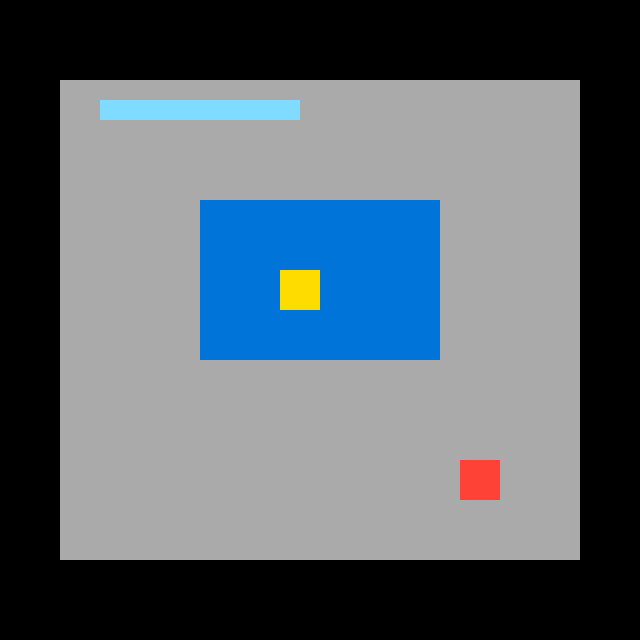
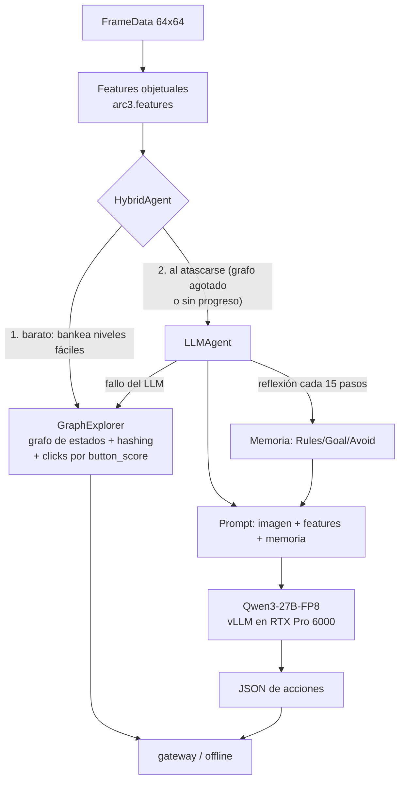

# ARC-AGI-3 — Diseño, features y estrategia (documento vivo)

> **Documento vivo.** Se actualiza en cada decisión de estrategia. Ver el
> [registro de decisiones](#registro-de-decisiones) al final. Última actualización: 2026-07-22.

---

## 1. El problema

ARC-AGI-3 (Kaggle `arc-prize-2026-arc-agi-3`) mide **inteligencia fluida**: un agente juega
environments interactivos **nunca vistos** y debe (a) **explorar** para descubrir las reglas,
(b) **modelar** el mundo a partir de observaciones, y (c) **fijarse metas** sin instrucciones.

- **Observación:** un grid **64×64** con colores 0–15 (una imagen). Se entrega en `FrameData`
  junto a `state` (`NOT_PLAYED/NOT_FINISHED/WIN/GAME_OVER`), `levels_completed`, `win_levels`
  y `available_actions`.
- **Acciones:** `RESET`(0), `ACTION1–5`(1–5) y `ACTION7`(7) simples (teclado/botones), y
  `ACTION6`(6) = **click(x,y)** en una celda. Los juegos se etiquetan `keyboard`, `click` o
  `keyboard_click`.
- **Objetivo/score:** completar niveles en el set **oculto** (~110 juegos). No hay ejemplos
  input→output como en ARC-AGI-2: aquí el agente **actúa** y aprende de las transiciones.
- **Reglas de cómputo:** submission = notebook. En el *rerun* real espera un gateway
  (`http://gateway:8001`) y juega los juegos ocultos ~8 h, **sin internet**; el score sale de
  las partidas (el `submission.parquet` es un dummy). En *Save & Run* se juegan los 25 juegos
  públicos **offline** — nuestro banco de pruebas gratis (no gasta cupo de submission).

**Por qué es difícil:** el sondeo aleatorio completa ~0 niveles en casi todos los juegos de
train; y la exploración sistemática (nuestra vía inicial) topa en **0.25** en el set oculto —
esa es la fracción de juegos resolubles *sin entender el objetivo*. El resto exige un modelo
del mundo y del objetivo. Ahí entra el LLM.

---

## 2. Features (feature engineering)

Un frame es una imagen 64×64. Extraemos estructura **objetual** dura (numpy puro, offline)
que alimenta tanto al explorador como al prompt del LLM. Ver `src/arc3/features.py`.

**Frame sintético de ejemplo** (no es un juego real; ilustrativo):

**Features extraídas sobre ese frame:**

- **Objetos** = componentes conexas 4-conectadas del mismo color, excluyendo el fondo
  (color mayoritario). Por objeto: color, tamaño, bounding box, centroide.
- **`button_score`** (recuadros): mezcla *rareza de color* + *compacidad/tamaño pequeño*. Los
  elementos interactivos (botones, avatares) suelen ser pequeños y de color raro → score alto
  (verde). Las regiones grandes de relleno → score bajo (amarillo). Guía dónde hacer click.
- **Borde enmascarado (recuadro blanco):** los juegos pintan contadores/HUD en el borde de
  3 px; el **hash de estado** los ignora (si no, cada frame sería único y el grafo explota).
  Además aprendemos una **máscara de contador** interior (celdas que cambian en ≥80% de las
  transiciones = animaciones/relojes) para no confundir estados que se ven distintos por ruido.
- **Features de transición (s,a,s′):** píxeles cambiados, bbox del cambio, colores
  ganados/perdidos y **vector de movimiento** (detecta si un objeto se trasladó dy,dx). Esto
  distingue "esta acción movió al avatar" de "no pasó nada".
- **Perfil por acción** (`action_summary.csv`): P(cambio), píxeles medios, P(subir nivel) por
  acción y juego — revela qué acciones "hacen algo" en cada juego.

Datos de train (`features_out/games_summary.csv`): 25 juegos, tags keyboard/click/mixto,
`win_levels` 6–10, y `p_change` muy variable (ft09=0.07, lp85=0.02 → casi nada responde salvo
la acción correcta; ls20/tu93=1.0 → todo cambia). Esta señal dirige el diseño del agente.

---

## 3. Estrategia

### 3.1. Arquitectura actual: híbrido explorador + LLM

- **Piso (GraphExplorer):** exploración de grafo de estados con hashing enmascarado, clicks
  por `button_score`, supresión de clases de click inertes (deadsig) y BFS a nodos pendientes.
  Garantiza el ~0.25 sin coste de LLM. `src/arc3/agent.py`.
- **Techo (LLMAgent):** cuando el explorador se atasca, el LLM decide sobre la imagen **+ la
  descripción textual de features** (nuestro diferenciador) **+ memoria de reflexión**.
- **Fallback:** cualquier fallo del LLM → GraphExplorer. Nunca se queda sin acción ni crashea.

### 3.2. ¿Por qué un LLM, y por qué así?

- **Por qué:** completar niveles ocultos exige *entender el objetivo* a partir de pocas
  observaciones — razonamiento de sentido común y de causa-efecto que la búsqueda ciega no
  tiene. Los mejores del leaderboard (0.86–1.21) son todos LLM-agénticos, no búsqueda pura.
- **Por qué Qwen3-27B-FP8 local:** cabe en la G4 (36 GB en 96 GB VRAM), es open-weights
  (offline, requisito de la competencia) y está probado en esta GPU (lo usó el ganador 1.21).
- **Por qué features en el prompt (diferenciador):** los VLM alucinan sobre píxeles crudos;
  dándoles la estructura ya computada ("obj rojo 4×4 en (46,46), button_score 1.0") razonan
  sobre **datos duros**. Confirmado en los logs: el modelo cita `button_score` al elegir click.

### 3.3. El prompt (qué se mide)

Dos prompts (ver `src/arc3/llm_prompt.py`):

1. **Acción** (`SYSTEM_PROMPT` + `build_user_text`): system fija el formato JSON estricto
   (`{"reasoning","actions":[{"name":"up|down|left|right|click","x","y"}]}`) y la instrucción
   de *confiar en los números sobre la imagen*. El user trae: `legal_actions`, la **estructura
   de objetos** con `button_score`, el **efecto de la última acción** (píxeles/movimiento), las
   acciones marcadas **inefectivas en ese estado**, y la **memoria** de reflexión.
2. **Reflexión** (`REFLECT_SYSTEM` + `build_reflection_text`): cada 15 transiciones, una 2ª
   llamada resume el historial en markdown `# Memory / ## Rules / ## Goal / ## Progress /
   ## Avoid` (<1800 chars), que se re-inyecta en el prompt de acción. Convierte
   predicción-de-una-acción en **aprendizaje en contexto**.

**Qué medimos** (vía Save & Run offline, sin gastar submission): niveles completados,
`llm_calls`, y el desglose de fallos (`exception` / `parse_empty` / `no_legal`), más un volcado
de muestras (prompt→respuesta cruda→acciones) y las reflexiones. Así iteramos el prompt con
evidencia. Ver el diagnóstico embebido en `notebooks/llm.ipynb`.

### 3.4. Trucos de ingeniería (del análisis del leaderboard)

Presupuesto global 8 h con corte; **concurrencia** de workers (vLLM agrupa requests → más
throughput en la misma GPU); RESET temprano; degradación a fallback ante cualquier excepción;
JSON-repair robusto; hashing/diff ignorando el borde; `enable_thinking=False` (Qwen3 es modelo
de razonamiento); `VLLM_TEST_FORCE_FP8_MARLIN=1` (evita el crash de flashinfer en GEMM FP8).

---

## 4. Formas de entrenar / mejorar el modelo

Espectro de menor a mayor coste. **El estado actual usa (A).**

### (A) Aprendizaje en contexto — *sin entrenar pesos* — **[actual]**
Reflexión periódica + features + memoria de inefectividad. Barato, generaliza a juegos
nuevos, cero riesgo de overfit. Es lo que hizo el agente 0.86. **Primer lever a exprimir.**

### (B) LoRA-SFT offline (behavior cloning) — *entrenar un adaptador pequeño*
Fine-tune LoRA del LLM sobre **trayectorias buenas** de los 25 juegos de train. Fuente de
trayectorias: (1) las secuencias con las que el **explorador/solver** completa niveles —
podemos **cargar el `.py` del juego** y resolver con búsqueda en el simulador (como los agentes
FORGE), generando trayectorias casi-óptimas; (2) augmentación (D4×color, reetiquetado).
- **Pro:** enseña el **formato** de acción y **idiomas comunes** ("clickear botones",
  "explorar y luego explotar") de forma nativa → menos fallos, mejores clicks.
- **Contra / riesgo clave:** los juegos ocultos son **distintos** → SFT sobre 25 juegos puede
  **sobreajustar** y no generalizar (el núcleo de la dificultad ARC). Mitigación: entrenar
  *skills generales* y augmentar agresivamente, no memorizar soluciones concretas.
- **Coste:** 1 corrida de entrenamiento en la G4 (LoRA r=16–64 sobre 27B es factible), datos
  generados offline. Medio.

### (C) TTT — test-time training / adaptación por-juego
En ARC-AGI-2 "TTT" = fine-tune en los ejemplos de la tarea al inferir. Aquí la "tarea" es un
juego jugado en muchos pasos, así que TTT significaría **actualizar el LoRA online** con
`(estado, acción, resultado)` durante la partida.
- **Realidad:** vLLM (serving) **no** soporta bien updates de pesos online; montar
  entrenamiento + servido del 27B en paralelo en 1 GPU es caro y frágil. El ganador **no** lo
  hizo — su "adaptación en test" es la **memoria de reflexión** (nuestra opción A), que es TTT
  *en contexto* sin tocar pesos.
- **Alternativa ligera si se quiere aprendizaje online real:** una CNN pequeña estilo
  *StochasticGoose* (política online por curiosidad, reward = "el frame cambió"), entrenada
  desde cero por nivel. Barata y sin LLM, pero **techo bajo** (~0.35–0.46 en el LB público).

### Recomendación
1. **Exprimir (A)** — reflexión + prompt + features. Es donde estamos; medir vía Save & Run.
2. Si (A) se estanca, **(B) LoRA-SFT** con trayectorias del solver-sobre-simulador y fuerte
   augmentación, vigilando generalización en un held-out de juegos de train.
3. **(C) TTT-online sobre el LLM: no** (coste/beneficio malo con vLLM). Usar reflexión como la
   adaptación en test; considerar la CNN online solo como política auxiliar barata.

> **¿Sirve LoRA + TTT aquí?** LoRA-SFT (B): **sí, condicionalmente** — útil para formato y
> skills generales, con riesgo de overfit a los 25 juegos; el valor es enseñar a *generalizar*,
> no a memorizar. TTT-online sobre el LLM (C): **no lo recomendamos** por incompatibilidad
> práctica con vLLM y mal coste/beneficio; la reflexión en contexto cumple ese rol mejor.

---

## 5. Registro de decisiones

| Fecha | Decisión | Evidencia / razón |
|---|---|---|
| 2026-07-18 | Vía inicial = exploración de grafo (GraphExplorer), CPU | mejor coste/beneficio del LB público (0.54 sin ML); no gasta cuota G4 |
| 2026-07-19 | v2 = runner paralelo (workers) | rerun es HTTP-latencia; concurrencia sube throughput |
| 2026-07-20 | Confirmado: exploración pura capada | v1=v2=0.25 idéntico pese a 14× throughput → cuello semántico |
| 2026-07-21 | v3 reinicio diversificado = 0.25; pivote a LLM en la G4 | los reinicios tampoco mueven el LB → hace falta entender el objetivo |
| 2026-07-22 | Fase 3: LLMAgent con features en prompt; resueltos blockers vLLM (Marlin FP8, thinking off) | el modelo lee nuestras features (smoke test); llm_fails 6.5% |
| 2026-07-22 | HybridAgent (piso explorador + techo LLM) enviado = 0.25 | LLM single-shot no rompe el techo → añadir memoria |
| 2026-07-22 | + Reflection memory (opción A); trigger diario 8pm; Save & Run como banco de pruebas con diagnóstico | replicar el diferencial del agente 0.86; iterar sin gastar submission |
| 2026-07-22 | Diagnóstico v8: el LLM entiende mecánica+objetivo (memoria excelente) pero no rompe el piso; re-elige clicks pese a saber que no sirven | volcado real de prompts/respuestas/reflexiones en el log de Save & Run |
| 2026-07-22 | + Inyección de "action effectiveness" (P(cambio) por acción) en el prompt | contrarresta el desfase observado: dato duro de qué acciones mueven el mundo |
| 2026-07-22 | v9: fallos 7.7%→5% pero niveles offline planos (9) | los tweaks de prompt mejoran robustez, no rompen el muro; el cuello es planeación/objetivo, no el prompt |

## Diagnóstico del muro (2026-07-22)

Save & Run con volcado confirma: el LLM **entiende** la mecánica y el objetivo (la memoria de
reflexión infiere reglas correctas y hasta el tipo de meta), pero **no ejecuta un plan** hacia
ese objetivo. Los niveles que completa son los mismos que la exploración ya alcanza. Los tweaks
de prompt (effectiveness, ineffective, memoria) reducen fallos pero no añaden niveles.

**Conclusión:** para romper 0.25 hacen falta inversiones mayores, no más ajuste de prompt:
1. **Planner sobre simulador** (estilo FORGE): si el `.py` del juego es accesible en el rerun,
   buscar la solución en el simulador local domina al LLM. Depende de accesibilidad del source.
2. **LoRA-SFT** (opción B) sobre trayectorias del solver, con augmentación fuerte.
3. **Loop agéntico más profundo**: multi-candidato + verificación, o búsqueda guiada por el LLM
   (el LLM propone sub-objetivos; la búsqueda los alcanza).

Estas son decisiones de inversión (coste G4 + ingeniería) a consultar antes de ejecutar.

| 2026-07-22 | **Loop agéntico + búsqueda guiada** (elegido): el LLM propone un sub-objetivo espacial `goal:{x,y}`; un controlador de navegación con **modelo de movimiento aprendido** (acción→vector, de las features) alcanza el objetivo sin gastar llamadas al LLM por paso | ataca la causa raíz (planeación); en test la navegación reemplaza ~½ de las llamadas al LLM |
| 2026-07-22 | v10 Save&Run: navegación activa (nav_used=1692), fallos 3.7% (récord), pero niveles offline planos (9) | la navegación es más capaz/eficiente pero el test offline (30min) está limitado por tiempo; el rerun oculto (8h) es donde la eficiencia compone. Plateau offline v6–v10 = 9 |

## Nota sobre el plateau offline (2026-07-22)

Los niveles **offline** se estancan en ~9 (v6–v10) pese a mejoras reales (reflexión,
effectiveness, navegación guiada, fallos 7.7%→3.7%). Dos lecturas:
1. El test offline son **30 min/8 workers sobre 25 juegos** → limitado por tiempo. Las mejoras
   de eficiencia (navegación reemplaza ½ de las llamadas LLM) **componen en el rerun de 8 h**,
   donde el tiempo por juego es mucho mayor. El offline subestima al agente en el oculto.
2. Los juegos que faltan necesitan más que navegación (click-puzzles, match-config, lógica
   multi-paso). Próximos sub-objetivos a añadir al loop: `click_all(sig)`, `match_target`.

El siguiente dato duro es el **score oculto de v10** (lo envía el trigger diario). Decidir más
inversión (LoRA / planner sobre simulador) tras ver ese número.

> **Convención:** toda decisión de estrategia nueva se añade a esta tabla y actualiza las
> secciones relevantes arriba, junto con la fecha de "Última actualización".
