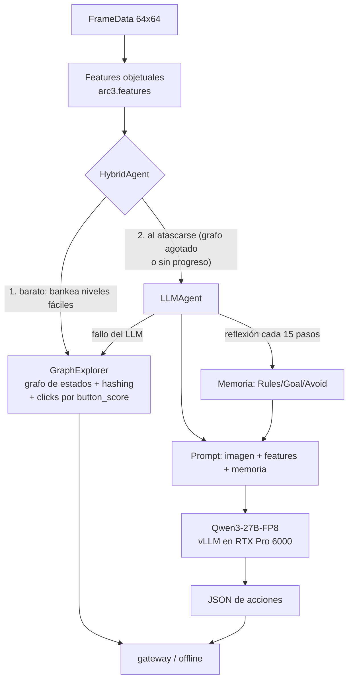

# ARC-AGI-3 — Diseño, features y estrategia (documento vivo)

> **Documento vivo.** Se actualiza en cada decisión de estrategia. Última actualización:
> **2026-08-17** (§8.9: reanálisis del cuello tras cuatro experimentos — **acciones y niveles están
> desacoplados por encima de un piso; la frontera es semántica, no de presupuesto**).
>
> **Empieza por aquí si buscas el estado vigente:** §8.9 (el reanálisis) y
> [ARCHITECTURE.md](ARCHITECTURE.md) §2 (los *seams* por donde entra código nuestro, ya validados
> en producción). §8.1–§8.7 conservan la medición del presupuesto, que sigue siendo correcta como
> descripción aunque §8.9 corrige su lectura estratégica.
> Le siguen el [registro de decisiones](#5-registro-de-decisiones) y el [estado ejecutivo](#6-estado-actual-2026-08-11--resumen-ejecutivo).
>
> Las secciones §1–§4 son el diseño fundacional (problema, features, arquitectura propia,
> tácticas de entrenamiento). Su descripción del **agente propio** quedó superada por el pivote al
> harness público (§5, 2026-08-11): hoy competimos con el harness duck + injertos, y nuestro
> `src/arc3` aporta las features y la navegación que se re-montan sobre él. El análisis del
> problema y de las features sigue vigente.

---

## 1. El problema

ARC-AGI-3 (Kaggle `arc-prize-2026-arc-agi-3`) mide **inteligencia fluida**: un agente juega
environments interactivos **nunca vistos** y debe (a) **explorar** para descubrir las reglas,
(b) **modelar** el mundo a partir de observaciones, y (c) **fijarse metas** sin instrucciones.

- **Observación:** un grid **64×64** con colores 0–15 (una imagen). Se entrega en `FrameData`
  junto a `state` (`NOT_PLAYED/NOT_FINISHED/WIN/GAME_OVER`), `levels_completed`, `win_levels`
  y `available_actions`.
- **Acciones:** `RESET`(0), `ACTION1–5`(1–5) y `ACTION7`(7) simples (teclado/botones), y
  `ACTION6`(6) = **click(x,y)** en una celda. Los juegos se etiquetan `keyboard`, `click` o
  `keyboard_click`.
- **Objetivo/score:** completar niveles en el set **oculto** (~110 juegos). No hay ejemplos
  input→output como en ARC-AGI-2: aquí el agente **actúa** y aprende de las transiciones.
- **Reglas de cómputo:** submission = notebook. En el *rerun* real espera un gateway
  (`http://gateway:8001`) y juega los juegos ocultos ~8 h, **sin internet**; el score sale de
  las partidas (el `submission.parquet` es un dummy). En *Save & Run* se juegan los 25 juegos
  públicos **offline** — nuestro banco de pruebas gratis (no gasta cupo de submission).

**Por qué es difícil:** el sondeo aleatorio completa ~0 niveles en casi todos los juegos de
train; y la exploración sistemática (nuestra vía inicial) topa en **0.25** en el set oculto —
esa es la fracción de juegos resolubles *sin entender el objetivo*. El resto exige un modelo
del mundo y del objetivo. Ahí entra el LLM.

---

## 2. Features (feature engineering)

Un frame es una imagen 64×64. Extraemos estructura **objetual** dura (numpy puro, offline)
que alimenta tanto al explorador como al prompt del LLM. Ver `src/arc3/features.py`.

**Frame sintético de ejemplo** (no es un juego real; ilustrativo):


**Features extraídas sobre ese frame:**


- **Objetos** = componentes conexas 4-conectadas del mismo color, excluyendo el fondo
  (color mayoritario). Por objeto: color, tamaño, bounding box, centroide.
- **`button_score`** (recuadros): mezcla *rareza de color* + *compacidad/tamaño pequeño*. Los
  elementos interactivos (botones, avatares) suelen ser pequeños y de color raro → score alto
  (verde). Las regiones grandes de relleno → score bajo (amarillo). Guía dónde hacer click.
- **Borde enmascarado (recuadro blanco):** los juegos pintan contadores/HUD en el borde de
  3 px; el **hash de estado** los ignora (si no, cada frame sería único y el grafo explota).
  Además aprendemos una **máscara de contador** interior (celdas que cambian en ≥80% de las
  transiciones = animaciones/relojes) para no confundir estados que se ven distintos por ruido.
- **Features de transición (s,a,s′):** píxeles cambiados, bbox del cambio, colores
  ganados/perdidos y **vector de movimiento** (detecta si un objeto se trasladó dy,dx). Esto
  distingue "esta acción movió al avatar" de "no pasó nada".
- **Perfil por acción** (`action_summary.csv`): P(cambio), píxeles medios, P(subir nivel) por
  acción y juego — revela qué acciones "hacen algo" en cada juego.

Datos de train (`features_out/games_summary.csv`): 25 juegos, tags keyboard/click/mixto,
`win_levels` 6–10, y `p_change` muy variable (ft09=0.07, lp85=0.02 → casi nada responde salvo
la acción correcta; ls20/tu93=1.0 → todo cambia). Esta señal dirige el diseño del agente.

---

## 3. Estrategia

### 3.1. Arquitectura actual: híbrido explorador + LLM



- **Piso (GraphExplorer):** exploración de grafo de estados con hashing enmascarado, clicks
  por `button_score`, supresión de clases de click inertes (deadsig) y BFS a nodos pendientes.
  Garantiza el ~0.25 sin coste de LLM. `src/arc3/agent.py`.
- **Techo (LLMAgent):** cuando el explorador se atasca, el LLM decide sobre la imagen **+ la
  descripción textual de features** (nuestro diferenciador) **+ memoria de reflexión**.
- **Fallback:** cualquier fallo del LLM → GraphExplorer. Nunca se queda sin acción ni crashea.

### 3.2. ¿Por qué un LLM, y por qué así?

- **Por qué:** completar niveles ocultos exige *entender el objetivo* a partir de pocas
  observaciones — razonamiento de sentido común y de causa-efecto que la búsqueda ciega no
  tiene. Los mejores del leaderboard (0.86–1.21) son todos LLM-agénticos, no búsqueda pura.
- **Por qué Qwen3-27B-FP8 local:** cabe en la G4 (36 GB en 96 GB VRAM), es open-weights
  (offline, requisito de la competencia) y está probado en esta GPU (lo usó el ganador 1.21).
- **Por qué features en el prompt (diferenciador):** los VLM alucinan sobre píxeles crudos;
  dándoles la estructura ya computada ("obj rojo 4×4 en (46,46), button_score 1.0") razonan
  sobre **datos duros**. Confirmado en los logs: el modelo cita `button_score` al elegir click.

### 3.3. El prompt (qué se mide)

Dos prompts (ver `src/arc3/llm_prompt.py`):

1. **Acción** (`SYSTEM_PROMPT` + `build_user_text`): system fija el formato JSON estricto
   (`{"reasoning","actions":[{"name":"up|down|left|right|click","x","y"}]}`) y la instrucción
   de *confiar en los números sobre la imagen*. El user trae: `legal_actions`, la **estructura
   de objetos** con `button_score`, el **efecto de la última acción** (píxeles/movimiento), las
   acciones marcadas **inefectivas en ese estado**, y la **memoria** de reflexión.
2. **Reflexión** (`REFLECT_SYSTEM` + `build_reflection_text`): cada 15 transiciones, una 2ª
   llamada resume el historial en markdown `# Memory / ## Rules / ## Goal / ## Progress /
   ## Avoid` (<1800 chars), que se re-inyecta en el prompt de acción. Convierte
   predicción-de-una-acción en **aprendizaje en contexto**.

**Qué medimos** (vía Save & Run offline, sin gastar submission): niveles completados,
`llm_calls`, y el desglose de fallos (`exception` / `parse_empty` / `no_legal`), más un volcado
de muestras (prompt→respuesta cruda→acciones) y las reflexiones. Así iteramos el prompt con
evidencia. Ver el diagnóstico embebido en `notebooks/llm.ipynb`.

### 3.4. Trucos de ingeniería (del análisis del leaderboard)

Presupuesto global 8 h con corte; **concurrencia** de workers (vLLM agrupa requests → más
throughput en la misma GPU); RESET temprano; degradación a fallback ante cualquier excepción;
JSON-repair robusto; hashing/diff ignorando el borde; `enable_thinking=False` (Qwen3 es modelo
de razonamiento); `VLLM_TEST_FORCE_FP8_MARLIN=1` (evita el crash de flashinfer en GEMM FP8).

---

## 4. Tácticas de aprendizaje / entrenamiento (detallado)

### 4.0. ¿Qué significa "entrenar" en ARC-AGI-3? (el encuadre)

Esto es clave y suele confundirse. ARC-AGI-3 **no** es aprendizaje supervisado como ARC-AGI-2: no hay
pares `input→output` que ajustar. Es un problema **RL-interactivo** (el agente actúa, observa, y solo
recibe señal esparsa: `levels_completed`). "Aprender" aquí puede significar **tres cosas distintas**,
y los tres coexisten en los agentes top del leaderboard:

1. **Aprender los PESOS del modelo** (con descenso de gradiente): SFT/LoRA offline, o RL. Cambia la red.
2. **Aprender EN CONTEXTO** (sin tocar pesos): meter en el prompt lo aprendido durante la partida
   (reglas, qué no funciona) para que el LLM lo use dentro de su ventana de atención.
3. **Aprender un MODELO DEL MUNDO explícito** durante la partida: estructuras de datos (un grafo de
   estados, un modelo de movimiento) que se actualizan con la experiencia — aprendizaje **sin
   gradientes** y sin LLM.

La táctica correcta depende de cuál cuello domina. **Nuestro estado actual usa (2) y (3); no usamos
(1).** Y el hallazgo reciente (§4.2) reordena las prioridades.

### 4.1. Lo que USAMOS ahora: aprendizaje sin gradientes (in-context + world-model)

**(3) Modelo del mundo explícito (el GraphExplorer).** Es aprendizaje real, online, sin gradientes:
- **Grafo de estados**: cada frame distinto (tras enmascarar) es un nodo; cada acción, una arista. El
  agente *construye* este mapa jugando y lo *reusa* (BFS a nodos con acciones pendientes, replay tras
  RESET). Aprende la topología del juego.
- **Máscara de contador aprendida**: durante 12 transiciones aprende qué celdas interiores son ruido
  (animaciones/contadores) y las congela — aprende a *ignorar* lo irrelevante.
- **P(cambio) por acción y `deadsig`**: aprende qué acciones/clicks mueven el mundo en cada estado y
  cuáles son inertes. Aprende la dinámica local.
- **Modelo de movimiento** (`acción → vector (dy,dx)`): aprende cómo cada tecla mueve al avatar, y con
  eso navega hacia objetivos. Aprende la física del juego.

**(2) Aprendizaje en contexto (el LLMAgent).** El LLM está **congelado**; "aprende" solo dentro del
prompt:
- **Memoria de reflexión**: cada 15 transiciones, una 2ª llamada resume el historial en reglas
  (`## Rules / ## Goal / ## Avoid`) que se re-inyectan. El modelo *acumula* comprensión sin cambiar
  pesos — es TTT *en contexto*.
- **Memoria de inefectividad** por `(hash_estado, acción)` y **efectividad** por acción: datos duros
  re-inyectados para que no repita lo que ya falló.

**Por qué esta táctica (y no entrenar pesos):** (a) **generaliza** a juegos nuevos por diseño — no hay
riesgo de overfit porque no ajustamos nada a los 25 de train; (b) es **barata** (sin corridas de
entrenamiento); (c) es exactamente lo que hizo el mejor agente público de un-solo-LLM (LB 0.86). Es el
primer lever a exprimir antes de pagar el coste de entrenar.

### 4.2. Estado HONESTO de esta táctica (2026-07-27 — crítico, reordena todo)

Medimos con submissions reales y una **ablación** (re-enviar el mismo config): el loop in-context del
LLM **no supera 0.25 de forma robusta**. La memoria *funciona* (infiere reglas correctas, verificado en
los logs), pero **no se traduce en niveles nuevos** por encima del piso de exploración; el único 0.26
resultó ser **ruido de semilla** (banda medida ~1 nivel ≈ 0.01, ver §6-bis del working note).

**El reencuadre que esto fuerza:** el cuello inmediato **no** es la táctica de entrenamiento del LLM.
Es que nuestro **modelo-del-mundo explorador (0.25) está muy por debajo del explorador público
(poby7722 = 0.54)** — más del doble, sin ML y sin GPU. Cerrar esa brecha **no requiere entrenar pesos**:
es ingeniería del aprendizaje-sin-gradientes (mejor hashing de estado, cobertura de candidatos de
click, detección de ciclos, presupuesto serial-por-juego). Por eso la prioridad #1 dejó de ser "más
LLM" y pasó a "arreglar el explorador". El LLM se reserva para lo que la exploración *genuinamente* no
alcanza.

### 4.3. (B) LoRA-SFT offline — entrenar un adaptador pequeño (cuándo y cómo)

Si (2)+(3) se agotan, el siguiente escalón **sí** toca pesos. Mecánica:
- **Qué es LoRA**: en vez de re-entrenar los 27B parámetros, se inserta un par de matrices de bajo
  rango `A·B` (rango r=16–64) en las capas de atención; solo se entrenan esos ~0.1% de parámetros.
  Cabe en la G4 y es rápido.
- **De dónde salen los datos (behavior cloning)**: generamos **trayectorias buenas** offline. La fuente
  potente: **cargar el `.py` del juego** (accesible offline en los 25 de train) y **resolverlo con
  búsqueda en el simulador** (BFS/beam, estilo FORGE) → secuencias `(estado → acción óptima)`. Luego se
  entrena al LLM a imitar esas acciones dado el estado + nuestras features.
- **Augmentación** (obligatoria contra overfit): D4 (rotaciones/reflejos) × permutación de colores ×
  reetiquetado de acciones equivalentes → multiplica los 25 juegos en miles de variantes.
- **El riesgo central (el núcleo de ARC)**: los juegos **ocultos son distintos** de los 25 de train.
  SFT puede **memorizar** soluciones concretas y **no generalizar**. La mitigación no es opcional:
  entrenar *skills generales* ("ir hacia el botón pequeño y raro", "explorar y luego explotar"), no
  soluciones; y validar en un **held-out** de juegos de train nunca vistos por el SFT. Si el held-out no
  mejora, el SFT está memorizando y no sirve.
- **Coste**: 1 corrida de entrenamiento en la G4 + generación de datos offline. Medio.

### 4.4. (C) TTT online sobre el LLM — por qué NO

"TTT" (test-time training) en ARC-AGI-2 = fine-tunear en los ejemplos de la tarea al inferir. Aquí sería
**actualizar el LoRA online** con `(estado, acción, resultado)` durante la partida de 8 h.
- **Por qué no**: vLLM (el servidor de inferencia) **no** soporta bien updates de pesos en caliente;
  montar entrenamiento **y** servido del 27B en paralelo en **una** GPU es caro, frágil y come el
  presupuesto de 8 h. El ganador (1.21) **no** lo hizo.
- **Qué hacemos en su lugar**: la **memoria de reflexión** ES la adaptación en test — TTT *en contexto*,
  sin tocar pesos, sin el coste. Cumple el mismo rol (el agente se especializa al juego actual) de forma
  robusta.

### 4.5. (D) RL online ligero (CNN estilo StochasticGoose) — la alternativa sin LLM

Si se quisiera aprendizaje **online con gradientes** pero barato: una CNN pequeña (no un LLM) entrenada
desde cero **por nivel**, con reward de curiosidad (`+1` si la acción cambió el frame). Es lo que hizo
el sample oficial. **Pro**: barata, sin GPU cara, adapta online de verdad. **Contra**: **techo bajo**
(~0.35–0.46 en el LB) porque aprende "qué hace algo", no "cuál es el objetivo". La descartamos como vía
principal, pero es un candidato de política auxiliar si el explorador+LLM dejan huecos.

### 4.6. Recomendación (actualizada tras el reencuadre 2026-07-27)

| Prioridad | Táctica | Tipo de aprendizaje | Coste | Estado |
|---|---|---|---|---|
| **1** | Cerrar la brecha del **explorador** a 0.54 (hashing, cobertura, presupuesto serial) | mundo explícito, sin gradientes | CPU, **sin cuota G4** | **el lever de mayor valor ahora** |
| 2 | LLM in-context (reflexión+features) solo sobre juegos que la exploración no alcanza | en contexto, sin gradientes | G4 (inferencia) | construido; noise-bound sobre el piso actual |
| 3 | LoRA-SFT con trayectorias del solver + augmentación fuerte + held-out | pesos, offline | G4 (1 entrenamiento) | si 1–2 se agotan |
| 4 | TTT-online sobre el LLM | pesos, online | alto/frágil | **descartado** (usar reflexión) |

> **¿Sirve LoRA + TTT aquí?** **LoRA-SFT**: sí, condicionalmente — para formato y skills generales, con
> riesgo real de overfit a los 25 juegos; el valor es enseñar a *generalizar*, no a memorizar, y hay que
> probarlo en held-out. **TTT-online sobre el LLM**: no — incompatible en la práctica con vLLM y mal
> coste/beneficio; la reflexión en contexto ya cumple ese papel. **Y el punto más importante hoy**: el
> cuello actual no se resuelve con *ninguna* forma de entrenar pesos, sino mejorando el **modelo del
> mundo sin gradientes** del explorador (0.25→0.54), que es gratis en GPU.

---

## 5. Registro de decisiones

| Fecha | Decisión | Evidencia / razón |
|---|---|---|
| 2026-07-18 | Vía inicial = exploración de grafo (GraphExplorer), CPU | mejor coste/beneficio del LB público (0.54 sin ML); no gasta cuota G4 |
| 2026-07-19 | v2 = runner paralelo (workers) | rerun es HTTP-latencia; concurrencia sube throughput |
| 2026-07-20 | Confirmado: exploración pura capada | v1=v2=0.25 idéntico pese a 14× throughput → cuello semántico |
| 2026-07-21 | v3 reinicio diversificado = 0.25; pivote a LLM en la G4 | los reinicios tampoco mueven el LB → hace falta entender el objetivo |
| 2026-07-22 | Fase 3: LLMAgent con features en prompt; resueltos blockers vLLM (Marlin FP8, thinking off) | el modelo lee nuestras features (smoke test); llm_fails 6.5% |
| 2026-07-22 | HybridAgent (piso explorador + techo LLM) enviado = 0.25 | LLM single-shot no rompe el techo → añadir memoria |
| 2026-07-22 | + Reflection memory (opción A); trigger diario 8pm; Save & Run como banco de pruebas con diagnóstico | replicar el diferencial del agente 0.86; iterar sin gastar submission |
| 2026-07-22 | Diagnóstico v8: el LLM entiende mecánica+objetivo (memoria excelente) pero no rompe el piso; re-elige clicks pese a saber que no sirven | volcado real de prompts/respuestas/reflexiones en el log de Save & Run |
| 2026-07-22 | + Inyección de "action effectiveness" (P(cambio) por acción) en el prompt | contrarresta el desfase observado: dato duro de qué acciones mueven el mundo |
| 2026-07-22 | v9: fallos 7.7%→5% pero niveles offline planos (9) | los tweaks de prompt mejoran robustez, no rompen el muro; el cuello es planeación/objetivo, no el prompt |

## Diagnóstico del muro (2026-07-22)

Save & Run con volcado confirma: el LLM **entiende** la mecánica y el objetivo (la memoria de
reflexión infiere reglas correctas y hasta el tipo de meta), pero **no ejecuta un plan** hacia
ese objetivo. Los niveles que completa son los mismos que la exploración ya alcanza. Los tweaks
de prompt (effectiveness, ineffective, memoria) reducen fallos pero no añaden niveles.

**Conclusión:** para romper 0.25 hacen falta inversiones mayores, no más ajuste de prompt:
1. **Planner sobre simulador** (estilo FORGE): si el `.py` del juego es accesible en el rerun,
   buscar la solución en el simulador local domina al LLM. Depende de accesibilidad del source.
2. **LoRA-SFT** (opción B) sobre trayectorias del solver, con augmentación fuerte.
3. **Loop agéntico más profundo**: multi-candidato + verificación, o búsqueda guiada por el LLM
   (el LLM propone sub-objetivos; la búsqueda los alcanza).

Estas son decisiones de inversión (coste G4 + ingeniería) a consultar antes de ejecutar.

| 2026-07-22 | **Loop agéntico + búsqueda guiada** (elegido): el LLM propone un sub-objetivo espacial `goal:{x,y}`; un controlador de navegación con **modelo de movimiento aprendido** (acción→vector, de las features) alcanza el objetivo sin gastar llamadas al LLM por paso | ataca la causa raíz (planeación); en test la navegación reemplaza ~½ de las llamadas al LLM |
| 2026-07-22 | v10 Save&Run: navegación activa (nav_used=1692), fallos 3.7% (récord), pero niveles offline planos (9) | la navegación es más capaz/eficiente pero el test offline (30min) está limitado por tiempo; el rerun oculto (8h) es donde la eficiencia compone. Plateau offline v6–v10 = 9 |

## Nota sobre el plateau offline (2026-07-22)

Los niveles **offline** se estancan en ~9 (v6–v10) pese a mejoras reales (reflexión,
effectiveness, navegación guiada, fallos 7.7%→3.7%). Dos lecturas:
1. El test offline son **30 min/8 workers sobre 25 juegos** → limitado por tiempo. Las mejoras
   de eficiencia (navegación reemplaza ½ de las llamadas LLM) **componen en el rerun de 8 h**,
   donde el tiempo por juego es mucho mayor. El offline subestima al agente en el oculto.
2. Los juegos que faltan necesitan más que navegación (click-puzzles, match-config, lógica
   multi-paso). Próximos sub-objetivos a añadir al loop: `click_all(sig)`, `match_target`.

El siguiente dato duro es el **score oculto de v10** (lo envía el trigger diario). Decidir más
inversión (LoRA / planner sobre simulador) tras ver ese número.

**RESULTADO (2026-07-23): v10 = 0.26** — primer quiebre del piso 0.25. El loop agéntico SÍ compone en
las 8 h (offline plano confirmó ser solo limitación de tiempo). Plan en ejecución: apilar sub-objetivos
más ricos (`click_all`, `match_target`).

> **Convención:** toda decisión de estrategia nueva se añade a esta tabla y actualiza las
> secciones relevantes arriba, junto con la fecha de "Última actualización".

**ACTUALIZACION 2026-07-26: 0.26 fue RUIDO.** 7 submissions LLM/hibrido = 0.26 una vez (v10), 0.25 seis veces. El loop agentico no supera 0.25 de forma robusta; los sub-objetivos incrementales estan por debajo de la banda de ruido (~1 nivel = 0.01). Proximo paso debe ser un lever cualitativamente mas fuerte (planner/LoRA) o protocolo de reduccion de varianza. Ver paper/working_note.

**ABLACION 2026-07-27: confirmado.** Re-enviar el config EXACTO de v10 (nav-sola) dio **0.25** (antes 0.26) → medición directa, mismo-config, de la banda de ruido. 0.26 = varianza de semilla, sin ambigüedad. Además, **reencuadre**: 0.25 es el techo de *nuestro* explorador, no de la exploración (poby7722 = 0.54 sin ML). Prioridad #1 pasa a **cerrar la brecha del explorador** (CPU, sin cuota).

**REDUCCIÓN DE VARIANZA 2026-07-27 (elegido por el usuario):** temp LLM → 0 (greedy, determinista); explorador ya determinista (sin RNG); varianza residual por timing/concurrencia medida ~1 nivel. Regla: solo cambios con efecto esperado ≥3 niveles (≈0.03) valen un slot.

| 2026-08-10 | Auditoría (pedida por el usuario, §7): replicar la mejor referencia pública ANTES de declarar un techo; juegos sintéticos adoptados como held-out | el "techo 0.25 de la exploración" se declaró sin calibrar contra poby7722; trigger diario reparado (falló en silencio ~2 sem) |
| 2026-08-10 | Réplica fiel del pipeline 0.54 enviada → **0.22** | el set oculto ROTÓ (~1-jul): el 0.54 era del set de junio; nuestra exploración (0.25) ya era mejor que la referencia en el set actual. Lección: toda referencia tiene fecha |
| 2026-08-11 | **PIVOTE a base duck**: réplica del fork v12 de TAAF (thtennant, con taaf-grafts) → **1.17** (4.7× nuestro 0.25) | el LB actual (top 1.86, cluster 1.5–1.7) son forks del duck; grafts confirmados instalados en el log → brecha 1.17→1.5 = diferencias de config, no graft caído |
| 2026-08-11 | Open-source completo: repo GitHub público (MIT), 5/5 kernels públicos, atribución en README | reglas ARC Prize: "all code and methods must be open sourced to be eligible" (milestone #2: 30-sep) |
| 2026-08-11 | Brecha 1.17→1.5 re-diagnosticada: NO es config — el v12 de thtennant usa flags idénticos a los nuestros | leído el notebook de referencia: `{efficiency, retry_guard, shortcircuit}` exacto. El duck tiene varianza alta entre corridas (Tufa: la versión legible "no tuvo la misma suerte" que el 1.21); el cluster 1.5–1.7 = máximo de N envíos diarios. Respuesta: enviar a diario (trigger ya lo hace) + cambios que muevan la media |
| 2026-08-11 | **+ goalkeep** (duck v3, sigue al v18 de thtennant publicado hoy) | goalkeep retiene el modelo del mundo (el stock lo borra en cada game-over/nivel: no-vacío solo 33/481 turnos, medido por thtennant) e inyecta digest de resultados medidos por turno — la misma tesis de nuestra inyección de effectiveness de Fase 3. Piso garantizado: install() blindado → peor caso = config v12 (1.17) |
| 2026-08-11 | Causa raíz del trigger diario: code competitions exigen `-v <versión>` — el script nunca lo pasó, el trigger NUNCA envió con éxito | corregido: `kernel_versions.json` (escrito por push_kernels.py) + `-v` en daily_submit.ps1 (con `-DryRun` verificado). "400 = cupo agotado" era un diagnóstico falso; el cupo real dice "Submission limit exceeded". v3 goalkeep enviada manual (id 55445915) |
| 2026-08-12 | **goalkeep = 0.81 (−0.36 vs 1.17): REVERTIDO** — trigger diario devuelto a duck v2 (config v12) vía kernel_versions.json, sin gastar GPU | 0.81 queda por debajo de toda la banda duck-base (1.1–1.3): no es varianza. Retener el modelo del mundo atrinchera errores; el digest gasta contexto. Lección: un graft publicado el mismo día no trae evidencia del set oculto — esperar señal del autor antes de adoptar. `schema_helpers` (viernes) irá sobre config v12, no sobre goalkeep |

---

## 6. Estado actual (2026-08-11) — resumen ejecutivo

**Dónde estamos:** score oculto **1.17** (duck v12-fork: harness TAAF + Qwen3-27B-FP8 en la G4 +
taaf-grafts), un salto de 4.7× sobre todo lo que logró nuestro stack propio (0.25–0.26). Es
esencialmente el número del ganador del milestone de junio (1.21) pero sobre el set oculto actual,
más difícil. LB: top 1.86, cluster denso 1.5–1.7 (forks del mismo duck).

**Qué aprendimos (lo valioso):**
1. **Un harness LLM que razona sobre objetivos vale ~5× frente a exploración pura** — la hipótesis
   semántica era correcta; lo que faltaba era la escala/madurez del harness, no la idea.
2. Toda referencia tiene fecha: el set oculto rota (la réplica "0.54" dio 0.22). Calibrar siempre
   contra el LB vigente.
3. La brecha 1.17→1.5 NO es de config: el v12 de referencia usa flags idénticos a los nuestros. El
   duck tiene **varianza alta entre corridas** (Tufa mismo no reprodujo su 1.21 con la versión
   legible) y el cluster 1.5–1.7 es el máximo de N envíos diarios. Nuestro 1.17 es 1 muestra.

**Camino elegido:** (1) enviar a diario la mejor config (el trigger ya lo hace) — con varianza alta,
cada slot es una muestra y el LB retiene el máximo; (2) adoptar cambios que muevan la MEDIA:
`goalkeep` (v18 de thtennant, hoy) que retiene el modelo del mundo e inyecta resultados medidos por
turno — convergente con nuestra tesis de inyección de features; (3) montar nuestro diferenciador
(features objetuales de `src/arc3` en el prompt del solver TAAF) sobre esta base; (4) juegos
sintéticos como held-out de generalización para iterar sin gastar slots.

**Infra estable:** submission = kernel `arc-agi3-duck` (dual-mode gateway/offline, vLLM boot con Marlin
FP8 + thinking off); trigger diario 8pm auto-envía; Save & Run con volcado diagnóstico como banco de
pruebas gratis; working notes EN+ES y este doc como documentos vivos; todo público (repo MIT + kernels).

---

## 7. Auditoría de la estrategia sin-gradientes (2026-08-10, pedida por el usuario)

Veredicto por punto, con evidencia:

1. **Dirección: CORRECTA.** El LB público confirma que la exploración sin gradientes bien hecha (0.54)
   supera al RL-online con gradientes (CNN, 0.35–0.46) en coste/beneficio, y es la base de todos los
   agentes altos. Nuestro déficit era de **implementación/harness**, no de paradigma.
2. **Fallo de proceso detectado (la lección de la auditoría):** declaramos "techo de exploración =
   0.25" **sin calibrar contra la mejor referencia pública** (0.54), y pivotamos al LLM sobre esa
   premisa falsa. Regla nueva: *antes de declarar un techo y pivotar, replicar la mejor referencia
   pública de esa vía y medir contra ella.*
3. **El harness pesa tanto como el algoritmo.** La brecha 0.25→0.54 es en parte **scheduling**: el
   Swarm oficial corre todos los juegos **concurrentes** (cada uno con 8 h y 15000 acciones); nuestro
   runner repartía presupuesto (~40 min/juego). Réplica fiel primero, mejoras después.
4. **Diferencias de algoritmo detectadas** (nuestro explorador vs 0.54): (a) su contador de
   agotamiento se **resetea al descubrir estados nuevos** (el nuestro nunca — abandona temprano);
   (b) **sin deadsig** (nuestra supresión de clases de click pudo dañar exploración; su nota dice que
   podas parecidas "mataron niveles"); (c) click-likeness `fill/(1+size)` plano (el suyo, validado con
   A/B propio) vs nuestro score con rareza; (d) efectividad medida sobre **cambio de estado
   enmascarado**, no de píxeles.
5. **Reducción de varianza: BIEN** (agente determinista, banda medida ~1 nivel). Se mantiene la regla:
   solo cambios con efecto esperado ≥3 niveles valen slot.
6. **Límite conocido de la vía:** la exploración sin gradientes topa en ~0.54 público. Para 0.86–1.21
   hace falta el LLM — pero **sobre la base 0.54**, no sobre 0.25. El trabajo LLM ya construido
   (features, reflexión, navegación) queda listo para re-montarse sobre la base nueva.
7. **Idea del usuario — JUEGOS SINTÉTICOS (aceptada, registrada como lever de validación):** los
   environment_files son subclases de `ARCBaseGame` (python puro sobre arcengine). Podemos **generar
   variantes sintéticas** (permutación de colores, reflejos/rotaciones, tamaños, mecánicas simples
   recombinadas) y usarlas como: (a) **held-out de generalización** — validar mejoras del explorador
   sin gastar slots ni sobreajustar a los 25 públicos; (b) banco de calibración de la banda de ruido;
   (c) a futuro, fuente de trayectorias para LoRA-SFT (§4.3) con menos riesgo de memorizar.
   Encaja exactamente con "monitorear y generalizar".

**Plan post-auditoría:** (i) réplica fiel 0.54 enviada (kernel `arc-agi3-explorer054`); (ii) según su
score real, A/B de nuestras diferencias (deadsig off/on, reset-de-contador, likeness) sobre esa base;
(iii) juegos sintéticos como held-out para iterar sin slots; (iv) re-montar el LLM sobre la base nueva
solo donde la exploración se agote de verdad.

> **Convención:** toda decisión de estrategia nueva se añade al registro y actualiza las secciones
> relevantes, junto con la fecha de "Última actualización".

---

## 8. La física del presupuesto (2026-08-16) — el análisis que reordena las prioridades

> Sección nueva a raíz de dos preguntas del usuario: (a) ¿serviría tokenizar en *nibbles* para
> gastar menos?, (b) ¿en qué nos podemos inspirar en la física cuántica? Ambas llevaron al mismo
> sitio: **medir dónde se va de verdad el presupuesto**. Lo que sigue está medido, no estimado.

### 8.1. Cuántas decisiones tiene el agente (y por qué eso explica el puntaje)

Un *token* es la unidad mínima de texto que el modelo produce (aproximadamente media palabra).
La tarjeta gráfica sirve al modelo de 27 mil millones de parámetros a **195 tokens generados por
segundo en total**, repartidos entre los **28 juegos que corren en paralelo**. En las 8 horas del
rerun oculto:

| Cantidad | Cálculo | Resultado |
|---|---|---|
| Presupuesto total de generación | 195 tok/s × 28.800 s | ~5,6 millones de tokens |
| Por juego (~110 juegos) | 5,6 M / 110 | **~52.000 tokens** |
| Turnos de pensamiento por juego | 52.000 / (1.000–2.500 por turno, con razonamiento explícito) | **~20–40 turnos** |
| Acciones por juego | 52.000 / 556 tokens por acción (medido) | **~94 acciones** |

Y el costo de ganar, leído de los pares por nivel del propio harness (juego tu93: 19, 16, 34, 42,
123, 80, 14, 23, 111): **el primer nivel cuesta entre 7 y 55 acciones jugando perfecto**. Con ~94
acciones y exploración imperfecta, el techo natural es **un nivel por juego** — exactamente el
0,98 de media que medimos. La aritmética predice nuestro puntaje sin ajustar nada.

### 8.2. Dónde se concentra la pérdida

En la validación, **todos los juegos reciben casi los mismos tokens (~8.000)** pero los convierten
en cantidades de acciones radicalmente distintas, y ahí está la señal:

| Juego | Acciones | Tokens por acción | ¿Nivel? |
|---|---|---|---|
| ka59 | 2 | 4.204 | no |
| lp85 | 2 | 3.502 | no |
| sb26 | 18 | 464 | **sí** |
| su15 | 21 | 385 | **sí** |
| tu93 | 52 | 108 | no |

**Ningún juego con menos de ~18 acciones completó jamás un nivel.** En los peores casos el agente
quemó todo el presupuesto deliberando sin actuar. El error no es uniforme: se concentra en una
cola de juegos que entran en bucle de deliberación. Eso también explica la varianza medida
(0,76–1,17 con código idéntico): hay muchos juegos justo en el filo.

### 8.3. El hallazgo mayor: se relee 26 veces más de lo que se escribe

Auditoría del registro del servidor de inferencia (gratis, ya estaba en las salidas del kernel):

| Medida | Valor | Lectura en palabras claras |
|---|---|---|
| Tokens de entrada procesados | 1.950–5.775 por segundo | *prellenado*: releer la conversación previa |
| Tokens de salida generados | 110–236 por segundo | lo único que produce decisiones |
| **Relación entrada/salida** | **~26 : 1** | por cada token escrito, se releen 26 |
| **Acierto de caché de prefijos** | **43,6–45,1%** | debería ser 85–95% en un diálogo que solo crece |
| Memoria de atención disponible | 177.968 tokens | para 28 conversaciones de hasta 32.768 → **sobresuscrita ~5×** |
| Decodificación especulativa | apagada | palanca disponible sin usar |

La *caché de prefijos* guarda el trabajo ya hecho sobre la parte del texto que no cambió, para no
recalcularla. Que acierte solo el 44% significa que **más de la mitad del trabajo de lectura es
recálculo desperdiciado**, casi con seguridad por desalojo: no cabe todo en la memoria de atención.
Y empeora con el tiempo — los historiales crecen, el desalojo aumenta, y el agente se frena justo
cuando está más cerca de completar un nivel.

### 8.4. Respuesta a la idea de los *nibbles*

Un *nibble* son 4 bits, es decir 16 valores posibles — exactamente los 16 colores de ARC-AGI-3. La
correspondencia es elegante, pero: (1) no se puede cambiar el vocabulario de un modelo ya entrenado
sin reentrenarlo; (2) el agente **no lee la grilla cruda** — recibe objetos segmentados y una
imagen; (3) y sobre todo, **la grilla no es donde se van los tokens**: se van en releer la
conversación. La intuición ("comprimir la representación para gastar menos") es la correcta; el
blanco es el historial, no el tablero. En el proyecto hermano la misma pregunta produjo la línea
más valiosa de allá (decodificación especulativa, ×1,88 menos pasos) por exactamente este camino:
la idea se conserva, el blanco se corrige con medición.

### 8.5. Inspiración de la física cuántica: qué sí se traslada

El paralelo honesto no es místico: **nuestro agente tiene ~30 mediciones por juego y cada una es
cara y altera el sistema** — el problema clásico del diseño experimental bajo escasez.

1. **Elegir la medición que más distingue, no la que parece más prometedora.** Mantener
   explícitamente varias hipótesis sobre las reglas ("la flecha mueve al personaje" / "desplaza el
   tablero" / "rota la pieza") y elegir la acción cuyos resultados más *difieran* entre ellas. Con
   30 oportunidades, cada acción debería eliminar la mitad de las explicaciones vivas. Fuera de la
   analogía se llama diseño experimental por ganancia de información, y es implementable como
   herramienta del entorno aislado, **sin gastar tokens del modelo**.
2. **Superposición con colapso tardío.** No casarse con un único modelo del mundo en el turno tres
   y arrastrarlo. Nota empírica: el injerto que *añadía* memoria persistente (`goalkeep`) fue el
   que peor puntuó — la evidencia disponible sugiere que lo que falta no es memoria sino decisiones.
   Lo aprovechable de la metáfora es la **interferencia destructiva**: dos hipótesis que predicen
   resultados contradictorios sobre la misma acción se cancelan al ejecutarla, y eso indica
   exactamente qué acción vale la pena.
3. **Suma sobre trayectorias.** Evaluar muchos caminos posibles en el modelo aprendido y quedarse
   con el mejor, en vez de un solo plan hacia adelante. Ya lo construimos en la Fase 3 (modelo de
   movimiento aprendido + búsqueda en anchura) y encaja con la palanca de amplificación: la
   búsqueda ocurre en código, cuesta cero tokens del modelo, y devuelve una secuencia completa.
4. **Advertencia (decoherencia):** mantener demasiadas hipótesis vivas consume el recurso escaso.
   Con ~30 mediciones, el número sano es tres o cuatro, no veinte.

### 8.6. Prioridades resultantes

1. **Reducir la relectura** — perilla `context_window` del composite. Experimento CTX-8192 en curso
   en kernel aparte, con umbrales pre-registrados (ver working notes). **Validable gratis**: el
   registro del servidor imprime acierto de caché y tokens por segundo; no gasta envío diario.
2. **Amplificación por programas** — que un turno ejecute muchas acciones. El entorno ya acepta
   `action([...])` con listas y bucles; el modelo casi nunca lo usa. Inyectar nuestra navegación
   por el mismo mecanismo que `schema_helpers`.
3. **Decodificación especulativa** — hoy apagada; con n-gramas no requiere modelo extra. Acelera la
   escritura, que es la parte menor del costo → tercera.

### 8.7. Método (adoptado del proyecto hermano)

- **Umbrales de decisión escritos ANTES de ver el resultado.** Nació de dos errores propios: leer
  un 1.17 como avance (era la cola alta de una distribución con media 0,98) y un 0.81 como daño
  (cae dentro del rango de la misma línea base).
- **Matar hipótesis en el banco más barato disponible.** Orden: CPU local (segundos) → validación
  en la tarjeta grande sin envío (~40 min) → envío diario (1 por día, con varianza de 0,41, así que
  distinguir dos configuraciones cuesta 3–4 noches).

### 8.8. Corrección del 2026-08-17: Goodhart, y por qué el experimento offline mintió

El v5 (ventana de contexto 16.384) marcó **0.60** en el set oculto — por debajo de todo el rango
del baseline {0.76–1.17} — pese a que offline había medido **+48% de acciones** en dos corridas
independientes. La causa es un defecto de diseño mío que conviene dejar escrito:

**La validación offline dura 16 minutos y genera ~9.500 tokens por juego; el rerun oculto genera
~52.000.** El experimento nunca ejercitó el régimen de historial largo donde vive el problema.
Recortar la ventana compra acciones (prompts más cortos, menos relectura) vendiendo memoria de
trabajo — y esa venta solo se cobra cuando el historial se alarga, es decir, en el rerun.

Corrección a la ecuación de §8.1:

```
puntaje ∝ acciones × CALIDAD POR ACCIÓN     (antes escribí solo "∝ acciones")
```

Mi análisis del 16-ago identificó bien el numerador y olvidó el denominador. Optimicé el proxy
medible (acciones) y perdí el objetivo (niveles): **ley de Goodhart en carne propia**, la tercera
vez en el proyecto que el instrumento resulta ser parte del experimento.

**Regla de reversión refinada** (para no repetir ni el error de `goalkeep` ni este): con una sola
muestra, revertir **solo si cae fuera del rango observado de la alternativa**. El 0.81 de
`goalkeep` caía dentro de {0.76–1.17} → esperar más muestras (y en efecto el veredicto quedó en
suspenso). El 0.60 de v5 cae fuera → revertir ya.

**Regla de diseño de experimentos añadida:** un experimento offline solo es informativo si
ejercita el **mismo régimen** que la producción. Para este harness eso significa ventanas de
validación largas (≥60 min) cuando lo que se toca afecta al historial. Las ventanas cortas siguen
sirviendo para verificar mecanismos (¿se instala el injerto?, ¿arranca el servidor?), no para
decidir configuraciones.

**Hacia dónde va la palanca ahora:** el desalojo de memoria sigue siendo real (44% de acierto de
caché), pero la vía correcta no es quitarle contexto al agente sino **darle más memoria por
juego bajando la concurrencia**: con 28 conversaciones simultáneas la memoria de atención reparte
6.356 tokens por juego para contextos de 32.768; con 14 reparte el doble, sin recortar una sola
línea del historial. Experimento en curso con ventana offline de 70 minutos y umbrales
pre-registrados que esta vez **incluyen los niveles**, no solo las acciones.

### 8.9. Reanálisis del cuello (2026-08-17, tras cuatro experimentos)

Cuatro experimentos después, la hipótesis de §8.1 —"el cuello es el número de acciones"— queda
**refutada como estaba enunciada**. La tabla completa:

| Cambio | Acciones | Niveles / score | Veredicto |
|---|---|---|---|
| Ventana de contexto 32.768 → 16.384 | **+48%** (offline) | **0.60 oculto** (baseline 0.98) | ❌ peor |
| Concurrencia 28 → 14 | −27% | 7 vs 9 niveles | ❌ peor |
| Helpers de navegación en el sandbox | −18% | 9 = 9 niveles, score +25% | 🟡 neutro |
| (referencia) ventana offline 16 min → 62 min | +333% | 3 → 9 niveles | ✅ mejor |

**Lo que dicen juntos:** por encima de un piso, **las acciones y los niveles están desacoplados**.
Se puede subir acciones un 48% y bajar el puntaje; se puede bajarlas un 18% y mantener los niveles.
Lo único que escaló limpio fue dar más **tiempo real** — que sube acciones *y* preserva calidad.

Modelo corregido:

```
niveles ≈ f(acciones × CALIDAD de cada acción)      con un PISO duro
piso: ningún juego con < ~18 acciones completó jamás un nivel
```

- **Por debajo del piso** (juegos que se quedan en 2-10 acciones): el problema es presupuesto y se
  arregla con throughput. En el rerun de 8 h ya estamos por encima: ~94 acciones por juego.
- **Por encima del piso**: el problema es **semántico**. El agente no infiere la regla ni la meta,
  y más acciones no compran comprensión. Ahí es donde vive nuestro techo de ~1 nivel por juego.

**Consecuencia estratégica:** la física del presupuesto (§8.3) describe una ineficiencia **real**
—se releen 26 tokens por cada uno escrito, la caché acierta 44%— pero **esa ineficiencia no es lo
que capa el puntaje**. Los dos experimentos que la atacaron de frente fallaron, que es justo lo que
se espera si el presupuesto no es la restricción activa. El 44% es el precio estructural de correr
28 conversaciones largas en una tarjeta, y se convive con él.

**Dónde queda la frontera:** en la calidad por acción, es decir, en lo semántico. Y la herramienta
para atacarla ya está validada: los **seams de inyección** (ver [ARCHITECTURE.md](ARCHITECTURE.md)
§2). El experimento del 17-ago probó que una sola línea de nota basta para que el modelo adopte
código nuestro en 25 de 25 juegos. Lo que falló no fue el canal sino la carga: entregamos una
*función que cuesta un turno llamar* en vez de un *dato que ya viene en el prompt*.

**Siguiente carga, v2:** inyectar por el seam C (`_build_user_prompt`) el **modelo de movimiento
medido y el perfil de efectividad por acción**, calculados en el anfitrión a partir del historial
que el harness ya tiene. Coste cero en turnos, disponible en todos los juegos, y es exactamente la
tesis de Fase 3 (§3.2) que este proyecto persigue desde julio — ahora con el canal demostrado.

### 8.10. El instrumento micro y un error de medición propio (2026-08-19)

**Por qué se construyó.** El único instrumento fiable era el envío diario: un dato por noche, con
varianza 0.41 entre repeticiones de la *misma* configuración. Con eso hacen falta 3–4 días para
distinguir dos variantes, y cuatro experimentos seguidos no produjeron dirección. El banco micro
mide otra cosa, mucho más barata y mucho más cerca del cuello identificado en §8.9: **si el agente
infiere la mecánica**. Preguntas con respuesta derivada del propio environment (sin juez humano ni
modelo evaluador), cientos por minuto.

**Hallazgo operativo:** no hacía falta GPU. Los prompts son cortos (~330 tokens los de rejilla, ~86
los demás) → ~93k tokens de prefill para el banco entero, que un modelo de 0.6B despacha en CPU.
Se pedía T4 por inercia. Además, **vLLM no sirve en la T4 gratis**: sus workers agotan la RAM del
anfitrión (~12.7 GB) y matan el kernel de Jupyter (`Timeout waiting for output`); `transformers`
con batching sobra para generaciones cortas y greedy.

**El hallazgo que justifica todo el ejercicio: nuestro detector de movimiento fabricaba datos.**
`sandbox_nav._nav_shift` busca el desplazamiento que mejor alinea *todo* el conjunto de celdas
no-fondo. Los tableros reales son densos (medido: 630–855 celdas no-fondo de 4096), así que ese
criterio ajusta ruido: sobre una textura densa siempre hay algún offset que alinea muchas celdas
por casualidad. Consecuencias medidas:

- reportaba el **mismo desplazamiento para cuatro acciones distintas** (tu93);
- **contradecía a un segundo detector en casi todos los pares** — ninguno de los dos era fiable;
- y lo hacía con 100% de *consistencia*, repitiendo el mismo error: **la consistencia no valida nada**.

La causa se ve en una transición real de tu93: `(15,15..17) 9→0` y `(15,21..23) 0→9` es una barra
de 3 celdas que se traslada +6 columnas, pero como el 0 no es el fondo (es el 5), las celdas
vaciadas caían en el conjunto «destino» y las nuevas en el «origen». Ambos contaminados, y el test
de mayoría tumbaba una traslación limpia.

**Corrección** (`src/arc3/effects_model.py`): emparejar huellas **por color** y **solo sobre las
celdas que cambiaron**. Un objeto que se mueve vacía unas pocas celdas y llena otras pocas; las
600+ restantes no cambian. Desempate por rareza global del color (el objeto es lo raro, el campo
lo abundante).

**Validación por predicción fuera de muestra** — se ajusta la tabla con la primera mitad del
historial y se predice la segunda. Es lo único que un detector no puede fingir:

| detector | aciertos fuera de muestra | juegos degenerados |
|---|---|---|
| anterior (`_nav_shift`) | 131/146 = 89.7% | varios (tu93 con 4 acciones iguales) |
| corregido, sin filtro | 188/221 = 85.1% | 1/25 |
| **corregido, conf ≥ 0.6** | **141/146 = 96.6%** | 1/25 |

La confianza declarada resultó ser un filtro limpio (0.6 → 96.6%; 0.5 → 88.1%; sin filtro → 85.1%),
de ahí `MIN_CONF = 0.6`. Por debajo, la nota **degrada a incertidumbre honesta** en vez de afirmar
un vector falso: meter un hecho inventado en el prompt es peor que callar.

**Consecuencia sobre el banco:** su primera versión (201 items) derivaba la verdad del detector
roto — las respuestas `move DR DC` estaban inventadas. Reconstruido sobre verdad válida quedan 176
items; al corregir apareció que `change` se llevaba el 60.8% de `effect_of_action`, así que se topan
las clases (20/clase) para que el brazo A pueda distinguir algo. Bases triviales: 37.0% / 38.5% /
30.8%.

**Sobre el modelo pequeño como instrumento.** Qwen3-0.6B quedó **por debajo del suelo útil**: en la
variante de control `C.lookup` —donde la respuesta está literalmente escrita en el enunciado— sacó
53.8%. Un modelo que no lee de forma fiable no puede informar sobre formatos de prompt aguas abajo.
La variante de control hizo exactamente su trabajo: declarar inválido el resto de la corrida.
(El brazo A dio 0/54 por un defecto **nuestro**: el prompt ofrecía la plantilla literal `move DR DC`
y el modelo la copiaba tal cual. Un hueco copiable se copia.)

**Estado de la carga del seam C.** `effects_model.render_effects_note()` produce nota **no vacía en
25/25 juegos** — justo donde falló la v1, que era vacía en los juegos sin movimiento. Detecta además
35 acciones inertes, incluidos **5 juegos donde ninguna acción simple hace nada** pero el tablero sí
responde a clics (medido: s5i5 y vc33, 12/12). Ahí el agente puede quemar la partida entera pulsando
botones muertos, así que la nota lo dice explícitamente en vez de dejarlo deducir.

### 8.11. Primer resultado del banco micro (2026-08-19) — la carga del seam C queda justificada

Corrida en T4 sobre el banco corregido (176 items), dos tamaños para poder distinguir un efecto
**estructural del prompt** de un ruido de un modelo concreto. Contraste **pareado** sobre los
discordantes (los items que un brazo acierta y el otro falla), no dos porcentajes sueltos.

| | Qwen3-1.7B | Qwen3-4B | base trivial |
|---|---|---|---|
| A.V0 recortes crudos | 38.9% | **70.4%** | 37% |
| A.V1 + objetos del recorte | 38.9% | 68.5% | 37% |
| **A pareado** | 0 vs 0 · p=1.0 | 3 vs 2 · **p=1.0** | |
| B.V0 sin tabla | 14.7% | 44.0% | 38% |
| B.V2 + tabla de efectos medida | 5.5% | **66.1%** | 38% |
| **B pareado** | 15 vs 5 · p=0.041 (**perjudica**) | **0 vs 24 · p≈0** (**ayuda**) | |

**Lectura 1 — la tabla de efectos medida funciona, y el resultado es unánime.** A 4B, inyectar el
modelo de movimiento sube la planificación de 44.0% a 66.1%, y de los 24 items discordantes
**los 24 van a favor de la tabla, ninguno en contra**. Es la evidencia directa que faltaba para la
carga del seam C: el dato ya calculado, entregado como texto, cambia la decisión del modelo.

**Lectura 2 — las features objetuales no aportan (negativo limpio).** A 4B, 70.4% vs 68.5% con
3 vs 2 discordantes: indistinguible. Y esta vez la comparación es válida — la versión anterior
adjuntaba objetos del tablero completo en coordenadas absolutas mientras mostraba un recorte, o
sea que medía «¿ayuda una lista irrelevante?». Con features **del recorte y en coordenadas del
recorte**, el efecto sigue siendo nulo. La tesis de Fase 3, en esta forma, no paga: lo que el
modelo necesita no es que le describan lo que ya ve, sino **lo que no puede ver** (la dinámica).

**Lectura 3 (metodológica, la más importante) — el efecto SE INVIERTE con el tamaño.** A 1.7B la
misma tabla **perjudica** (15 vs 5 discordantes, p=0.041); a 4B ayuda de forma unánime. Es un
umbral de capacidad: un modelo que no sabe usar información estructurada se distrae con ella.
**Consecuencia operativa: el modelo más pequeño posible NO es un proxy válido por sí solo.** Si
esta corrida se hubiera hecho sólo con el pequeño —que era el plan— la conclusión habría sido
«la tabla perjudica» y se habría matado la carga del seam C que acaba de demostrarse buena.
Regla adoptada: **toda comparación de formato de prompt se corre a dos tamaños como mínimo**, y
sólo se cree la dirección si se sostiene en el mayor (el de producción es de 27B, por encima de
ambos).

### 8.12. El formato del dato importa tanto como el dato (2026-08-19)

Tras confirmar que la tabla de efectos ayuda (§8.11), se analizó **dónde seguía fallando** el 4B
con ella (37 fallos de 109). El patrón no era aleatorio:

| condición | acierto con tabla vectorial |
|---|---|
| meta en eje puro | 81.1% |
| **meta en diagonal** | **51.8%** |
| una sola acción alcanza la meta | 80.0% |
| **hay que componer varias** | **64.6%** |
| con 4 acciones disponibles | 100% |
| **con sólo 2 disponibles** | **58.4%** |

El cuello está en **componer**: cuando ninguna acción apunta a la meta, hay que comparar
reducciones de distancia. Se probaron dos reformulaciones, ambas **computables en producción**
(precalcular la distancia a la meta habría subido el número, pero en producción no hay meta
explícita — sería optimizar un proxy inexistente, el mismo Goodhart que costó el v5):

| variante (Qwen3-4B, 109 items) | acierto | pareado vs vectorial |
|---|---|---|
| sin tabla | 44.0% | — |
| V2 vectorial `move 0 -3` | 66.1% | — |
| **V3 palabras** `mueve 3 a la izquierda` | **86.2%** | **24 vs 2** · p≈0 |
| V4 mapa inverso `para ir IZQUIERDA: ACTION3` | 85.3% | 35 vs 14 · p=0.0038 |

**Sólo cambiar el vector por palabras vale +20 puntos** — más que la ganancia de añadir la tabla
entera (+22). Interpretar `move 0 -3` consume razonamiento que el modelo necesita para la tarea;
nombrar la dirección se lo devuelve. Es la misma lección que el §8.9 en otra escala: **el cuello
no es el presupuesto ni la disponibilidad del dato, sino cuánto trabajo cuesta usarlo**.

A diferencia del efecto tabla-vs-nada (que **se invierte** a 1.7B, §8.11), el formato en palabras
gana en **ambos** tamaños (1.7B: 15.6% vs 5.5%; 4B: 86.2% vs 66.1%). Una dirección consistente a
través de la escala es lo que autoriza a extrapolar hacia el 27B de producción; una que se
invierte, no.

**Carga desplegada** (`render_effects_note`, flag `--effects`): formato V3. Se eligió sobre V4
por ser más corto a igualdad estadística (86.2% vs 85.3%).

### 8.13. Confirmación a tres tamaños y la segunda mitad de la carga (2026-08-20)

Banco corregido (197 items, metas todas dentro del tablero). Se añade un tercer tamaño para
apoyar la extrapolación al 27B de producción, y una pregunta nueva (`avoid_inert`) que mide la
**otra mitad** de la nota: marcar las acciones sin efecto.

**Formato de la tabla — la dirección se sostiene en los tres tamaños:**

| plan_action (99 items) | 1.7B | 4B | 8B (4 bits) |
|---|---|---|---|
| sin tabla | 14.7% | 45.5% | 45.5% |
| V2 vectorial `move 0 -3` | 5.5% | 69.7% | 52.5% |
| **V3 palabras** `mueve 3 a la izquierda` | 15.6% | **90.9%** | **76.8%** |
| V4 mapa inverso | 12.8% | 85.9% | 57.6% |
| **pareado V3 vs V2** | a favor de V3 | **23 vs 2** · p≈0 | **24 vs 0** · p≈0 |

En el 8B el contraste es **unánime**: de 24 items discordantes, los 24 favorecen las palabras y
**ninguno** el vector. Tres tamaños con la misma dirección, y el más grande con el resultado más
limpio, es lo que autoriza a extrapolar. (V4 queda descartado: a 8B cae a 57.6%.)

**Segunda mitad de la carga — marcar las inertes sí vale sus tokens:**

| avoid_inert (31 items, base 35.5%) | 4B | 8B |
|---|---|---|
| D.V0 omitir las inertes | 71.0% | 64.5% |
| **D.V1 marcarlas "SIN EFECTO"** | **90.3%** | **71.0%** |
| pareado | **6 vs 0** · p=0.031 | 2 vs 0 · p=0.5 |

En los dos tamaños **ningún** item discordante favorece omitirlas. A 4B es significativo y unánime;
a 8B la dirección es la misma pero con n insuficiente. Decisión: la nota mantiene la línea de
acciones inertes. Importa sobre todo en los **5 de 25 juegos donde ninguna acción simple hace
nada** y el agente puede gastar la partida entera en botones muertos.

**Features objetuales: negativo estable.** 4B 3 vs 2 (p=1.0), 8B 3 vs 6 (p=0.51). Nulo en ambos.

**Dos defectos de instrumento más, cazados por el mismo síntoma.** (a) El 9% de los items de
planificación pedía llegar a casillas inexistentes (columna 66 en una rejilla 0..63); filtrarlos
subió al ganador de 86.2% a 90.9% — el ruido no era inocuo. (b) `avoid_inert` dio **0/31 en ambos
brazos**: `normalize()` no lo incluía en la rama del regex de acciones, así que ninguna respuesta
podía casar. Cero por construcción, no por incapacidad.

> **Regla de diagnóstico adoptada.** Tres fallos distintos de hoy se delataron igual: **dos
> condiciones que deberían diferir dando exactamente el mismo número**. Ante esa coincidencia,
> sospechar del instrumento antes que del modelo.
