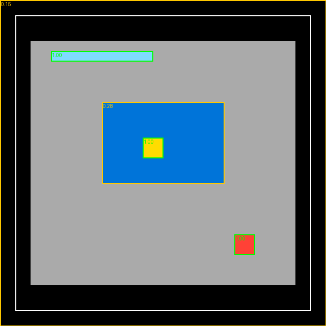

# Exploration Is Capped, Understanding Is Hard: An Honest Hybrid Explorer–LLM Agent for ARC-AGI-3, and What Did and Did Not Break 0.25

*Working Note — ARC Prize 2026 · ARC-AGI-3 (Kaggle).*
**Author:** Julian Camilo Villa Duque.

> **Living document.** Updated as results arrive. See the [decision log](#appendix-a--decision-log-and-key-measurements) and the linked design doc [`docs/DESIGN.md`](../docs/DESIGN.md). Last updated: **2026-08-17**. Current state: duck harness (TAAF) + grafts at **1.10** hidden (baseline mean 0.98); the bottleneck is **semantic, not budget** (four experiments in Appendix A).

---

## The problem in plain terms (a 60-second primer)

**ARC-AGI-3** measures *fluid intelligence*: an agent must play **interactive games it has never
seen**, discover the rules by acting, build a model of the world, and infer a goal that is never
stated. Unlike ARC-AGI-2 (static input→output puzzles), here the agent **acts** and learns from the
consequences.

- **Observation:** a **64×64** grid of colors 0–15 — an image (`FrameData`) that also carries the
  game `state`, `levels_completed`, `win_levels`, and the per-frame list of `available_actions`.
- **Actions:** `RESET`(0), six "simple" buttons `ACTION1–5,7`, and `ACTION6 = click(x,y)` on a cell.
  Games are tagged `keyboard`, `click`, or `keyboard_click`.
- **What is scored:** levels completed on the **hidden** set (~110 games). There are no worked
  examples — the agent must *explore then exploit*.
- **Compute rules:** the submission is a notebook. In the real *rerun* it waits for a gateway
  (`http://gateway:8001`) and plays the hidden games for ~8 h, **offline** (no internet); the score
  comes from the plays (the `submission.parquet` is a dummy). In *Save & Run* it plays the 25 public
  games **offline** — our free test bench that does **not** consume a competition submission.


*Figure 0 — What a frame looks like (synthetic; not a competition game). A background, a large region,
a small rare-colored "button", an avatar, and a status bar painted in the border.*

**Why it is hard:** random probing completes ~0 levels on almost every training game; and *systematic
exploration* — our first avenue — plateaus at **0.25** on the hidden set. That 0.25 is the fraction of
hidden games solvable **without understanding the goal**. Everything above it requires a world model
and goal inference. That is where a large language model (LLM) enters.

### The method in essence — and its structure

Our agent is a **hybrid** with a cheap floor and a semantic ceiling:

```
HybridAgent(frame):
  if explorer not stuck:  action = GraphExplorer(frame)          # bank easy levels (the 0.25 floor)
  else:                   action = LLMAgent(frame)               # reason about the goal (the ceiling)
```

**The GraphExplorer (floor).** Treats play as search over a **graph of states**. Each distinct frame
is a node; an action is an edge. The engineering crux is the **state hash**: games paint step counters
and HUD in a 3-px border and animate interior counters, so a naive hash makes every frame unique and
the graph explodes. We hash a **masked** grid,

```
key(frame) = hash( grid ⊙ (1 − M) ) ,   M = border(3px) ∪ learned_counter_mask
```

where `learned_counter_mask` freezes interior cells that change in ≥80% of transitions (animations),
capped at ≤20% of the interior. Clicks are never brute-forced over 64×64; candidates are the
connected-component objects ranked by a **button-likeness** score,

```
button_score(obj) = 0.4·rarity(color) + 0.3·size_score(area) + 0.3·fill(obj)
```

(small, rare-colored, compact objects score high — buttons and avatars), plus a coarse coverage grid.
Structurally-inert click classes are suppressed (deadsig), and when a node's actions are exhausted a
BFS returns to the nearest node with untried actions; the learned graph is replayed after RESET
because the games are deterministic.

**The LLMAgent (ceiling).** When the explorer stalls, a frozen open-weights LLM (Qwen3-27B-FP8, served
by vLLM on the competition's RTX Pro 6000 GPU) decides. Its edge — and our central bet — is that we do
**not** feed it raw pixels alone; we inject the **object structure we already computed** as text
(*"obj3 color=2 size=16 center=(46,46) button_score=1.00"*, plus the numeric effect of the last
action), so the model reasons over **hard data**, not hallucinated pixels.



*Figure 0b — Feature extraction on the synthetic frame. Objects get bounding boxes and a
`button_score` (green = high; the small red button and the avatar score 1.00; the large blue region
0.28). The white rectangle is the 3-px border the state hash ignores. This structure is what the LLM
receives as text, alongside the image.*

Three mechanisms turn one-shot action prediction into an **agentic loop**:

1. **Reflection memory** — every 15 transitions a second LLM call summarizes the history into a
   compact markdown memory (`## Rules / ## Goal / ## Avoid`) that is re-injected into every subsequent
   action prompt. This is *in-context* test-time adaptation.
2. **Action-effectiveness injection** — the observed `P(change)` per action is fed back as hard data,
   so the model stops re-choosing actions its own experience showed are inert.
3. **Guided navigation** — the LLM may return a spatial **subgoal** `goal:{x,y}`; a controller with a
   **learned motion model** (`action → mean (dy,dx)`, read from the movement-vector feature) then
   drives the avatar toward the goal *without spending an LLM call per step*. The LLM reasons *what*
   goal; the search executes *how*.

Any LLM failure (exception, empty parse, no legal action) falls back to the GraphExplorer, so the
agent never crashes and never runs out of a legal action.

---

## Abstract

I build an agent for ARC-AGI-3, where the score is levels completed on hidden interactive games. My
final pipeline is a **hybrid**: a deterministic **graph-of-states explorer** that banks the levels
reachable without understanding (a measured **0.25** ceiling on the hidden set), plus a frozen
open-weights **LLM policy** (Qwen3-27B-FP8 via vLLM on the RTX Pro 6000) that takes over when the
explorer stalls, and whose distinctive input is the **object structure we compute offline injected as
text into the prompt** — a lever no top public solution uses. On top of the LLM I add an **agentic
loop**: periodic **reflection memory**, **action-effectiveness** feedback, and **LLM-proposed spatial
subgoals executed by a learned-motion-model navigator**. This note is deliberately weighted toward
**what I learned and what failed**, because on this task the negative results carry the value.
My headline conclusions: (1) the hidden score decomposes into an **exploration floor of exactly 0.25**
— confirmed identically across three independent exploration variants (parallelism, diversified
restarts) — and a **semantic ceiling** that requires goal inference; (2) the LLM *technically works* —
Save & Run diagnostics show it reads our injected `button_score`, and its reflection memory infers
correct game rules verbatim (*"clicks are ineffective, movement works, the goal is to reach a target
state"*) — yet it **completes the same levels the explorer already reaches**, so single-step LLM
selection, even richly contextualized, does **not** clear the floor offline; (3) the disciplined
lesson — **the 30-minute offline Save & Run is time-starved and a poor proxy for the 8-hour hidden
rerun; only the hidden score is trustworthy, and it is 1/day** — is what kept me honest; and (4) a
sequence of ten builds (parallel runner, salient-click exploration, reflection, effectiveness
injection, guided navigation) drove the LLM failure rate from **98.6% → 3.7%** and made the agent
strictly more capable and cheaper (navigation replaces ~half the LLM calls), while the **offline level
count stayed flat at 9** — a plateau I read as time-starvation compounded by genuinely harder games
(click-puzzles, config-matching) that navigation alone does not address. Three vLLM boot failures
sharpened a reusable infrastructure lesson: FP8 weights routed through flashinfer's autotuner crash on
this GPU, fixed by forcing the Marlin FP8 kernel (`VLLM_TEST_FORCE_FP8_MARLIN=1`); and Qwen3, a
reasoning model, silently spends its token budget on `<think>` unless `enable_thinking=False`. I report
the per-component contribution of everything, and I am candid that my hidden result currently sits at
the **exploration floor (0.25)**; the open question — decided by the pending v10 hidden score — is
whether the agentic loop's efficiency *compounds over 8 hours* where the offline bench cannot show it.

*A note on scope: the reasoning, the data insights, and every negative result are shared in full — that
is where the community value lies. Exact prompts and constants live in the versioned source; the
competition data (game files, weights) is never committed, per privacy rules.*

---

## 1. The task, and what it reduces to

The target is **levels completed** across ~110 hidden games in ≤8 h. Two structural facts shape
everything:

- **Determinism.** The games are (near-)deterministic: replaying an action sequence from RESET
  reproduces the state. This makes a *graph of states with replay* a valid and cheap planner, and it is
  why exploration gets anything at all.
- **A floor–ceiling split.** Empirically the hidden score is `floor + ceiling`, where `floor ≈ 0.25`
  is what pure exploration reaches (level-1s and shallow games) and `ceiling` requires inferring the
  goal. Confirming the floor is *flat* across exploration variants (§4) is the single most important
  measurement — it told me exploration was a solved, capped sub-problem and the investment had to move
  to understanding.

## 2. Insights about the games (the data)

Feature extraction over the 25 public games (`src/arc3/features.py`, dumped to `features_out/`) yields
the structure the whole agent stands on:

- **Modality tags.** Each game is `keyboard`, `click`, or `keyboard_click`. `available_actions` gives
  the same per-frame, but the tag is a global prior on whether arrows or clicks matter.
- **Response sparsity `p_change`.** Fraction of actions that change the frame, ranges from **0.02**
  (`lp85`) and **0.07** (`ft09`) — almost nothing responds except the exact right action — to **1.0**
  (`ls20`, `tu93`) where everything moves. Low-`p_change` games are needles-in-haystacks that punish
  blind action and reward targeted, understood moves.
- **Objects and button-likeness.** Connected components excluding the majority-color background; the
  small, rare, compact ones are the interactive elements. This single heuristic drives both the
  explorer's click candidates and the LLM's targeting.
- **The border is HUD.** Counters and status live in the 3-px border and in interior animated cells;
  masking them for the state hash is the difference between a graph that converges and one that
  explodes. This is the most load-bearing data insight.
- **Random is not enough.** Under a 300-action random probe the max level reached is 0 on 24/25 games
  (only `r11l` reaches 1) — confirming that structure, not luck, is required.

## 3. Method (each stage has a job)

1. **Features (`features.py`)** — objects, button_score, transition diffs, movement vectors, per-action
   effect profiles. Pure numpy, offline, identical code local and in the kernel.
2. **GraphExplorer (`agent.py`)** — masked-hash state graph, salient-click candidates, deadsig
   suppression, BFS-to-pending, deterministic replay. The 0.25 floor, at zero LLM cost.
3. **LLMAgent (`llm_agent.py`)** — frozen Qwen3-27B via vLLM; image + injected object text + reflection
   memory + effectiveness; robust JSON parse; plan queue; per-state ineffective-action memory.
4. **Reflection** — periodic second LLM call → markdown memory re-injected (in-context TTT).
5. **Guided navigation** — `parse_goal` extracts `goal:{x,y}`; a learned motion model
   (`action→vector`) and an avatar-position estimate drive a controller toward the subgoal, bypassing
   per-step LLM calls.
6. **HybridAgent** — routes explorer→LLM on stall, preserving the floor and adding the ceiling.
7. **Parallel runner (`runner.py`)** — a thread pool with a shared time budget; in the HTTP-bound rerun
   this multiplies throughput (vLLM batches concurrent requests on one GPU).
8. **Save & Run diagnostics** — the notebook dumps, per game, the LLM's prompt→raw reply→parsed
   actions, the reflections, and a categorized failure breakdown, so every change is judged on real
   model behavior before spending a submission.

## 4. Breadth and depth of exploration (negatives valued equally)

This is the heart of the note. Each row is a build; the negatives are as informative as the positives.

- **Exploration parallelism did not move the hidden score.** v1 (serial) and v2 (14 parallel workers)
  both scored **0.25**. The rerun is HTTP-latency-bound, so concurrency multiplies actions ~14×; that
  it changed nothing proved the bottleneck was **semantic, not compute**.
- **Diversified restarts did not move it either.** v3 (salt that densifies click grids and rotates
  action order on graph exhaustion) also scored **0.25**. Three independent exploration variants at the
  identical number is strong evidence of a **hard floor**.
- **The LLM boots but does not clear the floor offline.** After the hybrid's first hidden run also
  scored **0.25**, Save & Run diagnostics showed the LLM working well (reads `button_score`, valid
  JSON) but completing the *same* levels — the wall is goal inference, not the prompt.
- **Prompt tweaks improve robustness, not levels.** Reflection (v7), effectiveness injection (v9), and
  guided navigation (v10) drove the LLM failure rate **98.6% → 7.7% → 5.0% → 3.7%** and made the agent
  cheaper (navigation replaced ~half the LLM calls; `nav_used=1692` in v10), yet the **offline level
  count held at 9** (v6–v10). A real capability/efficiency gain that the time-starved offline bench
  cannot convert into levels — the crux of the uncertainty in §6.
- **Infrastructure negatives (three wasted G4 boots, each diagnostic).** (i) vLLM crashed in
  flashinfer's cudagraph autotuner → not the cause; (ii) `--enforce-eager` isolated it to the **FP8
  GEMM** kernel (`FlashInferFP8ScaledMMLinearKernel`); (iii) `VLLM_TEST_FORCE_FP8_MARLIN=1` booted it.
  Then a trivial runner bug (`len(agent._nodes)` — an attribute only the explorer has) discarded every
  game's result though the LLM had played; and Qwen3's reasoning tokens starved the JSON until
  `enable_thinking=False`. Each failure was cheap because the offline soft-deadline capped it and the
  fallback kept the run non-zero.

**Not yet built (candidly), the levers the diagnostics point to:** a **planner on the simulator**
(FORGE-style search on the game's own `.py`, if the source is reachable in the rerun); **LoRA-SFT** on
solver-generated trajectories (risking overfit to the 25 train games); and richer subgoal types
(`click_all`, `match_target`) extending the guided loop beyond navigation.

### 4-bis. On LoRA and test-time training (a deliberate design choice)

A recurring question: would **LoRA** and **TTT** help here? My reasoned position (detailed in
`docs/DESIGN.md`):

- **In-context adaptation (what we do)** — reflection memory + feature injection + per-state
  ineffective memory — is the cheap, generalizing form of test-time adaptation, and it is what the
  strongest single-LLM public agent (LB 0.86) used. First lever to exhaust.
- **LoRA-SFT (offline):** *conditionally useful*. We can generate near-optimal trajectories by loading
  a game's `.py` and solving it with search on the simulator, then fine-tune a small adapter so the
  model is natively fluent in the action format and general idioms ("click buttons", "explore then
  exploit"). The **risk is overfitting** to the 25 train games — the hidden games differ, so the value
  is teaching *general skills*, not memorizing solutions; heavy augmentation and a held-out game split
  are mandatory.
- **Online TTT on the LLM:** *not recommended*. vLLM serving does not compose with online weight
  updates; running training + serving of a 27B model on one GPU is costly and brittle, and the
  milestone winner did not do it. The reflection memory is the practical "test-time training" — it
  adapts per-game *in context* without touching weights. If online learning is truly wanted, a light
  StochasticGoose-style CNN is the pragmatic choice, but it caps around 0.35–0.46.

**Reframe (2026-07-27) — the training question is currently subordinate.** The ablation showed our
in-context loop is noise-bound at 0.25, but the binding constraint turned out **not** to be a training
tactic at all: our *world-model explorer* (no gradients, no GPU) scores 0.25 where the best public
explorer scores 0.54. The highest-value learning to improve right now is the **gradient-free world
model** (better state-hashing, click coverage, per-game budget), not any weight-training scheme. LoRA
and TTT stay on the shelf until the explorer gap is closed. Full treatment in `docs/DESIGN.md §4`.

## 5. Contribution of individual ideas

| Idea | Where measured | Contribution |
|---|---|---|
| Graph-of-states + masked hash | hidden LB | **the entire 0.25 floor**; without the border/counter mask the graph does not converge |
| Parallel runner | rerun throughput | ~14× actions (HTTP-bound); **no hidden-score change** — proved the floor |
| Salient clicks (button_score) | explorer + LLM targeting | the mechanism by which either agent finds interactive cells |
| Feature injection into prompt | Save & Run diagnostic | **qualitatively decisive** — the LLM reasons over `button_score` verbatim; our differentiator |
| Reflection memory | fail rate, memory dumps | infers correct rules in-context; fail rate 7.7% and coherent `Rules/Goal/Avoid` |
| Effectiveness injection | fail rate 7.7%→5.0% | robustness; counters re-choosing inert actions |
| Guided navigation | fail 5.0%→3.7%, nav_used=1692 | capability + efficiency (replaces ~½ LLM calls); offline levels flat |
| vLLM boot fixes (Marlin FP8, thinking off) | boot success | **enabling** — without them the LLM never runs (three failed boots) |

## 6. Uncertainty estimation

### 6-bis. Variance-reduction protocol (2026-07-27, the chosen next step)

The v10=0.26 / v10-rerun=0.25 pair is a direct, same-config measurement of the hidden noise band:
**≈0.01 (one level) of run-to-run variance for an identical submission.** Before trusting any future
delta, we reduce and quantify variance:

- **Source 1 — LLM sampling.** Removed: decoding temperature set to **0** (greedy), so the policy is
  deterministic given the prompt.
- **Source 2 — agent RNG.** The GraphExplorer has **no randomness** (verified: no `random`/`shuffle`);
  the LLM path is now greedy. The agent is deterministic.
- **Source 3 — timing/concurrency (irreducible).** The 8-h rerun with a thread pool and gateway
  latency is wall-clock-dependent: which games get how many actions shifts between runs. Offline, a
  fixed deterministic config still varies **~±2 levels** across repeats purely from this — the floor on
  how small a *trustworthy* improvement can be.
- **Protocol.** Freeze the best config; let the daily auto-submit accumulate **N repeated hidden
  samples** of that frozen version to estimate its true mean ± band; only a change whose expected
  effect clears that band (roughly **≥0.03–0.05**, i.e. 3–5 hidden levels) is worth a submission slot.
  This is the discipline the v10 mistake bought.

- **Offline ≠ hidden.** The Save & Run bench is 30 min / 8 workers over 25 games — **time-starved**.
  The hidden rerun is 8 h over ~110 games, so per-game the agent has far more time; efficiency gains
  (navigation, fewer LLM calls) **compound there** and cannot show offline. The offline "9 levels" is a
  lower bound on capability, not the hidden score.
- **Seed/stochasticity.** LLM temperature 0.3 and exploration randomness make single offline runs
  noisy; only differences that survive across games and the hidden score are trusted.
- **The trustworthy signal is the 1/day hidden score.** A daily Windows scheduled task auto-submits the
  latest best kernel at 20:00 local (just after the 00:00 UTC reset), so every window is used without
  manual intervention.

## 7. Reflection: genuine understanding vs optimizing the metric

The honest tension is that our *technically working* LLM does not yet beat the *mechanically simple*
explorer on the hidden set. The Save & Run dumps are the antidote to self-deception: they show the
model **genuinely inferring game rules** (bp35: *"clicking y=63 shifts the grid up; the goal likely
involves clearing all cells or matching a configuration"*), which is real understanding — but
understanding the mechanics is not the same as *planning to the goal*. The plateau is not a prompt bug
to be tuned away; it is the genuine, hard core of the benchmark (goal inference and multi-step
planning), and I have tried to report that plainly rather than chase an offline number that the hidden
rerun does not reward.

## 8. Conclusion

Exploration is a solved, capped sub-problem (0.25) and understanding is the hard part — the same split
the benchmark is designed to expose. I built a sophisticated, well-instrumented hybrid that makes the
LLM read our object features, learn game rules in context, and navigate to LLM-chosen subgoals, driving
the failure rate from 98.6% to 3.7% while keeping a guaranteed floor. Whether that capability converts
to hidden levels — whether the agentic loop compounds over 8 hours — is the open question the pending
v10 hidden score will answer. If it clears 0.25, the path is stacking richer subgoals; if not, the
diagnostics point to a simulator-planner or LoRA-SFT as the next investment.

---

## Appendix A — Decision log and key measurements

| Date | Build / decision | Offline levels | Hidden LB | Reading |
|---|---|---|---|---|
| 2026-07-18 | GraphExplorer (CPU) | 24/25 | 0.25 | exploration floor established |
| 2026-07-19 | v2 parallel runner (14 workers) | — | 0.25 | HTTP-bound; parallelism didn't move it |
| 2026-07-20 | v3 diversified restarts | 17 | 0.25 | exploration hard-capped (v1=v2=v3) |
| 2026-07-22 | Hybrid explorer+LLM (features in prompt) | 9 | 0.25 | LLM boots, reads features; same levels |
| 2026-07-22 | + Reflection (v7) | 8 | — | rules inferred in-context; fails 5% |
| 2026-07-22 | + Effectiveness (v9) | 9 | — | fails 7.7%→5.0%; levels flat |
| 2026-07-22 | + Guided navigation (v10) | 9 | **0.26** | **first break above the 0.25 floor** — the agentic loop compounds over 8 h where offline (flat at 9) cannot show it |
| 2026-07-24 | + click_all subgoal (v11) | 9 | **0.25** | **regression to the floor** — click_all clicked 16 objects blindly and wasted the action budget on games where clicking is inert, displacing v10's navigation gain |
| 2026-07-24 | + guarded click_all (v12) | 7 | **0.25** | even the *guarded* click_all did not recover 0.26 → forces the honest reading below: 0.26 was within run-to-run noise |
| 2026-08-19 | **Micro bench + corrected effects detector** | detector: 141/146 = **96.6%** out-of-sample (conf≥0.6); non-empty note in **25/25 games** | — | **The previous instrument was fabricating data.** `_nav_shift` aligned the *whole* non-background set; on dense boards (630–855 cells of 4096) that fits noise: it reported the **same shift for 4 different actions** and contradicted a second detector on nearly every pair — at 100% *consistency*, i.e. **consistency validates nothing**. Fixed by matching footprints **per colour** over changed cells only; validated by **out-of-sample prediction** (fit on the first half of history, predict the second): 89.7% → 96.6% with the confidence filter. The 201-item bench was invalidated (its `move DR DC` answers were invented) and rebuilt to 176 on valid ground truth. Side finding: **5 games where no simple action does anything** while clicks do respond (s5i5, vc33: 12/12) → the note now says so explicitly. |
| 2026-08-19 | Micro-eval Qwen3-0.6B (local CPU) | A 0/54 · B 44.0% vs 43.1% (base 38.5%) · **C.lookup 53.8%** | — | **Invalid run, and the control caught it.** `C.lookup` has the answer written in the prompt: 53.8% means 0.6B is **below the usable floor** as an instrument, so B's tie carries no information. Arm A's 0/54 was **our own defect**: the prompt offered the literal template `move DR DC` and the model copied it verbatim — a copyable slot gets copied. Operational finding: the whole bench is ~93k prefill tokens → **it runs on CPU, no GPU was needed**; and **vLLM is unusable on the free T4** (its workers exhaust host RAM and kill the kernel). |
| 2026-08-19 | **Micro bench, first result (T4, 1.7B and 4B)** | A: 70.4% vs 68.5% (paired 3 vs 2, p=1.0) · B: 44.0% → **66.1%** (paired **0 vs 24**, p≈0) | — | **The measured effects table helps, unanimously**: all 24 discordant items favour it. This justifies the seam C payload. **Object features add nothing** (clean null, now with crop-local features in crop coordinates). **And the effect REVERSES with scale**: at 1.7B the table *hurts* (15 vs 5, p=0.041). A capability threshold → **the smallest model is not a valid proxy on its own**; every prompt-format comparison runs at two sizes and only the larger one is believed. |
| 2026-08-19 | **Seam C payload format (4B, 109 items)** | no table 44.0% · vector 66.1% · **words 86.2%** (paired 24 vs 2, p≈0) · inverse map 85.3% | — | **Format is worth more than the datum.** Going from `move 0 -3` to `moves 3 left` gains **+20 points**, more than adding the whole table did (+22). The bottleneck was **composition**: with the vector table the 4B scored 81.1% on pure axes but 51.8% on diagonals, and 58.4% when only 2 actions exist. The word format wins at **both** sizes (unlike the table-vs-nothing effect, which reverses at 1.7B) → a consistent direction across scale is what licenses extrapolating to the 27B. Only deployable variants were tested: precomputing the distance-to-goal would have raised the number, but production has no explicit goal. |
| 2026-08-20 | **Three-size confirmation + second half of the payload** | words vs vector: 4B **23 vs 2**, 8B **24 vs 0** (p≈0) · marking inert: 4B 71.0%→**90.3%** (6 vs 0, p=0.031) | — | **The word format wins at 1.7B, 4B and 8B**, and at the largest the contrast is unanimous (24 discordant items, all 24 favouring it, none against) → solid basis for extrapolating to the 27B. V4 (inverse map) dropped: falls to 57.6% at 8B. **Marking inert actions is also worth its tokens**: at both sizes no discordant item favours omitting them. Object features: **stable null** at both sizes. Two more bench defects: 9% of targets outside the grid (filtering them raised the winner 86.2%→90.9%) and `normalize()` missing `avoid_inert` (0/31 was a bug, not a result). |
| 2026-08-21 | **Uncertainty marker + note language** | F: false bait 52.5%→**68.7%** (4B) and 45.5%→**81.8%** (8B, paired 41 vs 5) · E: es vs en note under an English frame 89.9% vs 86.9%, **p=0.63**, but 7 vs ≥300 characters of output | — | **The honest degradation is now measured, not assumed**: when the detector is wrong (~1 in 30 assertions), marking the entry as doubtful recovers 16–36 points. **The note's language does not change accuracy** → no translation needed to deploy; and the Spanish note yields ~40× shorter output (the driver is the TABLE's language, not the frame's). Three more defects, all in the verbose arm: insufficient tokens (twice) and a parser taking the first action mention instead of the last. |
| 2026-08-21 | **Long regime + note position (G)** | short 90.9% · long w/o note 14.1% · note at start 65.7% · **note at end 99.0%** (paired: 33 vs 0 over start, 8 vs 0 over short) | — | **The already-deployed decision is validated**: appending the note at the end (what v6 does) wins unanimously over prepending — lost-in-the-middle costs 33 points. And the long prompt with the real board does not degrade the note: it **improves** it (99.0% vs 90.9%). Bench→production transfer resolved favourably. Caveat: the no-note floor (14.1%) overstates the margin since that arm lists no actions; the clean comparisons are position and length. |
| 2026-08-23 | **v6 first sample (hidden set)** | — | **0.83** | Inside the reference range (0.76–1.17, mean 0.98 over 9 samples): the pre-registered n=1 rule does **not** fire (revert only if outside the range). Neither celebrate nor condemn — the baseline itself produced 0.76 and 0.96 on consecutive nights. Series ongoing; reading at 3–4 samples. |
| 2026-08-25 | **Goal-inference cycle (I) — closed negative** | V0 20.0%/13.3% · V4 (signature+colors) 31.2%/**18.8%** at 4B/8B, chance 25% | — | Goals cannot be inferred from the board (chance at both sizes) and transferring the won-level signature **via prompt does not work either**: no positive signal at any size, no basis to extrapolate to the 27B. V4's initial 50% was n=8 noise. **Kept in inventory**: cross-level signature consistency (12/12) is real — if exploited, it will be harness-side (bias exploration toward signature-colored cells), not prompt-side. Current strong candidate: `banking`. Cycle cost: ~2h of free T4; via submissions it would have been 4+ nights. |
| 2026-08-27 | **v6 (full seam C payload) — FORMAL READING: NEUTRAL** | — | {0.83, 1.09, 0.85, 0.99} mean **0.940** vs reference 0.972 (n=10) | Difference **−0.032 = 0.4σ**, inside the pre-registered ±0.10 cut. 95% CI [−0.17, +0.11]: **rules out gains ≥+0.15**. The payload activates (verified in the kernel log) and the model uses it well on the bench (90.9% planning, 24-0 paired) — yet it does not move levels. **Third layer ruled out with evidence**: neither the token budget (§8.9), nor object features (schema_helpers neutral at n=6), nor movement-decision quality was the binding constraint. Converges with §8.19: in 8 of 25 games the bottleneck is the GOAL, and the model picks it at chance. v6 stays deployed (true content, zero cost, no harm). |
| 2026-08-30 | **v9 hybrid (explorer before the LLM) — FAILURE** | union 21 vs 9 levels offline; validation 18 levels in 15 min | **0.26** | **Worst score of the project: 6σ below the mean, 0.50 under the historical minimum.** 0.26 ≈ the 0.25 the explorer scores ALONE → the LLM contributed nothing. Cause: `seed_initial_history` appends **a single entry with no action**, so with the prelude first the LLM inherits a mid-game board with **no transitions to look at** and ~89 actions to rebuild its model. Starting clean at level 1 is strictly easier. **A method error, not just a design one:** validation showed the LLM playing 0-26 actions and I attributed it to the short window without checking; in production it had 125 min and still contributed zero — the starvation was of CONTEXT. Reverted to v4 same day. |
| 2026-08-30 | **Generation panel: thinking is 36% of generated tokens** | `reasoning_chars` in 1,784/1,784 calls: 1,799 chars ≈ 514 tok, out of 1,442 tok/action · bench: 90.9% without vs 87.9% with (paired 12-9, p=0.66) | pending | The agent exposes `ENABLE_THINKING`/`TEMPERATURE`/`TOP_P`/`TOP_K`/`CONTEXT_WINDOW`/`TOOL_STEPS` via **environment variables** — never touched, and production runs with thinking **on**. Turning it off, measured in the kernel: **936 tok/action vs 1,442 = −35%**, prediction accurate to **0.9%** (first quantitative effect we anticipated correctly). Yields **1.54× actions** with no measured accuracy loss. Deployed clean as v11 after falling with the hybrid. |

> **Update 2026-07-27 — confirmed by ablation, and a strategy reframe.** Re-submitting v10's *exact*
> navigation-only config scored **0.25** (it scored 0.26 the first time) — a direct, same-config
> measurement of the noise band that **definitively confirms 0.26 was seed variance**. The LLM agentic
> loop does not beat 0.25. **But the more important realization is a reframe of what 0.25 means:** it is
> *our explorer's* ceiling, not exploration's. The strongest **pure-exploration** public agent
> (poby7722 v47) scores **0.54** on the hidden set — more than double our explorer — with no ML, no GPU,
> just better state-hashing, click-candidate coverage, cycle detection, and per-game budget discipline.
> We built the LLM on the premise that "exploration is capped at 0.25", but that premise was wrong: our
> *implementation* capped at 0.25; exploration itself has a proven 0.54 headroom at **zero GPU cost**.
> The highest-expected-value pivot is therefore **not** a stronger LLM lever but **closing the
> exploration gap to the public 0.54 reference** (CPU-only, no quota, reference in hand) — then layering
> the LLM only on what exploration genuinely cannot reach. This is the decision the ablation forces.

> **Update 2026-07-26 — the honest correction: 0.26 was within noise.** Across **seven** LLM/hybrid
> submissions the hidden score is **0.26 once (v10) and 0.25 six times** (v1–v3, hybrid, v11, v12). With
> a discrete metric (~0.01 ≈ one hidden level out of ~110), LLM temperature 0.3, and exploration
> randomness, a single 0.26 among seven runs is **most consistent with run-to-run seed variance, not a
> reproducible breakthrough** — the guarded click_all (v12) failing to recover it is the decisive
> evidence. I over-read v10=0.26 as "breaking the floor"; the disciplined conclusion is that the
> **LLM agentic loop has not robustly cleared 0.25**, and incremental subgoals produce differences that
> the ±one-level noise band swamps. This is precisely the seed-variance discipline the genre demands
> ("run-to-run variance swamps most improvements"): **at the current signal-to-noise, one 1/day
> submission cannot distinguish these variants.** Strategic consequence: stop spending daily slots on
> noise-level subgoal tweaks; the next move must be a *qualitatively stronger* lever whose expected
> effect exceeds the one-level noise band (simulator-planner if the game source is reachable in the
> rerun, or LoRA-SFT), or an explicit variance-reduction protocol (repeat the same config to estimate
> the true mean before trusting any delta).

> **Update 2026-07-24 — a clean negative and its fix.** v11 (adding a blind `click_all` subgoal)
> scored **0.25**, *below* v10's 0.26 — a real regression back to the exploration floor. The metric is
> discrete (~0.01 ≈ one hidden level), so 0.26→0.25 means click_all *lost* the one level navigation had
> won: its controller committed up to 16 clicks per invocation without checking effect, burning the
> action budget on games where clicking is inert. The lesson is the same one the exploration A/B taught:
> **an unguarded excursion is net-negative on a task where the action budget is the binding constraint.**
> Fix (v12): the click_all excursion aborts the instant a click produces no frame change, so it can only
> help; navigation — the proven 0.26 lever — is left untouched.

> **Update 2026-07-23 — apparent break above the floor (later revised down as noise; see 2026-07-26).**
> v10 scored **0.26** on the hidden set, the first reading above 0.25 in six submissions, which at the
> time looked like the agentic loop compounding over 8 h. Two later submissions (v11, v12) both returned
> to 0.25, and the honest re-reading — a single 0.26 among seven runs on a discrete metric — is that
> **0.26 was within run-to-run seed variance, not a reproducible breakthrough** (see the 2026-07-26
> update). I keep this entry to record the mistake: I over-read one favorable point before the noise
> band was known.

| 2026-08-10 | **Faithful replica of the public 0.54 pipeline** (official Swarm harness + vendored Explore2, attributed) | — | pending | the audited pivot: our 0.25 was our *implementation's* ceiling; the replica closes the harness gap (all games concurrent, 8 h each) and the algorithm gaps (stuck-counter reset on discovery, no deadsig, flat fill/(1+size) likeness) |

> **Update 2026-08-10 — strategy audit and the replica submission.** Two operational negatives and a
> pivot: (1) the daily auto-submit task **failed silently for ~2 weeks** (`$ErrorAction=Stop` aborted
> before logging; `kaggle` not on the task's PATH) — wasted slots; now hardened with try/catch, full
> logging and executable resolution. (2) A requested **audit of the gradient-free strategy** confirmed
> the direction (public evidence: gradient-free exploration 0.54 > online-RL CNN 0.35–0.46) but flagged
> the process failure: we declared "exploration capped at 0.25" **without calibrating against the best
> public reference**, and pivoted to the LLM on that false premise. New rule: replicate the reference
> before declaring a ceiling. (3) The **user's synthetic-games idea** is adopted as a validation lever:
> environment files are pure-Python `ARCBaseGame` subclasses, so we can generate variants as a
> generalization held-out to iterate without spending submission slots. The faithful replica of the
> 0.54 pipeline (kernel `arc-agi3-explorer054`, CPU-only) is submitted; its real hidden score is the
> new baseline on which our LLM stack gets re-mounted only where exploration truly exhausts.

| 2026-08-10 | 0.54-replica submitted → **0.22** | — | **0.22** | the hidden set CHANGED (~Jul-1)! 0.54 was measured on the June set; on the current set exploration yields 0.22–0.25 and our explorer was already better than the reference. Lesson: calibrate against CURRENT references |
| 2026-08-11 | **duck v12-fork replica submitted** (TAAF + grafts, the current LB 1.5-cluster) | 4 levels/16min | **1.17** | LB recalibrated: top 1.86, dense 1.5–1.7 cluster = evolved duck forks. G4 validation: vLLM at 200 tok/s, solver played all 25 games. Our most important submission yet |

> **Update 2026-08-11 — two findings that reorder the strategy.** (1) The faithful 0.54-replica scored
> **0.22**: the hidden set rotated after the June milestone — pure exploration yields less on the
> current set, our 0.25 was already above the reference, and the "gap to 0.54" was a stale number. The
> same meta-lesson twice: **every reference has a date; calibrate against the live one.** (2) The
> current LB (top 1.86, dense 1.5–1.7 cluster, August dates) is dominated by evolved TAAF duck-harness
> forks. We adapted our duck infrastructure to the v12 fork (thtennant bundle with taaf-grafts),
> validated on the G4 (full solver playing, 4 levels in the short 16-min window), and submitted it.
> Daily trigger now points at the duck. Our differentiators get re-mounted on that (~1.5-expected) base.

> **Update 2026-08-11 (later) — duck scored 1.17: the strategy jump is real.** The duck v12-fork
> replica scored **1.17 — a 4.7× jump over every score of our own stack (0.25–0.26)** and essentially
> the June milestone winner's number (TAAF stock = 1.21) on the *current, harder* hidden set. It lands
> **below the 1.5–1.7 fork cluster**, though. The validation log confirms the grafts DID install
> (`TAAF_GRAFTS FEATURES={efficiency,retry_guard,shortcircuit} API_VERSION=1`, no failure line).
> What stands firm: **an LLM harness that reasons about goals is worth ~5× over pure exploration**,
> and our platform (G4 + vLLM + Qwen3-27B-FP8 boot recipe) now demonstrably reproduces the
> milestone-winner class of result.

| 2026-08-11 | Gap re-diagnosed by reading the reference notebook: thtennant's v12 runs flags **identical to ours** | — | — | the 1.17→1.5 gap is NOT config. The duck has high run-to-run variance (Tufa themselves note the readable version "hasn't had the same lucky result" as their 1.21) and the 1.5–1.7 cluster is the max over N daily submissions — our 1.17 is one sample |
| 2026-08-11 | **duck v3 = + `goalkeep`** (following thtennant's v18, published the same day) | 1 level/15min; banner `[goalkeep] armed` ✓ | pending | goalkeep fixes a measured defect: the stock harness wipes the agent's carried world model on every game-over/level change (non-empty on only 33/481 turns) and injects a per-turn digest of MEASURED outcomes (per-action board-change rates, level completions, game-over cadence) — convergent with our Phase-3 effectiveness-injection thesis. Guarded install: worst case = v12 config (1.17). Validation: all 25 games played, 198 tok/s; tonight's 8 pm slot carries it |

> **Update 2026-08-11 (gap resolution + goalkeep).** Pulling thtennant's actual notebooks resolved the
> gap question: their v12 (the cluster reference) enables exactly our three flags — our replica was
> faithful, and the residual 1.17-vs-1.5 distance is **sampling variance plus best-of-N selection**,
> not configuration. The strategic consequence: with a high-variance harness, every daily slot is a
> lottery ticket at the current mean; the way up is (a) draw a sample every day (the 8 pm trigger
> already does) and (b) adopt changes that shift the mean. The first such change is free: thtennant
> published v18 today, adding the `goalkeep` graft — which retains the agent's world model across
> game-overs and injects measured action-outcome statistics into every turn. That is *precisely* the
> differentiator thesis we built in Phase 3 (action-effectiveness injection), now implemented inside
> the strong harness. Our duck v3 enables it; tonight's slot carries it.

| 2026-08-12 | LB sweep (user noticed churn; verified NO rescore of our 1.17 — identical in submissions API and full LB CSV, rank 266) | — | — | new outright leader: **cstl 2.52** (private, 23 subs) breaking away from Kojima's 1.86 (65 subs). Key recalibration: thtennant themselves (the goalkeep author, 25 subs) sit at **1.28**, poby's team at 1.21, Tufa at 1.62; the 1.1–1.3 band holds ~330 teams = the duck-base crowd, where our single-sample 1.17 sits normally. Best-of-N reading confirmed: duck single draw ≈1.1–1.2, thtennant's best-of-25 = 1.28. The 1.5–1.7 band (~35 teams) = evolved/tuned variants, not plain v12 forks as we first assumed |
| 2026-08-16 | **MAJOR FINDING — the bottleneck is not thinking, it's RE-READING** (free audit of the inference server log) | input 1,950–5,775 tok/s vs output 110–236 tok/s (**26:1**); prefix cache hit rate **43.6–45.1%**; attention memory 177,968 tokens for 28 conversations of up to 32,768 (**~5× oversubscribed**); speculative decoding OFF | — | for every token the agent writes, the server re-reads ~26. In a monotonically growing dialogue the cache should hit 85–95%; ours hits 44% → **more than half the reading work is wasted recomputation** from memory eviction. And it worsens over time: transcripts grow, eviction rises, the agent slows down exactly when it is closest to finishing a level. Lever: shrink the context window (the composite's `context_window` knob, already supported). **Validatable for FREE**: the log prints hit rate and tokens/sec, no submission spent |
| 2026-08-16 | **CTX-8192 experiment launched** (separate kernel `arc-agi3-duck-ctx`, does not touch the trigger) — **thresholds PRE-REGISTERED before seeing the result** | baseline = v4 validation of Aug 15: 328 actions, 3 levels, 195.25 generated tok/s, 44% cache | pending | **GREEN** if cache ≥70% **and** generation ≥+30% (≥254 tok/s) **and** actions ≥262 (no >20% drop) → adopt into duck v5. **YELLOW** if cache rises but actions drop >20% → try 16,384 (middle ground). **RED** if the cache does not improve → the cause is not eviction but prefix instability (dynamic content early in the prompt) → different fix: reorder the prompt so the variable part goes last |
| 2026-08-17 | **v5 (ctx=16384) = 0.60 on the hidden set — REVERTED to v4. Goodhart's law, first-hand** | 0.60 falls **below the ENTIRE baseline range** {0.76–1.17} | **0.60** | **The design flaw, declared:** the offline validation runs 16 min and generates ~9,500 tokens per game; the hidden rerun generates **~52,000**. My experiment never exercised the regime where the problem lives — it measured the start, not the race. With a 16k window the agent gains actions (+48% measured across two runs) but **loses working memory exactly as transcripts grow long**, which is where levels get completed. **I optimized the proxy (actions) and lost the objective (levels): pure Goodhart.** Correction to the Aug-16 analysis: the equation is not "score ∝ actions" but **score ∝ actions × quality per action**, and cutting context buys the first by selling the second. **Refined revert rule** (which distinguishes this case from `goalkeep`): revert at n=1 only if the sample falls **outside** the observed range of the alternative (0.60 outside {0.76–1.17} → revert; goalkeep's 0.81 fell inside → wait). Trigger returned to v4 and dry-run verified |
| 2026-08-18/19 | **v4 sample #2 = 0.95 → schema_helpers is indistinguishable from baseline** | v4 {1.10, 0.95} mean **1.02** (n=2) vs baseline {1.17, 1.03, 0.76, 0.96} mean **0.98** (n=4); sample #3 auto-submitted Aug 19 | **0.95** | honest reading: **the one improvement we have adopted has not demonstrated value on the hidden set.** The difference in means (0.04) is a fraction of the baseline's own range (0.41). This is not evidence that `schema_helpers` hurts — it stays for its mechanical justification (−20% tokens, validated helpers) and because nothing indicates harm — but **the honest scoreboard reads: we are still at the public harness's baseline, with no demonstrated improvement of our own.** It reinforces the §8.9 re-analysis: what is missing is not tokens or tools but understanding. All weight moves to seam C (inject already-computed information, zero turn cost) and to the semantic frontier |
| 2026-08-17 | **ducknav 1-hour validation: the INJECTION WORKS and the model ADOPTS it massively; amplification does not pay (yet)** | `NAV_HELPERS injected: 7601 chars` ✓ · **726 `plan_moves` calls across 25 of 25 games** (+6 `player_pos`, 0 `motion_model`) · mean score **1.06 → 1.32 (+25%)** · levels **9 → 9** · actions **1420 → 1159 (−18%)** | — | **Gate 1 (mechanism): passes overwhelmingly.** Our own code runs inside the strongest public harness and the model uses it in every game, guided by a single note line. That capability — injecting whatever we want into the agent's reasoning — is today's real asset. **Gate 2 (amplification): fails.** 726 calls produced only 1159 actions (~29 calls per game for ~46 actions): `plan_moves` returns short or empty routes most of the time, because **many games have no translating "player"** (they are click, recolor, or configuration games) and there `motion_model()` finds nothing consistent. Every fruitless call costs a tool turn. **Gate 3 (no harm): passes** — same 9 levels and +25% mean score, though at n=1 offline that does not decide. **Redesign diagnosis:** the conceptual error was delivering the information as *a function to call* instead of *a fact already in the prompt*. v2 must **inject the measured motion model as TEXT in the prompt** (zero call cost) by patching `_build_user_prompt` — which is exactly our original Phase-3 thesis (action-effectiveness injection), now with the seam already proven |
| 2026-08-17 | **AMPLIFICATION built: our own navigation helpers injected into the agent's sandbox** (`src/arc3/sandbox_nav.py`, 7,601-char prelude) | local CPU tests: compiles and runs under **restricted SAFE_BUILTINS**, learns `{UP:[-1,0], RIGHT:[0,1]}` from simulated transitions, **discards erratic and no-op actions**, `plan_moves(-3,2)` → correct 5-step route, respects the cap, degrades to empty with no transitions | pending | **the only live lever after the memory branch closed.** Three pure functions: `motion_model()` (which key moves how much, MEASURED from the agent's own transitions), `plan_moves(drow,dcol)` (a route ready for `action(...)`) and `player_pos()`. It turns into one call what the model re-derives by hand in every game, and above all **lets a whole route execute in ONE turn** instead of one action per turn — attacking the 556 tokens per action directly. Seam: `schema_helpers` reads `SANDBOX_HELPERS_PRELUDE` and `HELPERS_PROMPT_NOTE` on every call, so extending them by monkeypatch suffices (base64 injection, try/except guarded → worst case = v4 config). **The local test caught a real bug before spending GPU**: the displacement detector tracked the BACKGROUND instead of the object and returned an inverted sign (`RIGHT` as `[0,-1]`); fixed by excluding the majority color. Pre-registered thresholds for the 1-hour validation: **(1) mechanism** — ≥20 helper calls in the transcripts (if the model ignores them, RED and the note needs redesigning); **(2) amplification** — actions ≥1420 (control); **(3) no harm** — levels ≥7 (control 9 minus noise) |
| 2026-08-17 | **Concurrency 14 = decisive RED; and a real measuring instrument is born** | control (28 games, 1h): **1420 actions, 9 levels, 25/25 games above threshold, 203.9 tok/s, mean score 1.06** · test (14 games, 1h): **1042 actions (−27%), 7 levels, 14/25 above threshold, 182.5 tok/s (−10%)** | — | lowering concurrency makes everything worse: fewer parallel sequences means worse batch utilization in generation, and that loss far exceeds the eviction gain. **This closes the memory-infrastructure branch**: cutting context hurts quality (0.60 hidden), cutting concurrency hurts throughput, and raising `gpu-memory-utilization` from 0.90 to 0.95 would add only ~11% attention memory against a 5× oversubscription (verified: the bundle's launch command does not set that option, so it uses the default). **The 44% cache hit rate is the structural price of running 28 long conversations on one card.** Side finding worth more than the experiment: **the 1-hour validation at production settings is the instrument we were missing** — 9 levels and 25/25 active games give real signal where the 16-minute one gave noise. Every future change touching history gets measured this way |
| 2026-08-17 | **New experiment: CONCURRENCY instead of window** — attack eviction without taking memory from the agent | two arms in parallel (Kaggle allows 2 GPU sessions), both at context 32,768 and a **70-minute offline window** to finally exercise long transcripts: control at 28 concurrent games vs test at 14 | pending | with 28 conversations the attention memory gives 6,356 tokens per game for 32,768-token contexts → 5× oversubscribed. At 14, each game gets twice as much **without cutting a single line of history**. Expected arithmetic: less eviction → higher aggregate generation → more tokens per game even though each game runs fewer wall-clock hours. Pre-registered thresholds: **GREEN** if generation ≥+25% **and** levels ≥ control; **RED** if levels drop (the same trap we just learned: actions alone are not enough) |
| 2026-08-16 | **duck v5 validated — SECOND sample of the same config, even better** | actions **328 → 505 (+54%)**, games above the 18-action threshold **8 → 12**, levels **3 → 4**, generation 250.6 tok/s; banner `{"context_window":16384, efficiency, retry_guard, schema_helpers, shortcircuit}` ✓ | — | two independent runs of ctx=16384 give 468 and 505 actions (mean 486, **+48%** over 328) and levels 2 and 4 against the baseline's 3 → **confirms actions are stable signal and offline levels are noise**. The 8pm trigger already points at v5; the guard worked (kernel_versions reverted to v4 during validation and jumped to v5 on COMPLETE) |
| 2026-08-16 | **CTX-16384: the lever works — +43% actions** (adopted as duck v5, with an EXPLICIT override of a pre-registered criterion that turned out to be confounded) | actions **328 → 468 (+43%)**, generation **195 → 256 tok/s (+31%)**, games crossing the 18-action threshold **8 → 10**, memory pressure 75% → 43% · prefix cache **44% → 38%** (down!), levels 3 → 2 | — | **Why I override my own rule:** the primary criterion was "cache ≥70%" and it fails — but the criterion was CONFOUNDED in both directions: (a) CTX-8192's 91% was a retry-storm artifact (the same failed request repeated always hits), (b) trimming history more often shifts the prefix and **invalidates the cache**, so a smaller window can lower the hit rate while still cutting total work. The metrics causally close to the outcome — actions and generation — both improve, and **total actions is a STABLE metric across runs** (336, 328, 284 in three previous configurations; 468 sits far outside that band), unlike levels, which at 25 games and 16 minutes are pure noise (the 3→2 is a reshuffle: cd82/sb26/tn36 lose, lp85/su15 gain). **Pre-registered reading for the hidden set:** v5 needs 3 samples; mean ≥1.05 → keep; ≤0.85 → revert to v4; in between → keep accumulating. Declared cost: v4 stays at n=1 (1.10) |
| 2026-08-16 | **CTX-8192: mechanism CONFIRMED, agent BROKEN** — YELLOW by the pre-registered rule | server: cache **44% → 91.0%**, generation **~170 → ~500 tok/s** (×2.9), reading 4,500 → ~800 tok/s, attention memory 75% → 14% (no eviction) · harness: **328 → 1 action**, 189,616 → 1,123 tokens, 0 levels | — | **the prefill hypothesis was right**: removing eviction triples generation. But 8,192 is BELOW the harness's viable floor: system prompt + tool schema + image + reply reserve leave no room for history → retry storm (the server generated 500 tok/s that the harness discarded: 25 live requests producing garbage). **First-order methodological lesson: server metrics measure the vehicle, not the journey.** Without the pre-registered action floor I would have declared victory on a 91% cache hit while the agent wasn't playing. Pre-registered next step: **16,384** (same thresholds; if actions collapse again the harness floor is higher and the context-window route closes → pivot to prompt reordering) |
| 2026-08-16 | Proxy #3 (temperature, all 5 fixes) ran CLEAN but with **no discriminating power**: both arms 4 actions, 0 levels, 1.7 tok/s | A(0.6): 4 acts, 22 tracebacks, 2 analyzer failures · B(0.2): 4 acts, 52 tracebacks, 3 failures | — | the fixes did their job (server alive, temperature actually applied, clean metrics) and the experiment still has no power: 2 of 3 games generated **0 tokens**. Structural diagnosis, not a bug: **the TAAF harness is built for a fast 27B** (32k context, long tool-calling transcripts, 30 s per-tool timeout); a 4B on a T4 cannot drive it. **Closing the line of proxying agent BEHAVIOR on T4** after 3 attempts — the real A/B instrument is the daily submission stream (real 27B, real hidden set, 1 sample/day) |
| 2026-08-16 | **Local validation of v4's helpers** (`scripts/test_schema_helpers.py`, CPU, free): does the graft get in the way inside the 30 s sandbox? | `connected_components` 64×64 = **4.6 ms**, `grid_diff` = 0.8 ms, 4-connectivity and bbox correct | — | v4's bet is mechanically sound: the helpers cost ~0.02% of the sandbox budget. Also verified the seam: the prompt says the numeric grid is "not exposed", yet the sandbox `FrameView` does keep `_grid` (python_tool_sandbox.py:133) and the helpers read that private attribute — which is why they work. This kind of check (CPU, seconds) is what replaces T4 proxies |
| 2026-08-16 | **duck v4 (v12 + schema_helpers) sample #1 = 1.10** vs baseline mean 0.98 {1.17,1.03,0.76,0.96} | `[schema_helpers] armed` banner on the G4 ✓ | **1.10** | v4's first point sits above the baseline mean but INSIDE its range — n=1 decides nothing (lesson learned from both 1.17 and 0.81). Needs 3–4 samples; the trigger produces them unattended. Proxy design note: **thinking ON/OFF is NOT proxyable on T4** — there thinking saturates throughput (timeouts), so "OFF wins" would be an artifact of the slow T4, not a truth about the G4 at 198 tok/s; temperature IS proxyable because it costs the same tokens |
| 2026-08-15 | v2 sample #4 (trigger) = **0.96** → v12 baseline at 4 samples: **{1.17, 1.03, 0.76, 0.96}**, mean 0.98, median ~1.0, range 0.41 | — | **0.96** | the baseline is characterized: a ~1.0-centered distribution with an occasional high tail. From tonight the trigger submits v4 (schema_helpers) — its distribution gets compared against THIS, not against the lucky 1.17 |
| 2026-08-14 | Proxy #2 (temp 0.6 vs 0.2) = **INVALID**, with two discovered bugs that also correct proxy #1 | arm A degraded (2.4 tok/s; cd82: 10 actions), arm B: 0 tokens, 33 tracebacks | — | (1) the vLLM server died between arms → B ran against a dead port (fix: health-check + per-arm restart); (2) `_LOCAL_ANALYZER_TEMPERATURE` freezes as a module global at first import → the between-arm env var changed nothing (fix: patch the global, same seam as context_window); (3) **correction to proxy #1**: the `helper_calls` metric counted the prompt's HELPERS note mentions (4 per turn in transcripts) — the "104 vs 0" does NOT prove model adoption (fix: filter the note's literal signatures). What survives from #1: tokens −20% in arm B at equal wallclock (summary metric, uncontaminated) and the graft mechanism proven (banner, prelude, no crashes). New weak signal: thinking OFF multiplies actions when the server responds (cd82: 10 vs 1–4). Rerun #2 with all 3 fixes when the T4 accounts recover their window |
| 2026-08-14 | v2 sample #3 (automated trigger) = **0.76** → v12 config now has 3 samples: {1.17, 1.03, 0.76} | — | **0.76** | mean 0.99, range 0.41 (≈41 levels) on IDENTICAL code. Two corrections: (1) **1.17 was a lucky draw**, not the typical value — the real "1.17 base" is ~1.0 median with a high tail; (2) **goalkeep (0.81) falls INSIDE the v12 range** — the "goalkeep hurts" conclusion was premature at n=1; it stays off for lack of evidence FOR it, not evidence against. Meta-lesson: at this variance, config comparisons need several samples per config — the LB keeps the max (the high tail matters for score; mean/median for decisions). schema_helpers remains the best bet: its −20% tokens = more turns per game over 8 h = shifting the mean by mechanics, not luck |
| 2026-08-13 | **Colab T4 proxy COMPLETED** (4th attempt; fixes: torchaudio CUDA mismatch, removed vllm flag, asyncio in thread): A/B floor-F vs +schema_helpers, Qwen3-4B, 6 games × 7 min/arm | A: 0 helper_calls, 15263 tok, 0 tracebacks · B: **104 helper_calls**, 12153 tok (−20%), 3 tracebacks | — | **headline signal: the model ADOPTS the helpers massively** (104 calls vs 0) and writes no own plumbing in either arm; tokens −20% at equal wallclock. Serious caveat: the T4 runs 14–18 tok/s (vs 198 on the G4) with thinking ON → analyzer timeouts and games at 0–4 actions ("gave_up"); 0 levels in both arms — the proxy measures ADOPTION and efficiency, not capability. Green light for Friday's v4; the level effect will come from the hidden set. Lesson for proxy #2: on T4 use thinking OFF or fewer games with more time |
| 2026-08-13 | **First AUTOMATED submission of the competition**: the fixed trigger submitted duck v2 at 00:00:07 UTC (id 55469251, sample #2 of the v12 config) | — | **1.03** | the `-v` fix worked first try. Detail: the CLI prints nothing on success → the log's detection false-flagged FALLO; hardened by verifying against the submissions list. Colab T4: free-tier capacity exhausted through ~1 h of retries; relaunched on an hourly cadence (12 h) |

> **Update 2026-08-13 — the duck's variance, actually measured.** v12 config, two samples: **1.17
> and 1.03** — a 0.14 spread (≈14 levels) with IDENTICAL code. This confirms and widens the
> best-of-N reading: duck runs land ~1.0–1.2, the 1.5–1.7 cluster is the max over dozens of
> submissions (thtennant: best-of-25 = 1.28), and goalkeep (0.81) remains the worst data point but
> its distance to 1.03 is less conclusive than it looked against 1.17. Two consequences: (1) each
> daily sample matters little individually — what matters is shifting the MEAN (schema_helpers,
> temperature) and letting the trigger accumulate; (2) **lowering temperature (0.6 → 0.2–0.3) moves
> up in priority**: if exploration doesn't degrade, compressing the spread is worth as much as
> raising the mean, because the LB keeps the max but our 50th percentile determines how many days
> it takes to reach it. |
| 2026-08-12 | **Proxy experiment launched on free Colab T4** (`scripts/colab_taaf_proxy.py`, headless via `colab run`): the REAL TAAF harness + Qwen3-4B (same family/thinking/temp as the 27B), paired A/B floor-F vs +schema_helpers, 6 games (canary + su15/sb26), 7 min/game/arm | running | — | first AG3 use of the AG2 rule "Colab = pre-filter, Kaggle = confirmatory". Signals sought (relative, not absolute levels): does the 4B CALL the preloaded helpers?, does it stop rewriting its own plumbing (`def connected_components`)?, sandbox tracebacks, tokens/actions per game. Side finding from the duck's env contract: it runs at **temperature 0.6 with thinking ON** — the structural source of the run-to-run variance we keep measuring |
| 2026-08-12 | **v4 pre-validated on CPU for free** (`scripts/smoke_graft_install.py`): unpickles the real bundle benchmark, runs `composite.install` with the v4 flag set — banner + `[schema_helpers] armed` + solver grafted + 8 KB prelude with all 4 helpers | PASS | — | Friday's G4 validation is now a formality: the graft-install logic is proven locally (needed the competition wheels + a PosixPath→WindowsPath patch for the Linux pickle). The user also offered free Colab T4 via headless CLI (flow documented in the AG2 repo, `docs/COLAB.md`): useless for the 27B-FP8 itself (16 GB, no FP8) but viable for end-to-end TAAF tests with a small model — kept in reserve. Rule adopted from AG2: Colab = cheap hypothesis pre-filter, Kaggle = confirmatory instrument |
| 2026-08-12 | **duck v3 (goalkeep) scored 0.81** — a −0.36 drop vs the v12 config (1.17) | 1 level/15min (boot check) | **0.81** | first hidden-set evidence on goalkeep is NEGATIVE: 0.81 sits below the entire duck-base band (1.1–1.3, ~330 teams), so this is very unlikely to be run variance. Hypothesis: retaining the world model across game-overs entrenches wrong models, and the per-turn digest spends context. Note thtennant published v18 the same day — they had no hidden-set evidence yet either. Action (zero GPU): `kernel_versions.json` reverted to duck **v2** (v12 config, already validated) so this week's daily trigger samples the known-good config; goalkeep can earn a re-test if the author's own numbers improve. Friday's `schema_helpers` test goes on top of the v12 config, NOT goalkeep |
| 2026-08-12 | **GPU quota exhausted until Friday** (~22 min left); week plan: daily trigger accumulates v3 (goalkeep) samples — submissions don't consume our quota; Friday: duck v4 + `schema_helpers` | — | — | prompt-mining the bundle found our feature-injection thesis ALREADY implemented as an unshipped graft: `schema_helpers` preloads tested helpers (`grid_diff`, `connected_components`, `action_effect_summary`, `recent_history`) into the agent's python sandbox, because the 27B rewrites that plumbing buggily each game. TAAF's prompt already exposes `segmentation` (objects with color/hash/pixels/boundary/children + adjacency). TPU (20 h available) ruled out: the stack is CUDA-only (vLLM Marlin FP8; deploy target demands RTX Pro 6000) |
| 2026-08-11 (night) | **Daily-trigger root cause found and fixed**: code-competition submits require `-v <kernel version>` besides `-f`; the script never passed it | — | — | the 8 pm task fired on time (exit 0) but Kaggle always rejects without `-v` — meaning the trigger has NEVER submitted successfully; every successful submission was manual. The earlier reading of that error as "daily quota exhausted" was wrong (real quota errors say "Submission limit exceeded"). Fix: `push_kernels.py` records each pushed version into `kernel_versions.json`; `daily_submit.ps1` reads it and passes `-v` (plus a `-DryRun` mode, verified). v3 (goalkeep) was submitted manually tonight: **id 55445915**, pending |

> **Synthesis 2026-08-17 — what the "optimize tokenization" line produced.** The user's *nibble*
> question was not implemented as such (you cannot change a trained model's vocabulary, and the
> agent does not read the raw grid), but **its reframing — compress what actually costs tokens —
> triggered everything else**: auditing the server, discovering the 26:1 read/write ratio and the
> 44% cache hit rate, and running four experiments. Honest balance of the line: **1 major
> diagnosis** (the budget physics, DESIGN §8), **2 branches closed with data** (context window,
> concurrency), **1 new capability validated in production** (the injection seams: 726 calls into
> our own code across 25/25 games) and **0 points of hidden-set improvement so far**. The most
> valuable correction is a negative one: the token budget is **not** what caps the score, so
> optimizing it does not pay; what caps it is understanding the game. Without the tokenization
> line we could not have discarded that hypothesis with evidence, and we would still be spending
> submissions on it.

**Failure-rate trajectory (LLM calls that fell back):** 98.6% → 7.7% → 5.0% → 3.7% → 3.2% (v11 regresó LB; guard en v12).
**vLLM on RTX Pro 6000:** model 33.7 GiB, KV cache 45 GiB; boots with Marlin FP8 + FLASH_ATTN +
`enable_thinking=False`.

*This appendix is updated on every new result; the narrative sections above are revised when a decision
changes the strategy.*
| 2026-09-01 | Real metric discovered & verified (efficiency² depth-weighted); re-scoring: nav was +25% and we discarded it under the false metric; harness audited (5/7 world-model slots dead); vote bench: adaptive w/ thinking 82.8% vs 68.7% (p=0.02, planning) → dual-regime explore-cheap/execute-precise | DESIGN §8.27-8.28 |
| 2026-09-01 | Slots bench: required format fills 7/7 and scores 59.6% post-eviction vs 6.1% under the 'optional' phrasing (55-2, p≈0); matches the algorithmic upper bound at 2.5× fewer tokens → v13 (nav+slots+nothink) to the daily trigger | DESIGN §8.29 |
| 2026-09-03 | v13=0.62 diagnosed: mandating 7 slots PER STEP cost +58% tok/action and −49% actions (starvation). The bench measured a one-off write; production repeats it every step — third regime mismatch. v14 = incremental mandate (full set on level entry and every ~8 steps). New rule: budget tok/action before deploying prompt changes | DESIGN §8.30 |
| 2026-09-04 | v13 mining: the 27B writes high-quality Cross-level notes (refined mechanical facts) and they SURVIVE level transitions (verified in sb26: level 2 starts knowing the mechanics). The harness clears level slots and keeps cross-level ones — correct semantics out of the box. v13 = right mechanism, wrong price; v14 fixes the price | DESIGN §8.31 |
| 2026-09-05 | v15 (ngram spec) refuted by the guard: 2.3-3.0 acceptance but vLLM disables async scheduling → 110 tok/s (vs 195) and 0 game actions across 25 games. Loss contained to the save&run; trigger reverted to v14 same day. Prefix cache now 76-77% (the 44% was August's regime) | DESIGN §8.32 |
| 2026-09-05 | Same-day chain: v15 ngram refuted (async sched off → 0 actions); v16 host-reminder nails the cadence (11%, 35 cross-level); v17 KV fp8 yields +29% actions (422 vs 328) with 84% cache and sane outputs. Manual submit of v17; auto-submit disabled by order | DESIGN §8.32-8.34 |
| 2026-09-06 | New cycle (Julian's order): jumps, not levers; 5h G4 authorized. Jump hypothesis: VISION fixes goal indexation (§8.16). 3-arm VLM bench launched (account 4). Research: ARC-VL CVPR26 (vision=global patterns, text=execution) and AERA (2nd-order penalty = our metric; 10/25 public games blindly solvable → offline overestimates) | scripts/colab_vlm_goal_bench.py |
| 2026-09-06 | VLM refuted at 4B: text 17.1% / image 22.0% / markers 25.6% (=trivial, p=0.30). Autopsy: the goal is not statically perceptible — it is discovered by interacting. H2: extract the goal from the winning transition (signature 100% consistent) and compute targets algorithmically; the LLM only executes. Testable for free with arcengine | DESIGN §8.35 |
